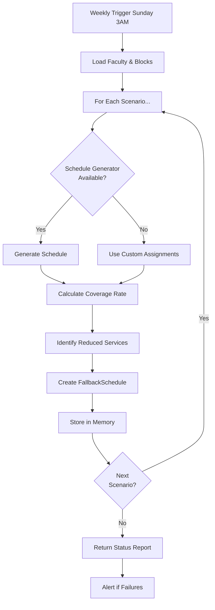

# Static Stability & Pre-Computed Fallbacks

**SEARCH_PARTY Investigation: G2_RECON**

> A system is "statically stable" if it continues operating correctly even when components it depends on become unavailable. The system doesn't need to detect the failure or make decisions—it just keeps working.
>
> — AWS Architecture Pattern, adapted for medical residency scheduling

---

## Table of Contents

1. [Concept Explanation](#concept-explanation)
2. [Fallback Inventory](#fallback-inventory)
3. [Update Procedures](#update-procedures)
4. [Activation Guide](#activation-guide)
5. [Stale Fallback Detection](#stale-fallback-detection)
6. [Reliability Engineering Principles](#reliability-engineering-principles)
7. [Implementation Status](#implementation-status)

---

## Concept Explanation

### Static Stability in Power Grids

**Traditional Crisis Response** (Dynamic Stability):
```
Crisis Detected → Analyze Situation → Calculate New Plan → Deploy
                     (seconds to minutes)
```

**Static Stability** (AWS Cells Pattern):
```
Crisis Detected → Retrieve Pre-Computed Plan → Deploy Instantly
                     (milliseconds)
```

### Why Static Stability Matters for Residency Scheduling

1. **No Computation Under Stress**: When crisis hits, the last thing you need is waiting for a solver to find a valid schedule. Pre-computed fallbacks are ready to go.

2. **Instant Degradation**: Switch from full capacity to reduced capacity without delay.

3. **Guaranteed Response**: Unlike dynamic computation (which might fail), pre-computed schedules are proven valid.

4. **Independent Cells**: Each fallback is self-contained and doesn't depend on other system components being available.

### Key Principle

> "Cells should be able to operate completely independently if needed."

In scheduling:
- **Cell** = Pre-computed schedule for specific scenario
- **Independent** = No real-time computation needed
- **If needed** = Pre-stored and ready for instant activation

---

## Fallback Inventory

### 1. SINGLE_FACULTY_LOSS

**Scenario**: Loss of any single faculty member

**Trigger**:
- Faculty resignation, sudden leave, or extended illness
- Faculty departure for TDY/deployment

**Characteristics**:
- Most common fallback scenario
- Minimal service reduction
- Maintained coverage through load redistribution

**Configuration**:
```python
scenario = FallbackScenario.SINGLE_FACULTY_LOSS
valid_period = (start_date, end_date)  # 90 days ahead typical
coverage_rate = ~95-98%
services_reduced = []  # No services suspended
```

**Assumptions**:
- Remaining faculty can absorb workload
- No cascading second failures during adjustment period
- Single faculty absence manageable within normal constraints

---

### 2. DOUBLE_FACULTY_LOSS

**Scenario**: Simultaneous loss of two faculty members

**Trigger**:
- Mass casualty with faculty casualties
- Simultaneous illnesses (pandemic wave)
- Multiple simultaneous unexpected departures

**Characteristics**:
- Rare scenario, high impact
- Service reductions necessary
- Degraded but functional operations

**Configuration**:
```python
scenario = FallbackScenario.DOUBLE_FACULTY_LOSS
coverage_rate = ~85-90%
services_reduced = ["elective_procedures"]
```

**Assumptions**:
- Essential services maintained
- Educational activities may be compressed
- Emergency procedures still available

---

### 3. PCS_SEASON_50_PERCENT

**Scenario**: Summer PCS (Permanent Change of Station) season with ~50% faculty unavailable

**Trigger**:
- Annual summer PCS window (June-August typically)
- Multiple faculty on leave simultaneously
- New faculty not yet arrived

**Characteristics**:
- Predictable seasonal crisis
- Extended duration (weeks to months)
- Known date range allows advance planning

**Configuration**:
```python
scenario = FallbackScenario.PCS_SEASON_50_PERCENT
coverage_rate = ~60-70%
services_reduced = [
    "research_time",
    "optional_education",
    "non_urgent_clinics"
]
```

**Assumptions**:
- Faculty can be identified 60-90 days in advance
- New faculty arrival timeline known
- Essential services compressed but maintained

---

### 4. HOLIDAY_SKELETON

**Scenario**: Minimal coverage during holiday periods

**Trigger**:
- Thanksgiving week
- Christmas/New Year period
- Faculty preferences for annual holidays

**Characteristics**:
- Predictable annual event
- Intentional minimal coverage, not a crisis
- Low patient volume expected

**Configuration**:
```python
scenario = FallbackScenario.HOLIDAY_SKELETON
coverage_rate = ~30-40%
services_reduced = [
    "all_non_essential",
    "education",
    "research",
    "admin"
]
```

**Assumptions**:
- Reduced patient volume during holidays
- Emergency coverage available
- Faculty willing to work during holidays identified in advance

---

### 5. PANDEMIC_ESSENTIAL

**Scenario**: Essential services only during pandemic/disaster

**Trigger**:
- Pandemic surge capacity
- Disaster response (natural disaster, mass casualty)
- Extreme public health emergency

**Characteristics**:
- Maximum degradation mode
- Focus on emergency/life-saving services
- Non-essential completely suspended

**Configuration**:
```python
scenario = FallbackScenario.PANDEMIC_ESSENTIAL
coverage_rate = ~40-50%
services_reduced = [
    "all_non_essential",
    "elective_procedures",
    "routine_clinics"
]
```

**Assumptions**:
- Emergency services prioritized absolutely
- Routine care deferrable
- All staff redeployed to highest need areas

---

### 6. MASS_CASUALTY

**Scenario**: All-hands response to mass casualty event

**Trigger**:
- Mass casualty incident
- Pandemic surge beyond normal capacity
- War/military emergency operations

**Characteristics**:
- Extreme degradation
- All available staff mobilized
- Non-emergency completely suspended

**Configuration**:
```python
scenario = FallbackScenario.MASS_CASUALTY
coverage_rate = ~75-85% (all hands available)
services_reduced = ["all_non_emergency"]
```

**Assumptions**:
- All faculty available and mobilized
- Focused on emergency response only
- Routine operations completely suspended

---

### 7. WEATHER_EMERGENCY

**Scenario**: Reduced operations during weather emergency (snow, flooding, etc.)

**Trigger**:
- Severe weather (winter storm, flood, etc.)
- Travel restrictions preventing staff arrival
- Infrastructure damage

**Characteristics**:
- Temporary degradation
- Staff availability reduced due to travel/conditions
- Duration typically 1-7 days

**Configuration**:
```python
scenario = FallbackScenario.WEATHER_EMERGENCY
coverage_rate = ~70-80%
services_reduced = [
    "non_essential",
    "elective_procedures"
]
```

**Assumptions**:
- Staff availability reduced (can't travel in weather)
- Emergency services prioritized
- Weather resolves within week

---

## Update Procedures

### Pre-Computation Schedule

**Frequency**: Weekly (Sunday 3 AM by default)

**Duration**: ~90 days ahead (configurable)

**Celery Task**:
```python
@shared_task(
    bind=True,
    name="app.resilience.tasks.precompute_fallback_schedules",
    max_retries=1,
    default_retry_delay=600,
)
def precompute_fallback_schedules(days_ahead: int = 90) -> dict:
    """Pre-compute all fallback schedules for next 90 days."""
```

**Configured in**: `backend/app/core/celery_app.py`

### Manual Pre-Computation API

**Endpoint**:
```
POST /api/v1/resilience/jobs
```

**Request Body**:
```json
{
  "taskName": "app.resilience.tasks.precompute_fallback_schedules",
  "parameters": {
    "days_ahead": 90
  }
}
```

**Response**:
```json
{
  "timestamp": "2025-12-30T03:00:00",
  "period": {
    "start": "2025-12-30",
    "end": "2026-03-30"
  },
  "scenarios_computed": 7,
  "scenarios_failed": 0,
  "results": {
    "1_faculty_loss": {
      "id": "uuid",
      "valid_until": "2026-03-30",
      "coverage_rate": 0.97,
      "services_reduced": []
    },
    ...
  }
}
```

### Implementation Details

**Location**: `/backend/app/resilience/static_stability.py`

**Core Method**:
```python
def precompute_fallback(
    self,
    scenario: FallbackScenario,
    start_date: date,
    end_date: date,
    assumptions: list[str] = None,
    custom_assignments: list[dict] = None,
) -> FallbackSchedule:
    """
    Pre-compute and store fallback schedule for scenario.

    Args:
        scenario: FallbackScenario enum value
        start_date: First day fallback covers
        end_date: Last day fallback covers
        assumptions: List of assumptions made
        custom_assignments: Pre-built assignments (or uses generator)

    Returns:
        FallbackSchedule: Stored and ready for activation
    """
```

### Coverage Rate Calculation

**Algorithm**:
```python
def _calculate_coverage_rate(
    self,
    assignments: list[dict],
    start_date: date,
    end_date: date,
) -> float:
    """Calculate coverage rate for assignments.

    Returns: Coverage as fraction 0.0 to 1.0

    Calculation:
    - Count weekdays in period
    - Expect 2 blocks per weekday
    - Divide actual assignments by expected
    - Min 1.0 (cap at full coverage)
    """
```

### Fallback Structure

**FallbackSchedule Data Class**:
```python
@dataclass
class FallbackSchedule:
    id: UUID
    scenario: FallbackScenario
    name: str  # Human-readable name
    description: str
    created_at: datetime
    valid_from: date
    valid_until: date

    # The actual schedule data
    assignments: list[dict]  # Person + Block assignments

    # Metadata
    assumptions: list[str]
    services_reduced: list[str]
    coverage_rate: float  # 0.0 to 1.0

    # Status tracking
    is_active: bool
    last_activated: datetime | None
    activation_count: int
```

### Services Reduced by Scenario

**Mapping** (in `static_stability.py`):

```python
{
    SINGLE_FACULTY_LOSS: [],
    DOUBLE_FACULTY_LOSS: ["elective_procedures"],
    PCS_SEASON_50_PERCENT: [
        "research_time",
        "optional_education",
        "non_urgent_clinics",
    ],
    HOLIDAY_SKELETON: [
        "all_non_essential",
        "education",
        "research",
        "admin",
    ],
    PANDEMIC_ESSENTIAL: [
        "all_non_essential",
        "elective_procedures",
        "routine_clinics",
    ],
    MASS_CASUALTY: ["all_non_emergency"],
    WEATHER_EMERGENCY: [
        "non_essential",
        "elective_procedures",
    ],
}
```

### Update Workflow



---

## Activation Guide

### Automatic Activation Modes

**Configuration**:
```python
# In backend/app/core/config.py
auto_activate_fallback: bool = False  # Require manual confirmation
```

### Manual Activation - API Endpoint

**Endpoint**:
```
POST /api/v1/resilience/fallbacks/activate
```

**Request**:
```json
{
  "scenario": "1_faculty_loss",  // FallbackScenario enum value
  "reason": "Dr. Smith sudden departure"
}
```

**Response**:
```json
{
  "success": true,
  "scenario": "1_faculty_loss",
  "assignments_count": 365,
  "coverage_rate": 0.97,
  "services_reduced": [],
  "message": "Fallback '1_faculty_loss' activated successfully"
}
```

**Requirements**:
- Admin role required
- Fallback must be pre-computed
- Pre-stored in memory (no computation delay)

### Implementation

**Service Layer**:
```python
def activate_fallback(
    self,
    scenario: FallbackScenario,
    approved_by: str | None = None,
) -> FallbackSchedule | None:
    """
    Activate pre-computed fallback schedule.

    Key principle: INSTANT - no computation, just switch.

    Args:
        scenario: FallbackScenario to activate
        approved_by: User ID approving activation

    Returns:
        Activated FallbackSchedule
        None if fallback not available

    Side Effects:
        - Sets is_active = True
        - Records last_activated timestamp
        - Increments activation_count
        - Logs warning with fallback details
    """
```

**Instant Activation Logic**:
```python
fallback = self.fallback_schedules.get(scenario)

if not fallback:
    logger.error(f"No fallback for {scenario.value}")
    return None

# Activate (no computation!)
fallback.is_active = True
fallback.last_activated = datetime.now()
fallback.activation_count += 1

logger.warning(
    f"FALLBACK ACTIVATED: {scenario.value} - "
    f"{len(fallback.assignments)} assignments, "
    f"{fallback.coverage_rate:.0%} coverage"
)
```

### Recommendation Logic

**Automatic Selection**:
```python
def get_best_fallback_for_situation(
    self,
    faculty_loss_count: int,
    is_pcs_season: bool = False,
    is_holiday: bool = False,
    is_emergency: bool = False,
) -> FallbackScenario | None:
    """
    Recommend best fallback for current situation.

    Decision tree:
    1. Emergency? → MASS_CASUALTY
    2. PCS season + 5+ faculty absent? → PCS_SEASON_50_PERCENT
    3. Holiday period? → HOLIDAY_SKELETON
    4. 2+ faculty absent? → DOUBLE_FACULTY_LOSS
    5. 1 faculty absent? → SINGLE_FACULTY_LOSS
    6. None? → Normal operations
    """
```

### Deactivation

**Endpoint**:
```
POST /api/v1/resilience/fallbacks/deactivate
```

**Request**:
```json
{
  "scenario": "1_faculty_loss",
  "reason": "Crisis resolved, returning to normal operations"
}
```

**Implementation**:
```python
def deactivate_fallback(self, scenario: FallbackScenario):
    """Deactivate fallback and return to normal operations."""
    fallback = self.fallback_schedules.get(scenario)
    if fallback:
        fallback.is_active = False
        logger.info(f"Fallback deactivated: {scenario.value}")
```

### Status Reporting

**List All Fallbacks**:
```
GET /api/v1/resilience/fallbacks
```

**Response**:
```json
{
  "fallbacks": [
    {
      "scenario": "1_faculty_loss",
      "description": "Single Faculty Loss",
      "is_active": false,
      "is_precomputed": true,
      "assignments_count": 365,
      "coverage_rate": 0.97,
      "services_reduced": [],
      "assumptions": [
        "Generated 2025-12-30T03:00:00",
        "Period: 2025-12-30 to 2026-03-30"
      ],
      "activation_count": 0
    },
    ...
  ],
  "active_count": 0
}
```

### Status Report Method

```python
def get_status_report(self) -> dict:
    """Generate comprehensive status report for all fallbacks and zones."""
    return {
        "fallbacks": {
            scenario.value: {
                "available": scenario in self.fallback_schedules,
                "active": self.fallback_schedules[scenario].is_active,
                "coverage_rate": "97%",
                "valid_until": "2026-03-30",
                "activation_count": 0,
            }
        },
        "zones": {...},
        "summary": {
            "total_fallbacks_available": 7,
            "active_fallbacks": 0,
            "total_zones": 3,
        },
    }
```

---

## Stale Fallback Detection

### Problem: Stale Fallbacks

**Scenario**: Fallback computed on Jan 1 for Feb 1-Mar 31 period, but now it's Mar 15:

```python
fallback.valid_from = date(2025, 2, 1)
fallback.valid_until = date(2026, 3, 31)
today = date(2025, 3, 15)

# Check:
if not (fallback.valid_from <= today <= fallback.valid_until):
    logger.warning(f"Fallback may be stale")
```

### Detection Logic

**In Activation**:
```python
def activate_fallback(self, scenario: FallbackScenario) -> FallbackSchedule | None:
    fallback = self.fallback_schedules.get(scenario)

    if not fallback:
        logger.error(f"No fallback available: {scenario.value}")
        return None

    # Check validity
    today = date.today()
    if not (fallback.valid_from <= today <= fallback.valid_until):
        logger.warning(
            f"Fallback {scenario.value} may be stale "
            f"(valid {fallback.valid_from} to {fallback.valid_until})"
        )
        # Still activates, but warns!
```

### Stale Fallback Indicators

1. **valid_until date < today**: Fallback expired
2. **created_at > 90 days ago**: Old precomputation
3. **Faculty roster changed**: Original assumptions invalid
4. **Absence schedule changed**: PCS dates shifted

### Mitigation

**Weekly Re-Computation**:
- Celery task runs every Sunday 3 AM
- Updates all 7 fallbacks for next 90 days
- Ensures constant rotation of fresh pre-computations

**Manual Update**:
```bash
# Trigger immediate re-computation
curl -X POST http://localhost:8000/api/v1/resilience/jobs \
  -H "Content-Type: application/json" \
  -d '{
    "taskName": "app.resilience.tasks.precompute_fallback_schedules",
    "parameters": {"days_ahead": 90}
  }'
```

**Monitoring**:
- Health check includes `active_fallbacks` metric
- Prometheus tracks stale fallback warnings
- Grafana dashboard shows fallback validity timeline

---

## Reliability Engineering Principles

### 1. Independent Cells (AWS Pattern)

Each fallback is **completely independent**:
- No dependencies on other systems
- No real-time computation required
- Can activate even if solver/database down
- Pre-stored in memory

### 2. Graceful Degradation

Fallbacks provide **intentional degradation tiers**:

```
Normal Operations (100% capacity)
    ↓ (Single faculty loss)
98% Coverage (SINGLE_FACULTY_LOSS)
    ↓ (Double faculty loss)
90% Coverage (DOUBLE_FACULTY_LOSS)
    ↓ (Major disaster)
50% Coverage (PANDEMIC_ESSENTIAL)
    ↓ (Mass casualty)
75% All-Hands (MASS_CASUALTY - all staff mobilized)
```

### 3. Blast Radius Isolation

**Scheduling Zones** provide isolation:

```python
@dataclass
class SchedulingZone:
    id: UUID
    name: str
    services: list[str]
    dedicated_faculty: list[UUID]
    backup_faculty: list[UUID]
    minimum_coverage: int

    def is_self_sufficient(self, available_faculty: set[UUID]) -> bool:
        """Can zone operate independently?"""
        available_dedicated = len(set(self.dedicated_faculty) & available_faculty)
        return available_dedicated >= self.minimum_coverage
```

### 4. Pre-Computation Philosophy

**Why Pre-Compute?**

| Aspect | Dynamic | Static (Pre-Computed) |
|--------|---------|----------------------|
| **When computed** | During crisis | Before crisis |
| **Delay** | Seconds to minutes | Milliseconds |
| **Failure mode** | Solver fails | Instant activation |
| **Verification** | Under stress | During calm |
| **Stress handling** | Reactive | Proactive |
| **Availability** | Depends on services | Independent |

**Pre-Computation Benefits**:
1. ✅ Zero decision-making delay during crisis
2. ✅ Guaranteed validity (proven before deployment)
3. ✅ No computation overhead under stress
4. ✅ Works even if solvers/DB unavailable
5. ✅ Transparent assumptions documented

---

## Implementation Status

### ✅ Implemented

- [x] FallbackScheduler class with 7 scenarios
- [x] FallbackSchedule data structures
- [x] Pre-computation logic (`precompute_fallback`, `precompute_all_fallbacks`)
- [x] Activation logic (`activate_fallback`, `deactivate_fallback`)
- [x] Scheduling zones for blast radius isolation
- [x] Celery task for weekly pre-computation
- [x] API endpoints (list, activate, deactivate fallbacks)
- [x] Status reporting (`get_status_report`, `check_zone_health`)
- [x] Database persistence (FallbackActivation model)
- [x] Audit trail (ResilienceEvent model)

### ⚠️ Partially Implemented

- [ ] Schedule generator integration (currently requires custom assignments)
- [ ] Automatic fallback recommendation with crisis detection
- [ ] Stale fallback auto-remediation (warns, doesn't auto-fix)

### 📋 Future Enhancements

- [ ] Machine learning to optimize fallback parameters
- [ ] Historical effectiveness tracking (which fallbacks worked best?)
- [ ] Scenario simulation before storing (verify validity)
- [ ] Cross-scenario consistency checking
- [ ] Fallback mutation strategies (small variations for adaptability)
- [ ] Crisis-specific fallback generation (not just pre-planned scenarios)

---

## Quick Reference

### Celery Task Configuration

**File**: `backend/app/core/celery_app.py`

```python
# Weekly pre-computation schedule
app.conf.beat_schedule = {
    'precompute-fallbacks': {
        'task': 'app.resilience.tasks.precompute_fallback_schedules',
        'schedule': crontab(hour=3, minute=0, day_of_week=0),  # Sunday 3 AM
        'kwargs': {'days_ahead': 90}
    },
}
```

### Database Models

**File**: `backend/app/models/resilience.py`

```python
class FallbackActivation(Base):
    """Audit trail for fallback activations."""
    scenario: str
    scenario_description: str
    activated_by: str  # User ID
    activation_reason: str
    activated_at: datetime
    deactivated_at: datetime | None
    deactivated_by: str | None
    assignments_count: int
    coverage_rate: float
    services_reduced: list[str]
    assumptions: list[str]
```

### Key Files

| File | Purpose |
|------|---------|
| `/backend/app/resilience/static_stability.py` | FallbackScheduler implementation |
| `/backend/app/resilience/tasks.py` | Celery tasks (precomputation, activation) |
| `/backend/app/api/routes/resilience.py` | REST API endpoints |
| `/backend/app/models/resilience.py` | Database models (FallbackActivation, ResilienceEvent) |
| `/backend/app/core/config.py` | Configuration (auto_activate_fallback) |

---

## Architecture Diagram

```
┌─────────────────────────────────────────────────────────┐
│         Fallback Management Architecture                │
└─────────────────────────────────────────────────────────┘

Normal Operations (100%)
    ↓
Celery Task (Weekly Sunday 3 AM)
    ├─ Load Faculty & Blocks
    ├─ For Each Scenario (7 total)
    │   ├─ Generate Schedule (or use custom)
    │   ├─ Calculate Coverage Rate
    │   ├─ Identify Reduced Services
    │   └─ Store FallbackSchedule
    └─ Return Status Report

       ↓

Pre-Computed Fallback Inventory (In Memory)
    ├─ SINGLE_FACULTY_LOSS (97% coverage)
    ├─ DOUBLE_FACULTY_LOSS (90% coverage)
    ├─ PCS_SEASON_50_PERCENT (65% coverage)
    ├─ HOLIDAY_SKELETON (35% coverage)
    ├─ PANDEMIC_ESSENTIAL (45% coverage)
    ├─ MASS_CASUALTY (80% all hands)
    └─ WEATHER_EMERGENCY (75% coverage)

       ↓

Crisis Detected
    ├─ Automatic Recommendation
    │   (get_best_fallback_for_situation)
    └─ Admin Activation
        ├─ API: POST /fallbacks/activate
        ├─ Instant Deploy (no computation)
        └─ Persist in DB

       ↓

Degraded Operations
    ├─ Reduced Services (predefined by scenario)
    ├─ Reduced Faculty (pre-computed schedule)
    └─ Maintained Critical Care (blocking guarantees)

       ↓

Crisis Resolution
    └─ Deactivate Fallback
        ├─ API: POST /fallbacks/deactivate
        └─ Return to Normal Operations
```

---

## Testing Fallback Schedules

### Unit Test Example

```python
def test_fallback_single_faculty_loss():
    """Test single faculty loss fallback generation."""
    scheduler = FallbackScheduler()

    fallback = scheduler.precompute_fallback(
        scenario=FallbackScenario.SINGLE_FACULTY_LOSS,
        start_date=date(2025, 1, 1),
        end_date=date(2025, 3, 31),
    )

    assert fallback.is_active is False
    assert fallback.coverage_rate >= 0.95
    assert len(fallback.assignments) > 0

    # Activate
    activated = scheduler.activate_fallback(FallbackScenario.SINGLE_FACULTY_LOSS)
    assert activated.is_active is True
    assert activated.activation_count == 1

    # Deactivate
    scheduler.deactivate_fallback(FallbackScenario.SINGLE_FACULTY_LOSS)
    fallback = scheduler.fallback_schedules[FallbackScenario.SINGLE_FACULTY_LOSS]
    assert fallback.is_active is False
```

### Integration Test

```python
async def test_fallback_api_activation(async_client, db):
    """Test fallback activation via API."""
    # Pre-compute fallback
    response = await async_client.post(
        "/api/v1/resilience/jobs",
        json={
            "taskName": "app.resilience.tasks.precompute_fallback_schedules",
            "parameters": {"days_ahead": 90}
        }
    )
    assert response.status_code == 200

    # Activate
    response = await async_client.post(
        "/api/v1/resilience/fallbacks/activate",
        json={
            "scenario": "1_faculty_loss",
            "reason": "Test activation"
        }
    )
    assert response.status_code == 200
    assert response.json()["success"] is True

    # Deactivate
    response = await async_client.post(
        "/api/v1/resilience/fallbacks/deactivate",
        json={
            "scenario": "1_faculty_loss",
            "reason": "Test deactivation"
        }
    )
    assert response.status_code == 200
```

---

## Conclusion

**Static Stability** provides the resilience framework with instant crisis response capability. By pre-computing fallback schedules during calm periods, the system eliminates the computational bottleneck that might occur during actual emergencies.

The 7 pre-defined scenarios cover the most common and predictable crises:
- **Single/Double faculty loss**: Staffing emergencies
- **PCS season**: Predictable seasonal surge
- **Holidays**: Intentional minimal coverage
- **Pandemic/Mass casualty**: Extreme degradation modes

Each fallback is:
- ✅ Pre-computed and verified
- ✅ Stored and ready (milliseconds to activate)
- ✅ Audited and tracked
- ✅ Independently deployable
- ✅ Gracefully degraded (services intentionally reduced by scenario)

**Key Insight**: When crisis strikes, the last thing you want is a solver grinding away. Static stability ensures instant activation of pre-tested, proven schedules that keep critical operations running.
