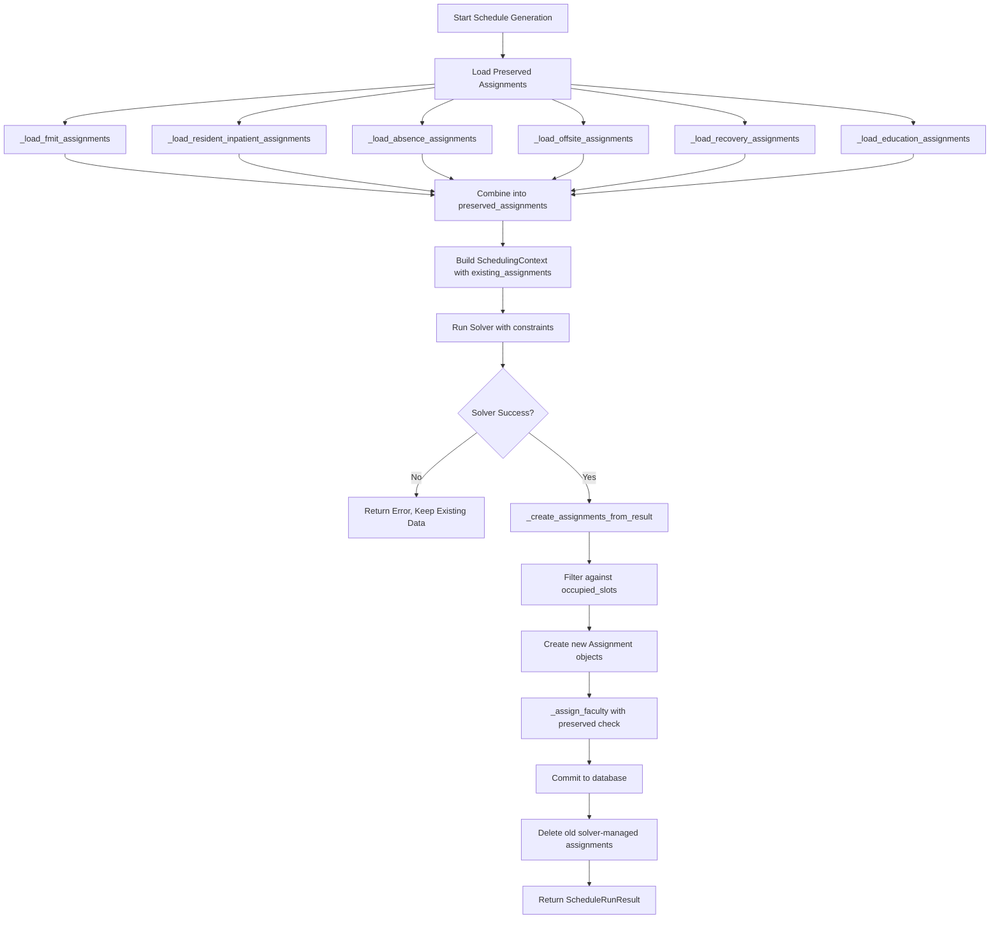

# Engine Assignment Flow

This document describes how the scheduling engine processes preserved (immutable) assignments and solver-generated assignments.

---

## Overview

The scheduling engine follows a **preserve-then-solve** pattern:

1. Load existing immutable assignments (inpatient, off-site, absence, recovery, education)
2. Pass them to solver as constraints
3. Solver generates outpatient/procedure assignments
4. Filter solver output against preserved slots
5. Create new assignments in database
6. Delete old solver-managed assignments (deferred for safety)

---

## Flow Diagram



---

## Step-by-Step Flow

### Step 1: Load Preserved Assignments

The engine loads 6 types of preserved assignments:

```python
# backend/app/scheduling/engine.py

# Step 1.5a: Load faculty FMIT assignments
fmit_assignments = self._load_fmit_assignments(session, templates, blocks)

# Step 1.5b: Load resident inpatient assignments
resident_inpatient_assignments = self._load_resident_inpatient_assignments(
    session, templates, blocks
)

# Step 1.5c: Load absence assignments (Leave, Weekend, TDY)
absence_assignments = self._load_absence_assignments(session, templates, blocks)

# Step 1.5d: Load off-site rotations (Hilo, Kapiolani, Okinawa)
offsite_assignments = self._load_offsite_assignments(session, templates, blocks)

# Step 1.5e: Load recovery assignments (Post-Call)
recovery_assignments = self._load_recovery_assignments(session, templates, blocks)

# Step 1.5f: Load education assignments (FMO, GME, Lectures)
education_assignments = self._load_education_assignments(session, templates, blocks)
```

### Step 2: Combine Preserved Assignments

```python
preserved_assignments = (
    fmit_assignments
    + resident_inpatient_assignments
    + absence_assignments
    + offsite_assignments
    + recovery_assignments
    + education_assignments
)
```

### Step 3: Build Context with Preserved Assignments

```python
context = self._build_context(
    residents=residents,
    faculty=faculty,
    templates=templates,
    blocks=blocks,
    existing_assignments=preserved_assignments,  # Key: passed to context
)
```

### Step 4: Run Solver

The solver receives the context including `existing_assignments` and uses them as constraints. It generates assignments only for unoccupied slots.

### Step 5: Filter Solver Output

```python
def _create_assignments_from_result(
    self,
    result: SolverResult,
    residents: list[Person],
    templates: list[RotationTemplate],
    run_id: UUID,
    existing_assignments: list[Assignment] | None = None,
):
    # Build set of occupied slots
    occupied_slots: set[tuple[UUID, UUID]] = set()
    if existing_assignments:
        for a in existing_assignments:
            occupied_slots.add((a.person_id, a.block_id))

    skipped = 0
    for person_id, block_id, template_id in result.assignments:
        # SKIP if this slot is already occupied by a preserved assignment
        if (person_id, block_id) in occupied_slots:
            skipped += 1
            continue

        # Create the assignment
        assignment = Assignment(...)
        self.assignments.append(assignment)
```

### Step 6: Faculty Assignment with Preserved Check

```python
def _assign_faculty(
    self,
    faculty: list[Person],
    blocks: list[Block],
    run_id: UUID,
    preserved_assignments: list[Assignment] | None = None,
):
    # Build occupied slots from BOTH preserved AND session assignments
    faculty_occupied_slots: set[tuple[UUID, UUID]] = set()
    faculty_ids = {f.id for f in faculty}

    # Check preserved assignments
    if preserved_assignments:
        for a in preserved_assignments:
            if a.person_id in faculty_ids:
                faculty_occupied_slots.add((a.person_id, a.block_id))

    # Check already-created session assignments
    for a in self.assignments:
        if a.person_id in faculty_ids:
            faculty_occupied_slots.add((a.person_id, a.block_id))

    # Only assign faculty to unoccupied slots
    for faculty_member in faculty:
        for block in blocks:
            if (faculty_member.id, block.id) in faculty_occupied_slots:
                continue  # Skip - already occupied
            # ... create faculty supervision assignment
```

### Step 7: Deferred Deletion

Old solver-managed assignments are deleted **after** successful solve:

```python
# Old approach (dangerous):
# DELETE existing assignments BEFORE solving
# If solver fails, data is lost!

# New approach (safe):
# 1. Run solver
# 2. If successful, create new assignments
# 3. THEN delete old solver-managed assignments
# 4. If solver fails, existing data is preserved
```

---

## Activity Type Filters

Each loader method filters by activity type:

| Loader | Activity Types | Description |
|--------|----------------|-------------|
| `_load_fmit_assignments` | `inpatient` + name contains "FMIT" | Faculty FMIT weeks |
| `_load_resident_inpatient_assignments` | `inpatient` | All other inpatient |
| `_load_absence_assignments` | `absence` | Leave, Weekend |
| `_load_offsite_assignments` | `off` | Hilo, Kapiolani, Okinawa |
| `_load_recovery_assignments` | `recovery` | Post-Call |
| `_load_education_assignments` | `education` | FMO, GME, Lectures |

---

## Preserve IDs

Assignments are marked for preservation using their IDs:

```python
preserve_ids: set[UUID] = set()

for a in preserved_assignments:
    preserve_ids.add(a.id)

# When deleting old assignments, skip those in preserve_ids
for old_assignment in old_solver_assignments:
    if old_assignment.id not in preserve_ids:
        session.delete(old_assignment)
```

---

## Error Handling

If the solver fails:
- Return error status immediately
- Do NOT delete existing assignments
- Existing schedule remains intact

```python
result = self._run_solver(model, context)

if result.status != SolverStatus.SUCCESS:
    return ScheduleRunResult(
        status=207,  # Partial Content
        message=f"Solver failed: {result.status}",
        ...
    )

# Only proceed with database changes if solver succeeded
```

---

## Key Data Structures

### `occupied_slots: set[tuple[UUID, UUID]]`

Set of (person_id, block_id) tuples representing slots that cannot be assigned.

### `preserve_ids: set[UUID]`

Set of assignment IDs that should not be deleted during cleanup.

### `SchedulingContext.existing_assignments`

List of Assignment objects passed to the solver as constraints.

---

## Related Documentation

- [Activity Types](ACTIVITY_TYPES.md) - Classification of rotation types
- [FMIT Constraints](FMIT_CONSTRAINTS.md) - FMIT-specific constraint rules
- [Session: Immutable Assignments](../sessions/SESSION_2025-12-26_IMMUTABLE_ASSIGNMENTS.md) - Development history
