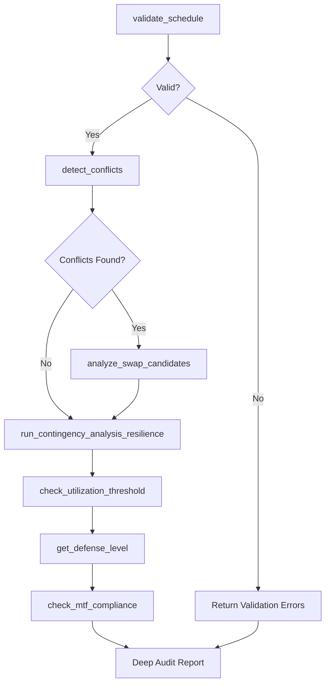
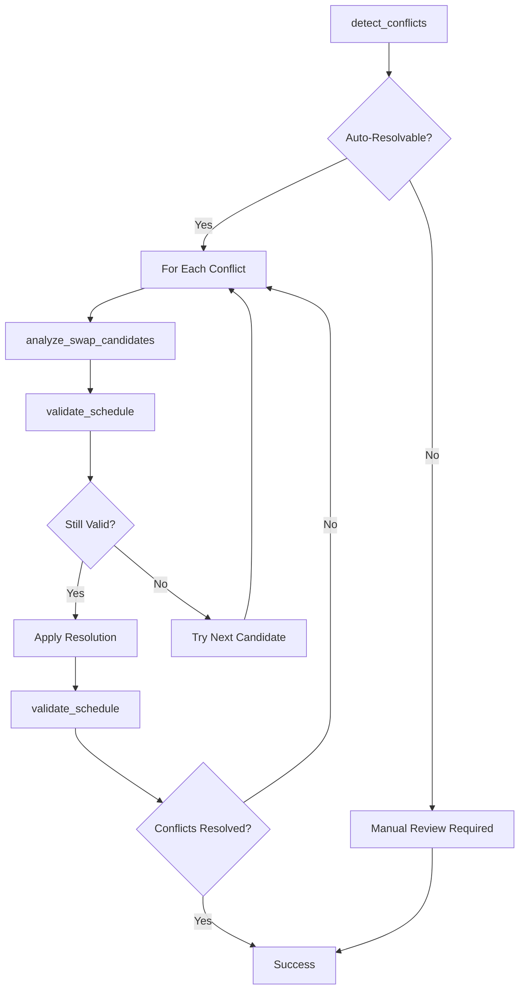
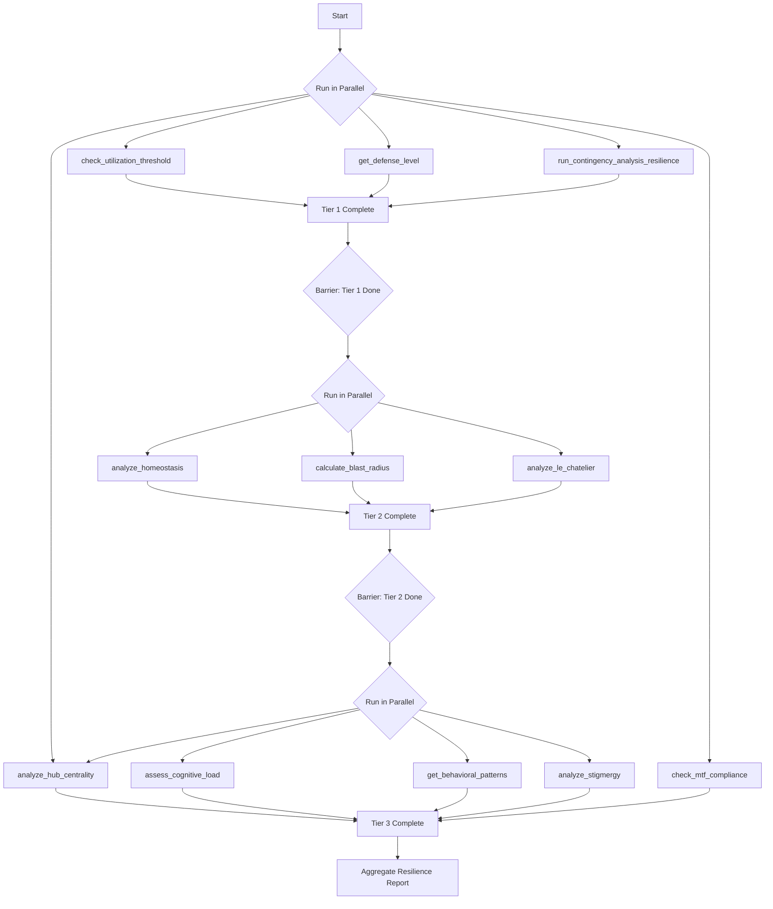
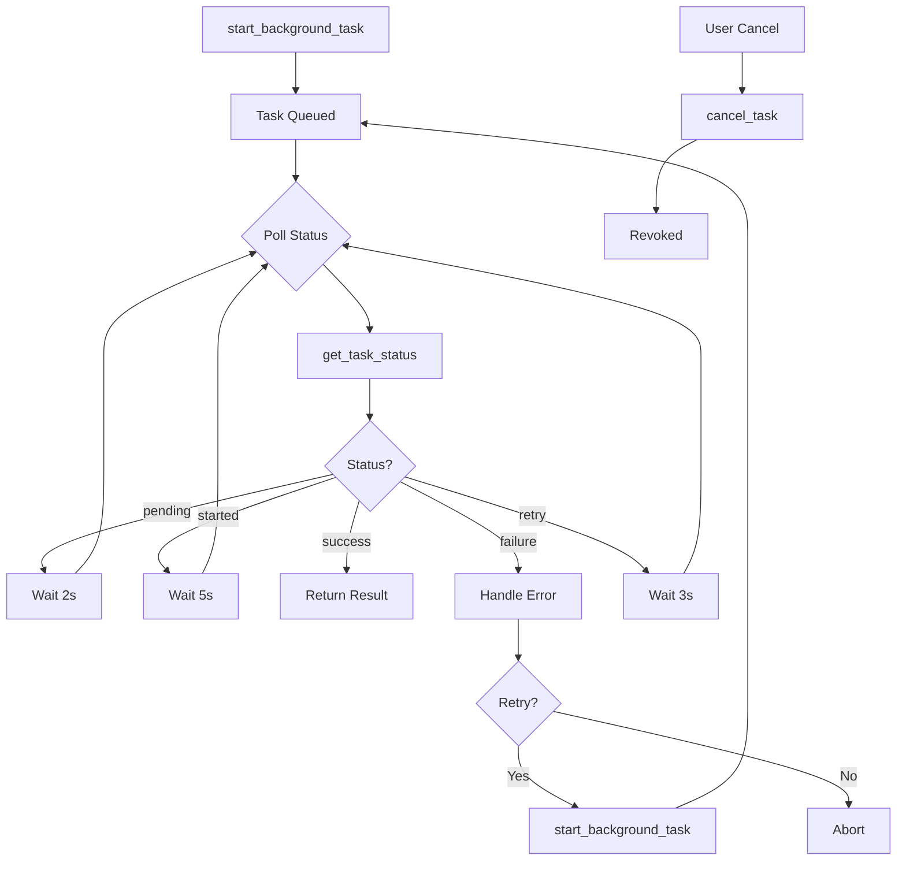
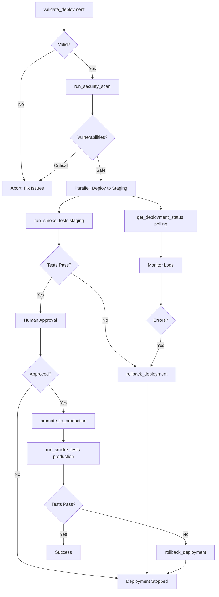
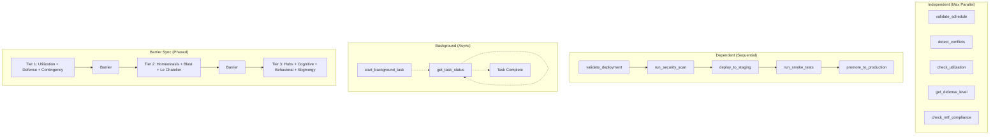

# MCP Orchestration Patterns

> **Version:** 1.0.0
> **Last Updated:** 2025-12-26
> **Status:** Implementation-Ready Specification

---

## Table of Contents

1. [Overview](#overview)
2. [Tool Inventory](#tool-inventory)
3. [Tool Composition DAGs](#tool-composition-dags)
4. [Meta-Tool Specifications](#meta-tool-specifications)
5. [Parallel Execution Patterns](#parallel-execution-patterns)
6. [MCP Prompt Templates](#mcp-prompt-templates)
7. [Error Recovery Flows](#error-recovery-flows)
8. [Implementation Guide](#implementation-guide)

---

## Overview

This document defines **orchestration patterns** for the 34 MCP tools in the Residency Scheduler system. It provides blueprints for:

- **Chaining tools** into coherent workflows (DAGs)
- **Composite meta-tools** that automate multi-step operations
- **Parallel execution** to optimize performance
- **Standardized prompts** for AI assistants
- **Graceful degradation** and error recovery

### Key Principles

1. **Composability**: Tools are building blocks for complex workflows
2. **Idempotency**: Tools can be safely retried without side effects
3. **Observable**: All operations emit status and can be monitored
4. **Fail-Safe**: Errors are contained and don't cascade
5. **Human-in-Loop**: Critical operations require approval

---

## Tool Inventory

### Core Scheduling Tools (5)

| Tool | Purpose | Modifies State | Async | Dependencies |
|------|---------|----------------|-------|--------------|
| `validate_schedule` | ACGME compliance validation | No | Yes | Backend API |
| `validate_schedule_by_id` | Constraint validation for specific schedule | No | Yes | ConstraintService |
| `run_contingency_analysis` | Workforce planning scenarios | No | Yes | Backend API |
| `detect_conflicts` | Find scheduling conflicts | No | Yes | Backend API |
| `analyze_swap_candidates` | Match swap partners | No | Yes | Backend API |

### Async Task Management (4)

| Tool | Purpose | Modifies State | Async | Dependencies |
|------|---------|----------------|-------|--------------|
| `start_background_task` | Launch Celery task | Yes (queue) | Yes | Redis, Celery |
| `get_task_status` | Poll task progress | No | Yes | Celery |
| `cancel_task` | Abort running task | Yes | Yes | Celery |
| `list_active_tasks` | View task queue | No | Yes | Celery |

### Resilience Framework (13)

| Tool | Purpose | Modifies State | Async | Dependencies |
|------|---------|----------------|-------|--------------|
| `check_utilization_threshold` | 80% threshold monitoring | No | Yes | Utilization service |
| `get_defense_level` | Defense-in-depth level | No | Yes | Defense service |
| `run_contingency_analysis_resilience` | N-1/N-2 analysis | No | Yes | Backend API |
| `get_static_fallbacks` | Pre-computed fallbacks | No | Yes | Fallback service |
| `execute_sacrifice_hierarchy` | Load shedding | Yes (if not simulated) | Yes | Sacrifice service |
| `analyze_homeostasis` | Feedback loops | No | Yes | Homeostasis service |
| `calculate_blast_radius` | Zone isolation | No | Yes | Blast radius service |
| `analyze_le_chatelier` | Equilibrium shifts | No | Yes | Le Chatelier service |
| `analyze_hub_centrality` | SPOF identification | No | Yes | NetworkX |
| `assess_cognitive_load` | Decision queue | No | Yes | Cognitive service |
| `get_behavioral_patterns` | Stigmergy trails | No | Yes | Stigmergy service |
| `analyze_stigmergy` | Slot optimization | No | Yes | Stigmergy service |
| `check_mtf_compliance` | Military compliance | No | Yes | Backend API |

### Deployment Workflow (7)

| Tool | Purpose | Modifies State | Async | Dependencies |
|------|---------|----------------|-------|--------------|
| `validate_deployment` | Pre-deploy checks | No | Yes | GitHub, CI |
| `run_security_scan` | Vulnerability scanning | No | Yes | Security tools |
| `run_smoke_tests` | Post-deploy validation | No | Yes | Test suite |
| `promote_to_production` | Deploy to prod | Yes | Yes | GitHub, approval |
| `rollback_deployment` | Revert deployment | Yes | Yes | GitHub |
| `get_deployment_status` | Check deploy progress | No | Yes | GitHub |
| `list_deployments` | View deploy history | No | Yes | GitHub |

### Empirical Testing (5)

| Tool | Purpose | Modifies State | Async | Dependencies |
|------|---------|----------------|-------|--------------|
| `benchmark_solvers` | Compare algorithms | No | Yes | Solver suite |
| `benchmark_constraints` | Constraint yield analysis | No | Yes | Constraint suite |
| `ablation_study` | Module removal impact | No | Yes | AST analysis |
| `benchmark_resilience` | Resilience module value | No | Yes | Resilience suite |
| `module_usage_analysis` | Dead code detection | No | Yes | AST analysis |

### Resources (2)

| Resource | Purpose | Cacheable | Dependencies |
|----------|---------|-----------|--------------|
| `schedule://status` | Current schedule state | Yes (5 min TTL) | Backend API |
| `schedule://compliance` | ACGME compliance summary | Yes (5 min TTL) | Backend API |

---

## Tool Composition DAGs

### DAG 1: Deep Schedule Audit

**Purpose**: Comprehensive schedule validation including compliance, conflicts, and contingency analysis.



**Execution Order**:
1. `validate_schedule` (blocks until complete)
2. If valid: `detect_conflicts` (parallel with resource fetch)
3. If conflicts: `analyze_swap_candidates` for each conflict
4. `run_contingency_analysis_resilience` (N-1/N-2)
5. Parallel: `check_utilization_threshold`, `get_defense_level`, `check_mtf_compliance`
6. Aggregate report

**Exit Criteria**:
- All tools complete successfully OR
- Critical validation failure (skip downstream tools)

**Estimated Duration**: 15-45 seconds (depending on schedule size)

---

### DAG 2: Conflict Resolution Pipeline

**Purpose**: Detect → Suggest → Validate → Apply conflict resolutions.



**Execution Order**:
1. `detect_conflicts` with `include_auto_resolution=true`
2. For each auto-resolvable conflict:
   - `analyze_swap_candidates` to find matches
   - `validate_schedule` with proposed swap (dry-run)
   - If valid: apply swap via backend API
   - Re-run `validate_schedule` to confirm
3. Repeat until all conflicts resolved or max iterations (default: 5)

**Exit Criteria**:
- All conflicts resolved OR
- Max iterations reached OR
- No more auto-resolvable conflicts

**Estimated Duration**: 10-60 seconds (depending on conflict count)

---

### DAG 3: Resilience Health Check

**Purpose**: Full system resilience analysis with all 13 resilience tools.



**Execution Order**:
1. **Tier 1 (Critical)** - Parallel:
   - `check_utilization_threshold`
   - `get_defense_level`
   - `run_contingency_analysis_resilience`

2. **Tier 2 (Strategic)** - Parallel (after Tier 1):
   - `analyze_homeostasis`
   - `calculate_blast_radius`
   - `analyze_le_chatelier`

3. **Tier 3 (Advanced)** - Parallel (after Tier 2):
   - `analyze_hub_centrality`
   - `assess_cognitive_load`
   - `get_behavioral_patterns`
   - `analyze_stigmergy`

4. **Military Compliance** - Independent:
   - `check_mtf_compliance` (can run anytime)

**Barrier Synchronization**: Each tier waits for all tools in the previous tier to complete.

**Exit Criteria**: All tools complete (with graceful degradation for unavailable services)

**Estimated Duration**: 5-15 seconds (with parallelization)

---

### DAG 4: Background Task Lifecycle

**Purpose**: Start → Poll → Complete/Cancel async tasks.



**Execution Order**:
1. `start_background_task` with `task_type` and `params`
2. Poll `get_task_status` every 2-5 seconds (exponential backoff)
3. On completion: return result
4. On failure: retry up to 3 times
5. On user cancel: `cancel_task`

**Polling Strategy**:
- Initial: 2s
- After 30s: 5s
- After 2m: 10s
- Max: 10 minutes, then timeout

**Exit Criteria**:
- Task completes successfully OR
- Task fails after max retries OR
- User cancels OR
- Timeout (default: 10 minutes)

**Estimated Duration**: Varies by task type (see task duration estimates)

---

### DAG 5: Deployment Pipeline

**Purpose**: Full deployment workflow from validation to production.



**Execution Order**:
1. `validate_deployment` (staging, git_ref)
2. `run_security_scan` (dependency + code + secrets)
3. Deploy to staging (external CI/CD)
4. Parallel:
   - `run_smoke_tests` (basic suite)
   - `get_deployment_status` (polling every 10s)
5. Human approval gate
6. `promote_to_production` (with approval token)
7. `run_smoke_tests` (full suite)
8. On failure at any step: `rollback_deployment`

**Exit Criteria**:
- Production deployment succeeds OR
- Validation/security/test failure triggers rollback

**Estimated Duration**: 10-30 minutes (includes human approval)

---

## Meta-Tool Specifications

### Meta-Tool 1: `deep_schedule_audit`

**Signature**:
```python
async def deep_schedule_audit(
    start_date: str,
    end_date: str,
    include_resilience: bool = True,
    include_empirical: bool = False,
    max_depth: int = 3
) -> DeepAuditReport
```

**Purpose**: Orchestrates DAG 1 (Deep Schedule Audit) with configurable depth.

**Orchestration Logic**:
```python
async def deep_schedule_audit(
    start_date: str,
    end_date: str,
    include_resilience: bool = True,
    include_empirical: bool = False,
    max_depth: int = 3
) -> DeepAuditReport:
    """
    Execute comprehensive schedule audit.

    Depth levels:
    - Level 1: Validation + Conflicts
    - Level 2: + Contingency + Utilization
    - Level 3: + Full Resilience Analysis
    - Level 4: + Empirical Benchmarks (slow)
    """
    report = DeepAuditReport()

    # Level 1: Core Validation
    validation = await validate_schedule(start_date, end_date)
    report.validation = validation

    if not validation.is_valid and max_depth == 1:
        return report  # Early exit

    conflicts = await detect_conflicts(start_date, end_date, include_auto_resolution=True)
    report.conflicts = conflicts

    if max_depth == 1:
        return report

    # Level 2: Contingency Planning
    contingency = await run_contingency_analysis_resilience(
        analyze_n1=True,
        analyze_n2=True if max_depth >= 3 else False
    )
    report.contingency = contingency

    utilization = await check_utilization_threshold(
        available_faculty=get_faculty_count(),
        required_blocks=get_block_count(start_date, end_date)
    )
    report.utilization = utilization

    if max_depth == 2:
        return report

    # Level 3: Full Resilience (Parallel)
    if include_resilience:
        resilience_results = await asyncio.gather(
            get_defense_level(validation.overall_compliance_rate),
            check_mtf_compliance(check_circuit_breaker=True, generate_sitrep=True),
            analyze_hub_centrality(),
            return_exceptions=True
        )
        report.resilience = {
            "defense": resilience_results[0],
            "mtf": resilience_results[1],
            "hubs": resilience_results[2]
        }

    # Level 4: Empirical (Optional, Slow)
    if max_depth >= 4 and include_empirical:
        empirical = await benchmark_constraints(test_schedules="historical")
        report.empirical = empirical

    return report
```

**Execution Strategy**:
- **Level 1**: Sequential (validation → conflicts)
- **Level 2**: Sequential (contingency → utilization)
- **Level 3**: Parallel resilience tools
- **Level 4**: Optional empirical (sequential)

**Timeout**: 60 seconds (configurable)

**Error Handling**: Graceful degradation (continue even if non-critical tools fail)

**Return Type**:
```python
class DeepAuditReport(BaseModel):
    validation: ScheduleValidationResult
    conflicts: ConflictDetectionResult
    contingency: ContingencyAnalysisResponse | None
    utilization: UtilizationResponse | None
    resilience: dict[str, Any] | None
    empirical: ConstraintBenchmarkResult | None
    execution_time_ms: int
    depth_achieved: int
    errors: list[str] = []
```

---

### Meta-Tool 2: `auto_resolve_conflicts`

**Signature**:
```python
async def auto_resolve_conflicts(
    start_date: str,
    end_date: str,
    max_iterations: int = 5,
    require_approval: bool = True,
    dry_run: bool = False
) -> ConflictResolutionReport
```

**Purpose**: Orchestrates DAG 2 (Conflict Resolution Pipeline) with approval gates.

**Orchestration Logic**:
```python
async def auto_resolve_conflicts(
    start_date: str,
    end_date: str,
    max_iterations: int = 5,
    require_approval: bool = True,
    dry_run: bool = False
) -> ConflictResolutionReport:
    """
    Detect and auto-resolve schedule conflicts.

    Strategy:
    1. Detect conflicts
    2. For each auto-resolvable conflict:
       - Find swap candidates
       - Validate proposed swap
       - Apply if valid (with approval)
    3. Repeat until resolved or max iterations
    """
    report = ConflictResolutionReport()
    iteration = 0

    while iteration < max_iterations:
        # Detect current conflicts
        conflicts = await detect_conflicts(
            start_date, end_date,
            include_auto_resolution=True
        )

        if conflicts.total_conflicts == 0:
            report.status = "success"
            break

        if conflicts.auto_resolvable_count == 0:
            report.status = "manual_review_required"
            break

        # Process auto-resolvable conflicts
        resolutions = []

        for conflict in conflicts.conflicts:
            if not conflict.auto_resolution_available:
                continue

            # Find swap candidates
            candidates = await analyze_swap_candidates(
                requester_person_id=conflict.affected_people[0],
                assignment_id=conflict.resolution_options[0].details.get("assignment_id"),
                max_candidates=5
            )

            if not candidates.candidates:
                continue

            # Validate best candidate
            best = candidates.candidates[0]

            # Dry run validation
            validation = await validate_schedule(
                start_date, end_date
                # TODO: Backend needs dry-run swap validation endpoint
            )

            if not validation.is_valid:
                continue

            # Approval gate
            if require_approval and not dry_run:
                approval = await request_human_approval(
                    conflict=conflict,
                    proposed_swap=best
                )
                if not approval:
                    continue

            # Apply resolution
            if not dry_run:
                resolution = await apply_swap_resolution(conflict, best)
                resolutions.append(resolution)

        report.resolutions.extend(resolutions)
        iteration += 1

    report.iterations = iteration
    report.final_conflicts = conflicts

    return report
```

**Execution Strategy**:
- Iterative (max 5 iterations by default)
- Each iteration: detect → resolve batch → re-validate
- Human approval for each resolution (optional)

**Timeout**: 120 seconds

**Error Handling**: Rollback on validation failure

**Return Type**:
```python
class ConflictResolutionReport(BaseModel):
    status: str  # "success", "manual_review_required", "timeout"
    iterations: int
    resolutions: list[SwapResolution]
    final_conflicts: ConflictDetectionResult
    execution_time_ms: int
    errors: list[str] = []
```

---

### Meta-Tool 3: `full_resilience_check`

**Signature**:
```python
async def full_resilience_check(
    include_tier1: bool = True,
    include_tier2: bool = True,
    include_tier3: bool = True,
    parallel: bool = True
) -> ResilienceHealthReport
```

**Purpose**: Orchestrates DAG 3 (Resilience Health Check) with all 13 tools.

**Orchestration Logic**:
```python
async def full_resilience_check(
    include_tier1: bool = True,
    include_tier2: bool = True,
    include_tier3: bool = True,
    parallel: bool = True
) -> ResilienceHealthReport:
    """
    Execute full resilience analysis across all tiers.

    Tiers execute sequentially (with barrier sync).
    Within each tier, tools run in parallel.
    """
    report = ResilienceHealthReport()

    # Tier 1: Critical (Parallel)
    if include_tier1:
        tier1_tasks = []

        if parallel:
            tier1_tasks = [
                check_utilization_threshold(
                    available_faculty=get_faculty_count(),
                    required_blocks=get_block_count()
                ),
                get_defense_level(get_current_coverage_rate()),
                run_contingency_analysis_resilience(
                    analyze_n1=True,
                    analyze_n2=True
                )
            ]
            tier1_results = await asyncio.gather(*tier1_tasks, return_exceptions=True)
        else:
            tier1_results = [
                await check_utilization_threshold(...),
                await get_defense_level(...),
                await run_contingency_analysis_resilience(...)
            ]

        report.tier1 = {
            "utilization": tier1_results[0],
            "defense": tier1_results[1],
            "contingency": tier1_results[2]
        }

    # Barrier: Wait for Tier 1 completion

    # Tier 2: Strategic (Parallel)
    if include_tier2:
        tier2_tasks = [
            analyze_homeostasis(get_current_metrics()),
            calculate_blast_radius(BlastRadiusAnalysisRequest(check_all_zones=True)),
            analyze_le_chatelier(LeChatelierAnalysisRequest(include_stress_prediction=True))
        ]

        tier2_results = await asyncio.gather(*tier2_tasks, return_exceptions=True)

        report.tier2 = {
            "homeostasis": tier2_results[0],
            "blast_radius": tier2_results[1],
            "le_chatelier": tier2_results[2]
        }

    # Barrier: Wait for Tier 2 completion

    # Tier 3: Advanced (Parallel)
    if include_tier3:
        tier3_tasks = [
            analyze_hub_centrality(),
            assess_cognitive_load(CognitiveLoadRequest(include_queue_status=True)),
            get_behavioral_patterns(),
            analyze_stigmergy(StigmergyAnalysisRequest(include_suggestions=True))
        ]

        tier3_results = await asyncio.gather(*tier3_tasks, return_exceptions=True)

        report.tier3 = {
            "hubs": tier3_results[0],
            "cognitive": tier3_results[1],
            "behavioral": tier3_results[2],
            "stigmergy": tier3_results[3]
        }

    # Military compliance (independent)
    mtf = await check_mtf_compliance(
        MTFComplianceRequest(check_circuit_breaker=True, generate_sitrep=True)
    )
    report.mtf = mtf

    # Aggregate severity
    report.overall_severity = aggregate_severity(report)

    return report
```

**Execution Strategy**:
- **Tier 1**: Parallel (3 tools)
- **Barrier Sync**: Wait for Tier 1 completion
- **Tier 2**: Parallel (3 tools)
- **Barrier Sync**: Wait for Tier 2 completion
- **Tier 3**: Parallel (4 tools)
- **Independent**: MTF compliance

**Timeout**: 30 seconds

**Error Handling**: Continue with partial results (log errors)

**Return Type**:
```python
class ResilienceHealthReport(BaseModel):
    tier1: dict[str, Any] | None
    tier2: dict[str, Any] | None
    tier3: dict[str, Any] | None
    mtf: MTFComplianceResponse
    overall_severity: str  # "healthy", "warning", "critical", "emergency"
    execution_time_ms: int
    errors: list[str] = []
```

---

### Meta-Tool 4: `monitor_background_task`

**Signature**:
```python
async def monitor_background_task(
    task_id: str,
    timeout_seconds: int = 600,
    poll_interval_seconds: int = 2
) -> TaskMonitoringReport
```

**Purpose**: Orchestrates DAG 4 (Background Task Lifecycle) with smart polling.

**Orchestration Logic**:
```python
async def monitor_background_task(
    task_id: str,
    timeout_seconds: int = 600,
    poll_interval_seconds: int = 2
) -> TaskMonitoringReport:
    """
    Poll task status until completion or timeout.

    Uses exponential backoff for polling:
    - 0-30s: poll every 2s
    - 30s-2m: poll every 5s
    - 2m+: poll every 10s
    """
    start_time = time.time()
    poll_interval = poll_interval_seconds

    while True:
        elapsed = time.time() - start_time

        if elapsed > timeout_seconds:
            # Timeout - cancel task
            await cancel_task(task_id)
            return TaskMonitoringReport(
                status="timeout",
                task_id=task_id,
                elapsed_time=elapsed
            )

        # Poll status
        status = await get_task_status(task_id)

        # Check terminal states
        if status.status == TaskStatus.SUCCESS:
            return TaskMonitoringReport(
                status="success",
                task_id=task_id,
                result=status.result,
                elapsed_time=elapsed
            )

        if status.status == TaskStatus.FAILURE:
            return TaskMonitoringReport(
                status="failure",
                task_id=task_id,
                error=status.error,
                elapsed_time=elapsed
            )

        if status.status == TaskStatus.REVOKED:
            return TaskMonitoringReport(
                status="canceled",
                task_id=task_id,
                elapsed_time=elapsed
            )

        # Exponential backoff
        if elapsed > 120:
            poll_interval = 10
        elif elapsed > 30:
            poll_interval = 5

        await asyncio.sleep(poll_interval)
```

**Execution Strategy**:
- Poll with exponential backoff
- Cancel on timeout
- Return immediately on terminal state

**Timeout**: Configurable (default: 10 minutes)

**Error Handling**: Auto-cancel on timeout

**Return Type**:
```python
class TaskMonitoringReport(BaseModel):
    status: str  # "success", "failure", "timeout", "canceled"
    task_id: str
    result: Any | None
    error: str | None
    elapsed_time: float
```

---

### Meta-Tool 5: `safe_deployment_pipeline`

**Signature**:
```python
async def safe_deployment_pipeline(
    git_ref: str,
    environment: Environment,
    approval_token: str | None = None,
    skip_smoke_tests: bool = False
) -> DeploymentPipelineReport
```

**Purpose**: Orchestrates DAG 5 (Deployment Pipeline) with rollback on failure.

**Orchestration Logic**:
```python
async def safe_deployment_pipeline(
    git_ref: str,
    environment: Environment,
    approval_token: str | None = None,
    skip_smoke_tests: bool = False
) -> DeploymentPipelineReport:
    """
    Execute full deployment pipeline with rollback on failure.

    Steps:
    1. Validate deployment
    2. Security scan
    3. Deploy to staging
    4. Smoke tests
    5. (Human approval)
    6. Promote to production
    7. Production smoke tests
    8. Rollback on failure
    """
    report = DeploymentPipelineReport()
    deployment_id = None

    try:
        # Step 1: Validation
        validation = await validate_deployment(
            environment=Environment.STAGING,
            git_ref=git_ref,
            skip_tests=False,
            skip_security_scan=False
        )

        if not validation.valid:
            report.status = "validation_failed"
            report.blockers = validation.blockers
            return report

        # Step 2: Security Scan
        security = await run_security_scan(
            git_ref=git_ref,
            scan_dependencies=True,
            scan_code=True,
            scan_secrets=True
        )

        if security.severity_summary.get("critical", 0) > 0:
            report.status = "security_blocked"
            report.blockers = [f"{security.severity_summary['critical']} critical vulnerabilities"]
            return report

        # Step 3: Deploy to Staging (external CI/CD)
        # Trigger GitHub Actions workflow via API
        # ...

        # Step 4: Smoke Tests (Staging)
        if not skip_smoke_tests:
            smoke_staging = await run_smoke_tests(
                environment=Environment.STAGING,
                test_suite=TestSuite.BASIC,
                timeout_seconds=300
            )

            if not smoke_staging.passed:
                report.status = "smoke_tests_failed"
                report.blockers = [f"{smoke_staging.failed_count} smoke tests failed"]
                return report

        # Step 5: Production Promotion (requires approval)
        if environment == Environment.PRODUCTION:
            if not approval_token:
                report.status = "approval_required"
                return report

            promotion = await promote_to_production(
                staging_version=git_ref,
                approval_token=approval_token,
                skip_smoke_tests=skip_smoke_tests
            )

            deployment_id = promotion.deployment_id

            # Monitor deployment
            while True:
                status = await get_deployment_status(deployment_id)

                if status.deployment.status == DeploymentStatus.SUCCESS:
                    break

                if status.deployment.status == DeploymentStatus.FAILURE:
                    raise Exception("Deployment failed")

                await asyncio.sleep(10)

            # Step 6: Smoke Tests (Production)
            if not skip_smoke_tests:
                smoke_prod = await run_smoke_tests(
                    environment=Environment.PRODUCTION,
                    test_suite=TestSuite.FULL,
                    timeout_seconds=600
                )

                if not smoke_prod.passed:
                    raise Exception(f"{smoke_prod.failed_count} production smoke tests failed")

        report.status = "success"
        report.deployment_id = deployment_id

    except Exception as e:
        # Rollback on any failure
        if deployment_id:
            rollback = await rollback_deployment(
                environment=environment,
                reason=str(e)
            )
            report.rollback = rollback

        report.status = "failed"
        report.error = str(e)

    return report
```

**Execution Strategy**:
- Sequential (no parallelization for safety)
- Rollback on any failure
- Human approval gate for production

**Timeout**: 30 minutes

**Error Handling**: Auto-rollback on failure

**Return Type**:
```python
class DeploymentPipelineReport(BaseModel):
    status: str  # "success", "validation_failed", "security_blocked", "smoke_tests_failed", "approval_required", "failed"
    deployment_id: str | None
    blockers: list[str] = []
    rollback: RollbackDeploymentResult | None
    error: str | None
    execution_time_ms: int
```

---

## Parallel Execution Patterns

### Pattern 1: Independent Reads (Max Parallelism)

**Use Case**: Multiple read-only tools with no dependencies.

**Tools**:
- All validation tools
- All resilience analysis tools
- Resource fetches

**Execution**:
```python
# Python (asyncio)
results = await asyncio.gather(
    validate_schedule(start, end),
    detect_conflicts(start, end),
    check_utilization_threshold(faculty, blocks),
    get_defense_level(coverage),
    return_exceptions=True  # Don't fail entire batch on single error
)
```

```typescript
// TypeScript (Promise.all)
const results = await Promise.all([
  validateSchedule({ start, end }),
  detectConflicts({ start, end }),
  checkUtilization({ faculty, blocks }),
  getDefenseLevel({ coverage })
]);
```

**Parallelism**: Up to 10 concurrent tools (respects API rate limits)

**Failure Handling**: `return_exceptions=True` allows partial results

---

### Pattern 2: Dependency Barriers (Phased Parallelism)

**Use Case**: Tools grouped into phases with dependencies between phases.

**Example**: Resilience Health Check (3 tiers)

**Execution**:
```python
# Phase 1: Tier 1 (parallel within tier)
tier1 = await asyncio.gather(
    check_utilization_threshold(...),
    get_defense_level(...),
    run_contingency_analysis_resilience(...)
)

# Barrier: Wait for Tier 1 completion

# Phase 2: Tier 2 (parallel within tier)
tier2 = await asyncio.gather(
    analyze_homeostasis(...),
    calculate_blast_radius(...),
    analyze_le_chatelier(...)
)

# Barrier: Wait for Tier 2 completion

# Phase 3: Tier 3 (parallel within tier)
tier3 = await asyncio.gather(
    analyze_hub_centrality(),
    assess_cognitive_load(...),
    get_behavioral_patterns(),
    analyze_stigmergy(...)
)
```

**Parallelism**: 3-4 tools per phase

**Failure Handling**: Continue to next tier even if some tools fail

---

### Pattern 3: Scatter-Gather (Fan-Out, Fan-In)

**Use Case**: Process multiple items in parallel, then aggregate results.

**Example**: Conflict resolution for multiple conflicts

**Execution**:
```python
# Scatter: Process each conflict in parallel
conflict_tasks = [
    analyze_swap_candidates(conflict.affected_people[0], conflict.assignment_id)
    for conflict in conflicts.conflicts
    if conflict.auto_resolution_available
]

candidates_list = await asyncio.gather(*conflict_tasks)

# Gather: Aggregate results
best_resolutions = [
    candidates[0] if candidates else None
    for candidates in candidates_list
]
```

**Parallelism**: Up to 20 concurrent swap analyses

**Failure Handling**: Filter out None results from failed analyses

---

### Pattern 4: Sequential with Side Effects (No Parallelism)

**Use Case**: Tools that modify state or have ordering dependencies.

**Tools**:
- Deployment pipeline
- Schedule generation
- Swap execution
- Load shedding

**Execution**:
```python
# Must be sequential
validation = await validate_deployment(...)
if not validation.valid:
    return

security = await run_security_scan(...)
if security.has_critical:
    return

# Can't parallelize deployment steps
deployment = await deploy_to_staging(...)
smoke_tests = await run_smoke_tests(...)
```

**Parallelism**: None (strict ordering)

**Failure Handling**: Abort on first failure, rollback if needed

---

### Pattern 5: Background Task + Polling (Async Monitoring)

**Use Case**: Long-running tasks that execute asynchronously.

**Tools**:
- All Celery background tasks
- Deployment status monitoring

**Execution**:
```python
# Start task (non-blocking)
task = await start_background_task(
    task_type=TaskType.RESILIENCE_CONTINGENCY,
    params={"days_ahead": 90}
)

# Poll status in background (non-blocking for user)
async def poll_task():
    while True:
        status = await get_task_status(task.task_id)

        if status.status in [TaskStatus.SUCCESS, TaskStatus.FAILURE, TaskStatus.REVOKED]:
            return status

        await asyncio.sleep(5)

# User can continue other work while task runs
result = await asyncio.wait_for(poll_task(), timeout=600)
```

**Parallelism**: Task runs in separate Celery worker

**Failure Handling**: Cancel task on timeout

---

### Dependency Graph



---

### Result Aggregation

**Pattern**: Combine results from parallel tools into a single report.

```python
class AggregatedReport(BaseModel):
    """Combined results from multiple tools."""

    tools_executed: int
    tools_succeeded: int
    tools_failed: int
    results: dict[str, Any]
    errors: list[str]
    execution_time_ms: int

async def aggregate_results(tools: list[Callable]) -> AggregatedReport:
    """
    Execute tools in parallel and aggregate results.
    """
    start_time = time.time()

    # Execute all tools
    results = await asyncio.gather(*[tool() for tool in tools], return_exceptions=True)

    # Aggregate
    report = AggregatedReport(
        tools_executed=len(tools),
        tools_succeeded=sum(1 for r in results if not isinstance(r, Exception)),
        tools_failed=sum(1 for r in results if isinstance(r, Exception)),
        results={},
        errors=[],
        execution_time_ms=int((time.time() - start_time) * 1000)
    )

    # Collect results and errors
    for i, result in enumerate(results):
        tool_name = tools[i].__name__

        if isinstance(result, Exception):
            report.errors.append(f"{tool_name}: {str(result)}")
        else:
            report.results[tool_name] = result

    return report
```

---

## MCP Prompt Templates

### Template 1: Schedule Review Prompt

**Use Case**: Daily schedule audit by Program Director

**Prompt**:
```
You are a residency program coordinator reviewing the schedule for [DATE_RANGE].

Please perform a comprehensive schedule audit using the following MCP tools:

1. **Validation**: Check ACGME compliance
   - Tool: validate_schedule
   - Date range: [START_DATE] to [END_DATE]
   - Check: work_hours, supervision, rest_periods, consecutive_duty

2. **Conflict Detection**: Find scheduling conflicts
   - Tool: detect_conflicts
   - Include auto-resolution suggestions

3. **Resilience Check**: Assess system health
   - Tool: check_utilization_threshold
   - Tool: run_contingency_analysis_resilience (N-1 only for speed)

4. **Executive Summary**:
   - Total violations (if any)
   - Critical conflicts (if any)
   - Utilization status
   - Top 3 vulnerabilities from N-1 analysis

Format your response as:

## Schedule Audit Report - [DATE]

### Compliance Status
[PASS/FAIL] - [X] violations found

### Conflicts
[X] conflicts detected ([Y] auto-resolvable)
- [List critical conflicts]

### System Health
- Utilization: [X]% ([GREEN/YELLOW/ORANGE/RED])
- N-1 Status: [PASS/FAIL]
- Top Vulnerabilities: [List top 3 faculty]

### Recommendations
[Numbered list of actions to take]
```

**Variables**:
- `DATE_RANGE`: e.g., "January 2025"
- `START_DATE`: e.g., "2025-01-01"
- `END_DATE`: e.g., "2025-01-31"

**Expected Tools Called**:
1. `validate_schedule`
2. `detect_conflicts`
3. `check_utilization_threshold`
4. `run_contingency_analysis_resilience`

**Estimated Duration**: 15-30 seconds

---

### Template 2: Crisis Response Prompt

**Use Case**: Emergency faculty absence or deployment

**Prompt**:
```
CRISIS ALERT: [FACULTY_NAME] is unavailable due to [REASON] from [START_DATE] to [END_DATE].

Execute emergency contingency analysis:

1. **Impact Assessment**:
   - Tool: run_contingency_analysis
   - Scenario: faculty_absence
   - Affected: [PERSON_ID]

2. **Immediate Coverage Check**:
   - Tool: detect_conflicts (to find uncovered blocks)

3. **Swap Candidates**:
   - For each uncovered block, use analyze_swap_candidates
   - Find top 3 candidates

4. **Fallback Options**:
   - Tool: get_static_fallbacks
   - Check if pre-computed fallback exists

5. **Load Shedding (if critical)**:
   - Tool: check_utilization_threshold
   - If utilization > 90%, run execute_sacrifice_hierarchy (simulate_only=true)

Provide:
- Coverage gap count
- Recommended resolution (swap vs. fallback vs. load shedding)
- Estimated impact on remaining faculty
- Approval request for execution
```

**Variables**:
- `FACULTY_NAME`: e.g., "Dr. Smith"
- `REASON`: e.g., "military deployment", "medical emergency"
- `START_DATE`: e.g., "2025-02-01"
- `END_DATE`: e.g., "2025-03-01"
- `PERSON_ID`: e.g., "faculty-007"

**Expected Tools Called**:
1. `run_contingency_analysis`
2. `detect_conflicts`
3. `analyze_swap_candidates` (multiple)
4. `get_static_fallbacks`
5. `check_utilization_threshold`
6. `execute_sacrifice_hierarchy` (simulate_only)

**Estimated Duration**: 30-60 seconds

**Human Approval Required**: Yes (before applying resolutions)

---

### Template 3: Deployment Approval Prompt

**Use Case**: Deploy new schedule generation algorithm to production

**Prompt**:
```
Deployment Request: [FEATURE_NAME]
Git Ref: [GIT_REF]
Requestor: [USER]

Execute deployment pipeline:

1. **Pre-Deploy Validation**:
   - Tool: validate_deployment
   - Environment: staging
   - Git ref: [GIT_REF]

2. **Security Scan**:
   - Tool: run_security_scan
   - Scan: dependencies, code, secrets
   - BLOCKER: Abort if critical vulnerabilities found

3. **Staging Deployment**:
   - Deploy to staging environment
   - Monitor: get_deployment_status (poll every 10s)

4. **Smoke Tests (Staging)**:
   - Tool: run_smoke_tests
   - Environment: staging
   - Suite: basic
   - BLOCKER: Abort if any tests fail

5. **Human Approval**:
   - Review staging smoke test results
   - Approval required to proceed to production

6. **Production Promotion**:
   - Tool: promote_to_production
   - Approval token: [TOKEN]

7. **Smoke Tests (Production)**:
   - Tool: run_smoke_tests
   - Environment: production
   - Suite: full
   - ROLLBACK: Automatic if any tests fail

8. **Monitoring**:
   - Monitor for 1 hour
   - Tool: get_deployment_status

Provide deployment summary with:
- Validation status
- Security scan results
- Smoke test pass rate
- Deployment ID
- Rollback instructions (if needed)
```

**Variables**:
- `FEATURE_NAME`: e.g., "CP-SAT solver optimization"
- `GIT_REF`: e.g., "v1.5.0" or "main"
- `USER`: e.g., "Dr. Johnson"
- `TOKEN`: Human-provided approval token

**Expected Tools Called**:
1. `validate_deployment`
2. `run_security_scan`
3. `get_deployment_status` (polling)
4. `run_smoke_tests` (staging)
5. `promote_to_production` (human approval)
6. `run_smoke_tests` (production)
7. `rollback_deployment` (if needed)

**Estimated Duration**: 15-30 minutes (includes human approval)

**Human Approval Required**: Yes (production deployment)

---

### Template 4: Empirical Analysis Prompt

**Use Case**: Determine which solver algorithm to use by default

**Prompt**:
```
Research Task: Determine optimal scheduling algorithm

Run empirical benchmarks:

1. **Solver Comparison**:
   - Tool: benchmark_solvers
   - Solvers: ["greedy", "cp_sat", "pulp", "hybrid"]
   - Scenario count: 20
   - Timeout: 60s per run

2. **Constraint Analysis**:
   - Tool: benchmark_constraints
   - Test schedules: historical
   - Identify low-yield constraints

3. **Ablation Study** (Optional):
   - For each low-yield constraint module:
     - Tool: ablation_study
     - Assess removal impact

4. **Module Usage**:
   - Tool: module_usage_analysis
   - Identify dead code

Provide:
- Winning solver by metric (runtime, violations, coverage, fairness)
- Recommended default solver
- Constraints to remove (if any)
- Dead code to clean up (if any)
```

**Variables**: None

**Expected Tools Called**:
1. `benchmark_solvers`
2. `benchmark_constraints`
3. `ablation_study` (conditional)
4. `module_usage_analysis`

**Estimated Duration**: 5-10 minutes (compute-intensive)

**Human Approval Required**: No (read-only analysis)

---

### Template 5: Background Task Management Prompt

**Use Case**: Schedule long-running resilience analysis

**Prompt**:
```
Background Task: Full Resilience Health Check

Start background task and monitor:

1. **Start Task**:
   - Tool: start_background_task
   - Task type: resilience_health_check
   - Params: {
       "days_ahead": 90,
       "include_cascade_simulation": true
     }

2. **Monitor Progress**:
   - Tool: get_task_status (poll every 5s)
   - Display progress bar

3. **On Completion**:
   - Display full resilience report
   - Highlight critical findings

4. **Cancellation**:
   - If user requests, use cancel_task

Provide:
- Task ID for tracking
- Estimated completion time
- Real-time progress updates
- Final report when complete
```

**Variables**: None

**Expected Tools Called**:
1. `start_background_task`
2. `get_task_status` (polling)
3. `cancel_task` (conditional)

**Estimated Duration**: 2-5 minutes (background)

**Human Approval Required**: No

---

## Error Recovery Flows

### Flow 1: Retry with Exponential Backoff

**Use Case**: Transient network errors or API rate limiting

**Strategy**:
```python
async def retry_with_backoff(
    tool: Callable,
    max_retries: int = 3,
    base_delay: float = 1.0,
    max_delay: float = 60.0
) -> Any:
    """
    Retry tool with exponential backoff.

    Retry on:
    - Network errors (ConnectionError, Timeout)
    - API rate limits (429)
    - Server errors (500-599)

    Do NOT retry on:
    - Validation errors (400)
    - Authentication errors (401, 403)
    - Not found errors (404)
    """
    for attempt in range(max_retries + 1):
        try:
            return await tool()

        except (httpx.TimeoutException, httpx.ConnectError) as e:
            if attempt == max_retries:
                raise

            delay = min(base_delay * (2 ** attempt), max_delay)
            logger.warning(f"Retry {attempt + 1}/{max_retries} after {delay}s: {e}")
            await asyncio.sleep(delay)

        except httpx.HTTPStatusError as e:
            if e.response.status_code == 429:  # Rate limit
                retry_after = int(e.response.headers.get("Retry-After", base_delay * (2 ** attempt)))
                await asyncio.sleep(min(retry_after, max_delay))
            elif 500 <= e.response.status_code < 600:  # Server error
                if attempt == max_retries:
                    raise
                delay = min(base_delay * (2 ** attempt), max_delay)
                await asyncio.sleep(delay)
            else:
                # Don't retry client errors
                raise
```

**Retry Schedule**:
- Attempt 1: Immediate
- Attempt 2: 1s delay
- Attempt 3: 2s delay
- Attempt 4: 4s delay (max 3 retries)

**Max Delay**: 60 seconds

---

### Flow 2: Fallback to Alternative Tool

**Use Case**: Primary tool fails, use alternative implementation

**Strategy**:
```python
async def fallback_chain(
    primary: Callable,
    fallbacks: list[Callable],
    error_handler: Callable[[Exception], bool] = None
) -> Any:
    """
    Try primary tool, fall back to alternatives on failure.

    Example:
        # Try backend API, fall back to mock data
        result = await fallback_chain(
            primary=lambda: api_client.validate_schedule(...),
            fallbacks=[
                lambda: mock_validate_schedule(...),
                lambda: offline_validate_schedule(...)
            ]
        )
    """
    tools = [primary] + fallbacks

    last_error = None

    for i, tool in enumerate(tools):
        try:
            result = await tool()

            if i > 0:
                logger.warning(f"Using fallback #{i}: {tool.__name__}")

            return result

        except Exception as e:
            last_error = e

            # Check if we should try next fallback
            if error_handler and not error_handler(e):
                raise

            logger.warning(f"Tool {tool.__name__} failed: {e}")

            if i == len(tools) - 1:
                # No more fallbacks
                raise last_error

    raise last_error
```

**Example Fallback Chains**:

1. **Validation**:
   - Primary: `validate_schedule` (backend API)
   - Fallback 1: Mock validation (placeholder data)
   - Fallback 2: Offline validation (local rules)

2. **Swap Analysis**:
   - Primary: `analyze_swap_candidates` (backend API)
   - Fallback: Mock swap candidates (algorithmic matching)

3. **Resilience**:
   - Primary: Full resilience check (all 13 tools)
   - Fallback: Critical tier only (Tier 1)

---

### Flow 3: Graceful Degradation

**Use Case**: Some tools fail, but continue with partial results

**Strategy**:
```python
async def graceful_degradation(
    tools: list[tuple[str, Callable]],
    required_tools: set[str] = None
) -> dict[str, Any]:
    """
    Execute tools and return partial results if some fail.

    Args:
        tools: List of (tool_name, tool_callable) tuples
        required_tools: Set of tool names that MUST succeed

    Returns:
        Dictionary of {tool_name: result or error}
    """
    required_tools = required_tools or set()

    # Execute all tools in parallel
    results = await asyncio.gather(
        *[tool() for _, tool in tools],
        return_exceptions=True
    )

    # Check required tools
    for i, (name, _) in enumerate(tools):
        if name in required_tools and isinstance(results[i], Exception):
            raise Exception(f"Required tool '{name}' failed: {results[i]}")

    # Return all results (including errors)
    return {
        name: result
        for (name, _), result in zip(tools, results)
    }
```

**Example**:
```python
# Resilience check: Tier 1 is required, Tier 2/3 are optional
results = await graceful_degradation(
    tools=[
        ("utilization", lambda: check_utilization_threshold(...)),  # Required
        ("defense", lambda: get_defense_level(...)),  # Required
        ("contingency", lambda: run_contingency_analysis_resilience(...)),  # Required
        ("homeostasis", lambda: analyze_homeostasis(...)),  # Optional
        ("blast_radius", lambda: calculate_blast_radius(...)),  # Optional
    ],
    required_tools={"utilization", "defense", "contingency"}
)

# Even if homeostasis/blast_radius fail, we get partial results
print(f"Utilization: {results['utilization']}")
print(f"Homeostasis: {results.get('homeostasis', 'unavailable')}")
```

---

### Flow 4: Circuit Breaker Pattern

**Use Case**: Prevent cascade failures when backend is down

**Strategy**:
```python
class CircuitBreaker:
    """
    Circuit breaker to prevent cascade failures.

    States:
    - CLOSED: Normal operation (all requests go through)
    - OPEN: Backend is down (fail fast without trying)
    - HALF_OPEN: Testing if backend recovered

    Transitions:
    - CLOSED -> OPEN: After N consecutive failures
    - OPEN -> HALF_OPEN: After timeout
    - HALF_OPEN -> CLOSED: After successful request
    - HALF_OPEN -> OPEN: After failure
    """

    def __init__(
        self,
        failure_threshold: int = 5,
        timeout_seconds: int = 60,
        half_open_max_calls: int = 3
    ):
        self.state = "CLOSED"
        self.failure_count = 0
        self.failure_threshold = failure_threshold
        self.timeout_seconds = timeout_seconds
        self.half_open_max_calls = half_open_max_calls
        self.half_open_calls = 0
        self.last_failure_time = None

    async def call(self, tool: Callable) -> Any:
        """
        Call tool through circuit breaker.
        """
        if self.state == "OPEN":
            # Check if we should try half-open
            if time.time() - self.last_failure_time > self.timeout_seconds:
                self.state = "HALF_OPEN"
                self.half_open_calls = 0
            else:
                raise CircuitBreakerOpenError("Circuit breaker is OPEN")

        if self.state == "HALF_OPEN":
            if self.half_open_calls >= self.half_open_max_calls:
                raise CircuitBreakerOpenError("Circuit breaker is HALF_OPEN (max calls reached)")
            self.half_open_calls += 1

        try:
            result = await tool()

            # Success: reset or close
            if self.state == "HALF_OPEN":
                self.state = "CLOSED"
                self.failure_count = 0
            elif self.state == "CLOSED":
                self.failure_count = 0

            return result

        except Exception as e:
            self.failure_count += 1
            self.last_failure_time = time.time()

            if self.state == "HALF_OPEN":
                self.state = "OPEN"
            elif self.failure_count >= self.failure_threshold:
                self.state = "OPEN"

            raise
```

**Usage**:
```python
# Global circuit breaker for backend API
backend_breaker = CircuitBreaker(failure_threshold=5, timeout_seconds=60)

async def validate_schedule_with_breaker(start_date, end_date):
    try:
        return await backend_breaker.call(
            lambda: validate_schedule(start_date, end_date)
        )
    except CircuitBreakerOpenError:
        # Use fallback (mock data)
        return mock_validate_schedule(start_date, end_date)
```

---

### Flow 5: Rollback on Validation Failure

**Use Case**: Schedule modification fails validation, rollback changes

**Strategy**:
```python
async def transactional_schedule_operation(
    operation: Callable,
    validation: Callable,
    rollback: Callable
) -> Any:
    """
    Execute operation with automatic rollback on validation failure.

    Example:
        # Apply swap with rollback
        result = await transactional_schedule_operation(
            operation=lambda: apply_swap(swap_id),
            validation=lambda: validate_schedule(start, end),
            rollback=lambda: revert_swap(swap_id)
        )
    """
    # Take snapshot before operation
    snapshot = await create_snapshot()

    try:
        # Execute operation
        result = await operation()

        # Validate result
        validation_result = await validation()

        if not validation_result.is_valid:
            raise ValidationError(
                f"Validation failed: {validation_result.critical_issues} critical issues"
            )

        return result

    except Exception as e:
        # Rollback on failure
        logger.error(f"Operation failed, rolling back: {e}")

        try:
            await rollback()
        except Exception as rollback_error:
            logger.critical(f"Rollback failed: {rollback_error}")
            # Restore from snapshot
            await restore_snapshot(snapshot)

        raise
```

**Example**:
```python
# Apply conflict resolution with rollback
try:
    result = await transactional_schedule_operation(
        operation=lambda: apply_swap_resolution(conflict, candidate),
        validation=lambda: validate_schedule(start, end),
        rollback=lambda: revert_swap(conflict.swap_id)
    )
except ValidationError as e:
    print(f"Resolution failed validation: {e}")
```

---

### Error Classification

| Error Type | Retry? | Fallback? | Circuit Breaker? | Rollback? |
|------------|--------|-----------|------------------|-----------|
| Network timeout | Yes | No | Yes | No |
| API rate limit (429) | Yes | No | No | No |
| Server error (500) | Yes | No | Yes | No |
| Validation error (400) | No | No | No | Yes |
| Authentication error (401) | No | No | No | No |
| Not found (404) | No | Yes | No | No |
| Backend unavailable | No | Yes | Yes | No |
| Database constraint violation | No | No | No | Yes |
| ACGME compliance failure | No | No | No | Yes |

---

## Implementation Guide

### Python Implementation (Backend/MCP Server)

**File Structure**:
```
mcp-server/src/scheduler_mcp/
├── orchestration/
│   ├── __init__.py
│   ├── meta_tools.py          # Meta-tool implementations
│   ├── dag_executor.py        # DAG execution engine
│   ├── parallel.py            # Parallel execution patterns
│   ├── retry.py               # Retry and error recovery
│   └── prompts.py             # Prompt template registry
├── server.py                  # Existing MCP server
└── tools.py                   # Existing tool definitions
```

**Meta-Tool Registration**:
```python
# mcp-server/src/scheduler_mcp/orchestration/meta_tools.py

from scheduler_mcp.server import mcp
from .dag_executor import DAGExecutor

@mcp.tool()
async def deep_schedule_audit(
    start_date: str,
    end_date: str,
    include_resilience: bool = True,
    max_depth: int = 3
) -> dict:
    """
    Execute comprehensive schedule audit (Meta-Tool 1).

    This is a composite tool that orchestrates multiple MCP tools
    according to the Deep Schedule Audit DAG.
    """
    from scheduler_mcp.orchestration.meta_tools import deep_schedule_audit_impl

    result = await deep_schedule_audit_impl(
        start_date=start_date,
        end_date=end_date,
        include_resilience=include_resilience,
        max_depth=max_depth
    )

    return result.model_dump()
```

**DAG Executor**:
```python
# mcp-server/src/scheduler_mcp/orchestration/dag_executor.py

import asyncio
from typing import Any, Callable, Dict, List
from dataclasses import dataclass

@dataclass
class DAGNode:
    """Node in a tool execution DAG."""
    name: str
    tool: Callable
    dependencies: List[str] = field(default_factory=list)

class DAGExecutor:
    """
    Execute tools in DAG order with dependency resolution.
    """

    def __init__(self, nodes: List[DAGNode]):
        self.nodes = {node.name: node for node in nodes}
        self.results: Dict[str, Any] = {}
        self.errors: Dict[str, Exception] = {}

    async def execute(self) -> Dict[str, Any]:
        """
        Execute all nodes respecting dependencies.
        """
        # Topological sort
        execution_order = self._topological_sort()

        for node_name in execution_order:
            node = self.nodes[node_name]

            # Wait for dependencies
            await self._wait_for_dependencies(node)

            # Execute node
            try:
                result = await node.tool()
                self.results[node_name] = result
            except Exception as e:
                self.errors[node_name] = e

        return self.results

    async def execute_parallel(self, tier: List[str]) -> Dict[str, Any]:
        """
        Execute a tier of nodes in parallel.
        """
        nodes = [self.nodes[name] for name in tier]

        results = await asyncio.gather(
            *[node.tool() for node in nodes],
            return_exceptions=True
        )

        for node, result in zip(nodes, results):
            if isinstance(result, Exception):
                self.errors[node.name] = result
            else:
                self.results[node.name] = result

        return self.results

    def _topological_sort(self) -> List[str]:
        """Topological sort using Kahn's algorithm."""
        # Implementation omitted for brevity
        pass

    async def _wait_for_dependencies(self, node: DAGNode):
        """Wait for all dependencies to complete."""
        while not all(dep in self.results or dep in self.errors for dep in node.dependencies):
            await asyncio.sleep(0.1)
```

---

### TypeScript Implementation (Frontend/AI Client)

**File Structure**:
```
frontend/src/lib/mcp/
├── orchestration/
│   ├── meta-tools.ts          # Meta-tool client wrappers
│   ├── dag-executor.ts        # DAG execution (client-side)
│   ├── parallel.ts            # Parallel execution
│   ├── retry.ts               # Retry logic
│   └── prompts.ts             # Prompt templates
├── client.ts                  # Existing MCP client
└── tools.ts                   # Existing tool types
```

**Meta-Tool Client**:
```typescript
// frontend/src/lib/mcp/orchestration/meta-tools.ts

import { mcpClient } from '../client';

export interface DeepAuditOptions {
  startDate: string;
  endDate: string;
  includeResilience?: boolean;
  maxDepth?: number;
}

export async function deepScheduleAudit(
  options: DeepAuditOptions
): Promise<DeepAuditReport> {
  // Call meta-tool on MCP server
  const result = await mcpClient.callTool('deep_schedule_audit', {
    start_date: options.startDate,
    end_date: options.endDate,
    include_resilience: options.includeResilience ?? true,
    max_depth: options.maxDepth ?? 3
  });

  return result as DeepAuditReport;
}

// Alternatively: Client-side orchestration
export async function deepScheduleAuditClientSide(
  options: DeepAuditOptions
): Promise<DeepAuditReport> {
  const report: DeepAuditReport = {
    validation: null,
    conflicts: null,
    contingency: null,
    utilization: null,
    resilience: null,
    executionTimeMs: 0,
    depthAchieved: 0,
    errors: []
  };

  const startTime = performance.now();

  try {
    // Level 1: Validation + Conflicts (parallel)
    const [validation, conflicts] = await Promise.all([
      mcpClient.callTool('validate_schedule', {
        start_date: options.startDate,
        end_date: options.endDate
      }),
      mcpClient.callTool('detect_conflicts', {
        start_date: options.startDate,
        end_date: options.endDate,
        include_auto_resolution: true
      })
    ]);

    report.validation = validation;
    report.conflicts = conflicts;
    report.depthAchieved = 1;

    if (options.maxDepth === 1) {
      return report;
    }

    // Level 2: Contingency + Utilization (parallel)
    const [contingency, utilization] = await Promise.all([
      mcpClient.callTool('run_contingency_analysis_resilience', {
        analyze_n1: true,
        analyze_n2: options.maxDepth >= 3
      }),
      mcpClient.callTool('check_utilization_threshold', {
        available_faculty: await getFacultyCount(),
        required_blocks: await getBlockCount(options.startDate, options.endDate)
      })
    ]);

    report.contingency = contingency;
    report.utilization = utilization;
    report.depthAchieved = 2;

    // ... continue for depth 3, 4

  } catch (error) {
    report.errors.push(error.message);
  } finally {
    report.executionTimeMs = performance.now() - startTime;
  }

  return report;
}
```

**Parallel Execution Helper**:
```typescript
// frontend/src/lib/mcp/orchestration/parallel.ts

export async function executeInParallel<T>(
  tools: Array<() => Promise<T>>,
  options: {
    maxConcurrency?: number;
    returnExceptions?: boolean;
  } = {}
): Promise<Array<T | Error>> {
  const maxConcurrency = options.maxConcurrency ?? 10;
  const returnExceptions = options.returnExceptions ?? false;

  const results: Array<T | Error> = [];
  const queue = [...tools];
  const executing: Promise<void>[] = [];

  while (queue.length > 0 || executing.length > 0) {
    while (executing.length < maxConcurrency && queue.length > 0) {
      const tool = queue.shift()!;
      const promise = tool()
        .then(result => {
          results.push(result);
        })
        .catch(error => {
          if (returnExceptions) {
            results.push(error);
          } else {
            throw error;
          }
        })
        .finally(() => {
          executing.splice(executing.indexOf(promise), 1);
        });

      executing.push(promise);
    }

    if (executing.length > 0) {
      await Promise.race(executing);
    }
  }

  return results;
}
```

---

### Configuration

**MCP Server Config** (`mcp-server/config.yaml`):
```yaml
orchestration:
  # Meta-tools enabled
  meta_tools_enabled: true

  # Parallel execution
  max_parallel_tools: 10

  # Retry settings
  retry:
    max_retries: 3
    base_delay_seconds: 1.0
    max_delay_seconds: 60.0

  # Circuit breaker
  circuit_breaker:
    enabled: true
    failure_threshold: 5
    timeout_seconds: 60

  # Timeouts
  timeouts:
    deep_audit: 60
    conflict_resolution: 120
    resilience_check: 30
    deployment_pipeline: 1800  # 30 minutes
```

---

### Monitoring and Observability

**Metrics to Track**:
- Tool execution time (p50, p95, p99)
- Tool success rate
- Retry count
- Circuit breaker state changes
- Parallel execution efficiency
- DAG execution time

**Logging**:
```python
# Structured logging for orchestration
logger.info(
    "DAG execution started",
    extra={
        "dag_name": "deep_schedule_audit",
        "node_count": 5,
        "parallel_groups": 2
    }
)

logger.info(
    "DAG node completed",
    extra={
        "node_name": "validate_schedule",
        "duration_ms": 1234,
        "status": "success"
    }
)
```

---

## Conclusion

This document provides **implementation-ready specifications** for orchestrating the 34 MCP tools into coherent workflows. Key takeaways:

1. **5 Tool Composition DAGs** for common workflows
2. **5 Meta-Tools** that automate multi-step operations
3. **5 Parallel Execution Patterns** for performance optimization
4. **5 MCP Prompt Templates** for AI assistants
5. **5 Error Recovery Flows** for resilience

**Next Steps**:
1. Implement meta-tools in `mcp-server/src/scheduler_mcp/orchestration/`
2. Register meta-tools as MCP tools in `server.py`
3. Add client-side orchestration helpers in `frontend/src/lib/mcp/orchestration/`
4. Create prompt template registry for AI assistants
5. Add monitoring and observability for orchestration metrics

**Estimated Implementation Time**: 2-3 days for full orchestration framework

**Dependencies**:
- All 34 MCP tools must be functional
- Backend API must be stable
- Celery workers must be running for background tasks

**Testing**:
- Unit tests for each meta-tool
- Integration tests for DAG execution
- Load tests for parallel execution
- Chaos tests for error recovery

---

**Document Version**: 1.0.0
**Last Updated**: 2025-12-26
**Maintainer**: Autonomous Claude Development Team
