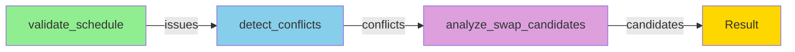
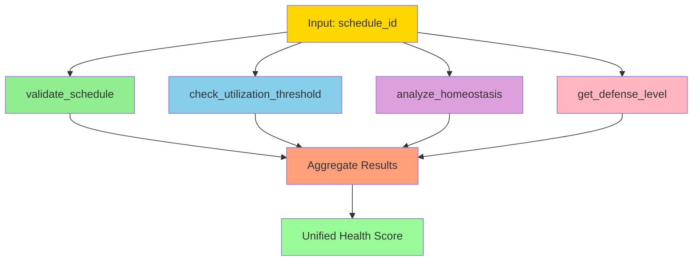
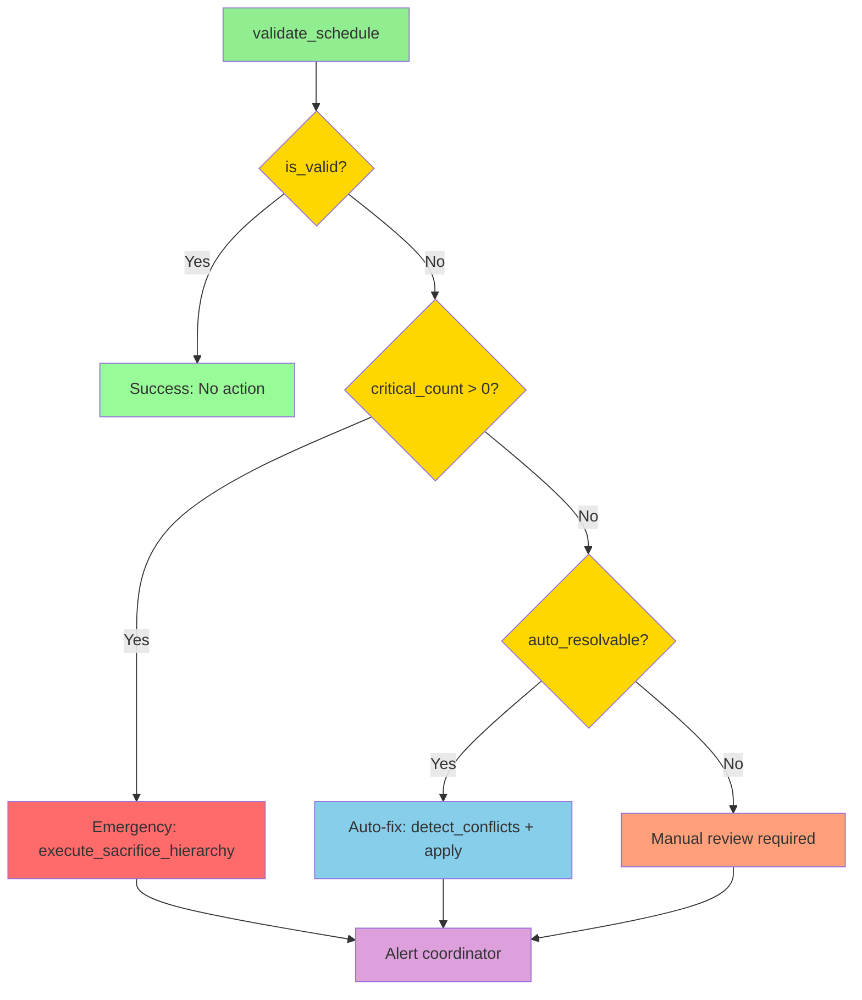
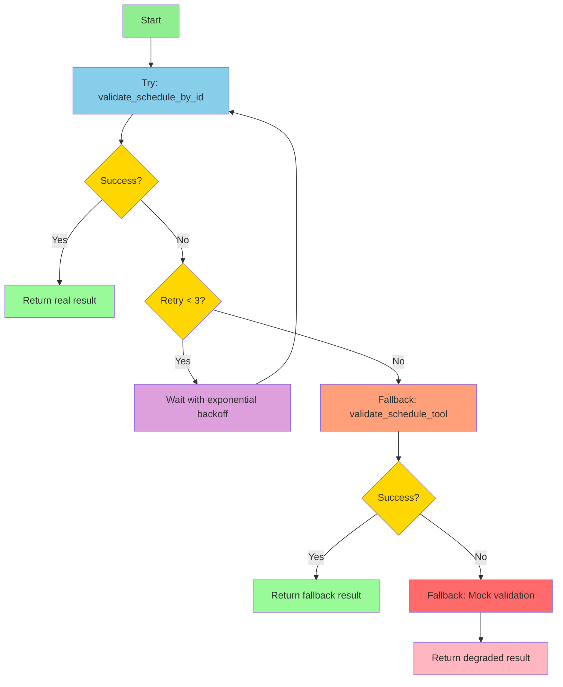
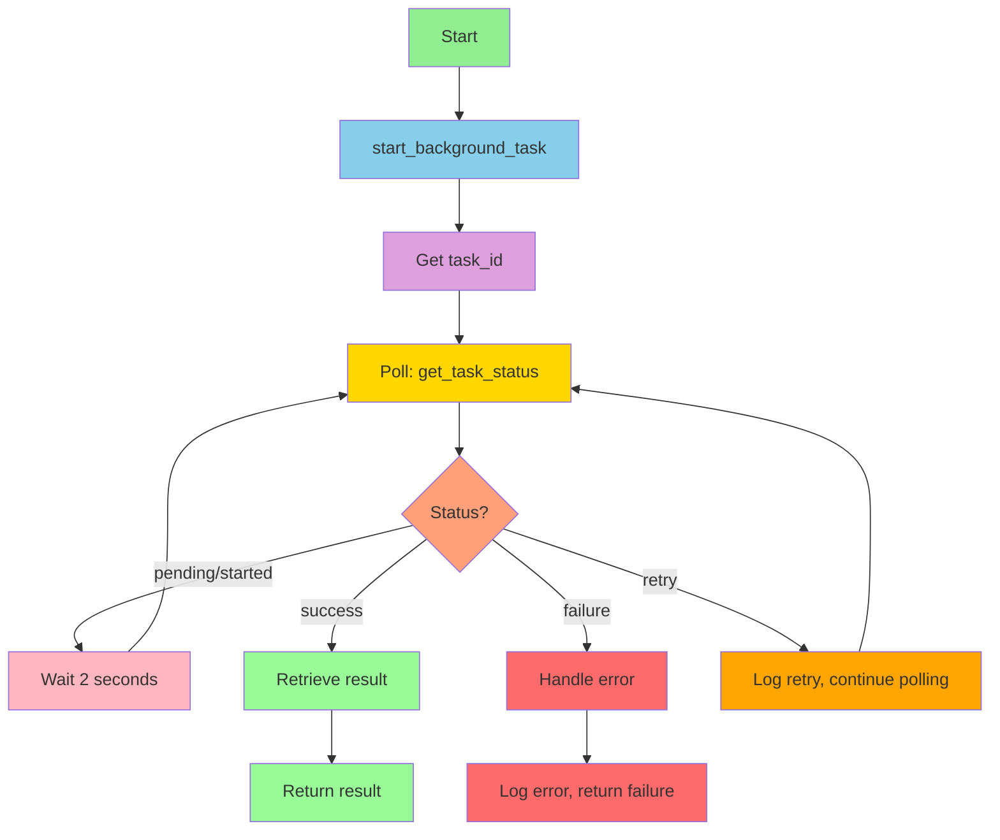
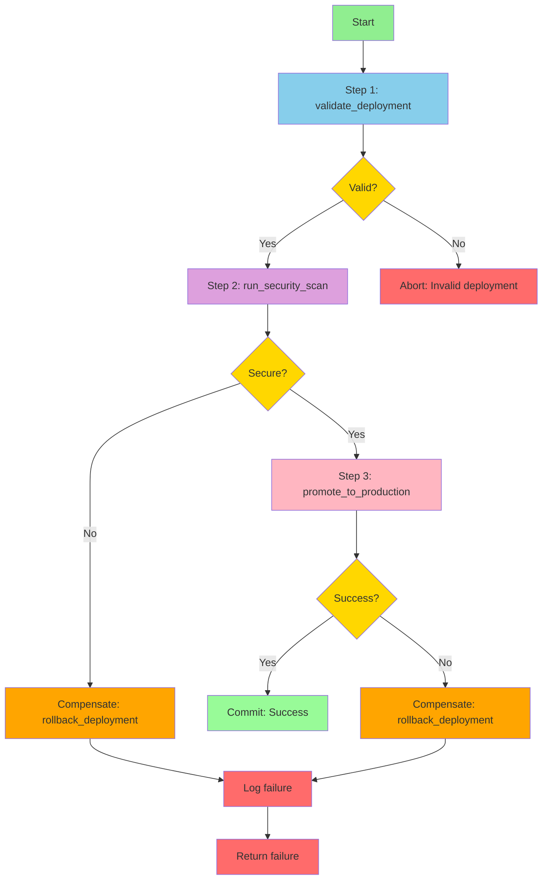

# Tool Composition Patterns

> **Last Updated:** 2025-12-26
> **Purpose:** Reusable patterns for composing MCP tools to build complex scheduling workflows

---

## Table of Contents

1. [Overview](#overview)
2. [Pattern Catalog](#pattern-catalog)
   - [Sequential Chain](#1-sequential-chain)
   - [Parallel Fan-Out](#2-parallel-fan-out)
   - [Conditional Branching](#3-conditional-branching)
   - [Retry with Fallback](#4-retry-with-fallback)
   - [Long-Running Task](#5-long-running-task)
   - [Transactional Saga](#6-transactional-saga)
3. [Advanced Patterns](#advanced-patterns)
4. [Real-World Examples](#real-world-examples)
5. [Anti-Patterns](#anti-patterns)

---

## Overview

### What is Tool Composition?

Tool composition is the practice of combining multiple MCP tools to accomplish complex tasks that no single tool can handle. The residency scheduler MCP server provides **34 tools** and **2 resources** that can be composed in various patterns.

### Available Tools (34 Total)

| Category | Count | Tools |
|----------|-------|-------|
| **Schedule Validation** | 2 | `validate_schedule`, `validate_schedule_by_id` |
| **Conflict & Contingency** | 3 | `detect_conflicts`, `run_contingency_analysis`, `analyze_swap_candidates` |
| **Async Task Management** | 4 | `start_background_task`, `get_task_status`, `cancel_task`, `list_active_tasks` |
| **Resilience Framework** | 13 | `check_utilization_threshold`, `get_defense_level`, `run_contingency_analysis_resilience`, `get_static_fallbacks`, `execute_sacrifice_hierarchy`, `analyze_homeostasis`, `calculate_blast_radius`, `analyze_le_chatelier`, `analyze_hub_centrality`, `assess_cognitive_load`, `get_behavioral_patterns`, `analyze_stigmergy`, `check_mtf_compliance` |
| **Deployment** | 7 | `validate_deployment`, `run_security_scan`, `run_smoke_tests`, `promote_to_production`, `rollback_deployment`, `get_deployment_status`, `list_deployments` |
| **Empirical Testing** | 5 | `benchmark_solvers`, `benchmark_constraints`, `ablation_study`, `benchmark_resilience`, `module_usage_analysis` |

### Available Resources (2 Total)

- `schedule://status` - Real-time schedule status
- `schedule://compliance` - ACGME compliance summary

### Design Principles

1. **Composition over Complexity**: Prefer combining simple tools over building monolithic tools
2. **Fail Fast**: Validate inputs early in the chain
3. **Graceful Degradation**: Provide fallbacks when tools fail
4. **Observability**: Log each step for debugging
5. **Idempotency**: Chains should be safe to retry

---

## Pattern Catalog

### 1. Sequential Chain

**Pattern:** A → B → C

**When to Use:**
- Each step depends on the output of the previous step
- Data flows linearly through transformations
- Order of operations matters

**When to Avoid:**
- Steps are independent (use Parallel Fan-Out instead)
- Need to handle multiple failure modes (use Conditional Branching)
- Steps take a long time (use Long-Running Task)

#### Diagram



#### TypeScript Implementation

```typescript
/**
 * Sequential chain: Validate → Detect Conflicts → Find Swap Candidates
 */
async function validateAndFixSchedule(
  scheduleId: string,
  startDate: string,
  endDate: string
): Promise<SwapRecommendations> {
  // Step 1: Validate schedule
  const validation = await mcp.call("validate_schedule_by_id", {
    schedule_id: scheduleId,
    constraint_config: "default",
    include_suggestions: true,
  });

  if (validation.is_valid) {
    return {
      status: "valid",
      recommendations: []
    };
  }

  // Step 2: Detect conflicts
  const conflicts = await mcp.call("detect_conflicts", {
    start_date: startDate,
    end_date: endDate,
    include_auto_resolution: true,
  });

  // Step 3: Find swap candidates for each conflict
  const recommendations: SwapRecommendation[] = [];

  for (const conflict of conflicts.conflicts) {
    if (conflict.type === "double_booking") {
      const swaps = await mcp.call("analyze_swap_candidates", {
        requester_person_id: conflict.affected_people[0],
        assignment_id: conflict.affected_assignments[0],
        max_candidates: 5,
      });

      recommendations.push({
        conflict_id: conflict.conflict_id,
        candidates: swaps.candidates,
      });
    }
  }

  return {
    status: "conflicts_found",
    recommendations,
  };
}
```

#### Python Implementation

```python
"""Sequential chain: Validate → Detect Conflicts → Find Swap Candidates"""
from typing import TypedDict
from datetime import date


class SwapRecommendation(TypedDict):
    conflict_id: str
    candidates: list


async def validate_and_fix_schedule(
    schedule_id: str,
    start_date: date,
    end_date: date
) -> dict:
    """
    Sequential chain to validate schedule and recommend fixes.

    Args:
        schedule_id: Schedule to validate
        start_date: Analysis start date
        end_date: Analysis end date

    Returns:
        Validation result with swap recommendations
    """
    # Step 1: Validate schedule
    validation = await mcp.call("validate_schedule_by_id", {
        "schedule_id": schedule_id,
        "constraint_config": "default",
        "include_suggestions": True,
    })

    if validation["is_valid"]:
        return {
            "status": "valid",
            "recommendations": []
        }

    # Step 2: Detect conflicts
    conflicts = await mcp.call("detect_conflicts", {
        "start_date": start_date.isoformat(),
        "end_date": end_date.isoformat(),
        "include_auto_resolution": True,
    })

    # Step 3: Find swap candidates for each conflict
    recommendations = []

    for conflict in conflicts["conflicts"]:
        if conflict["type"] == "double_booking":
            swaps = await mcp.call("analyze_swap_candidates", {
                "requester_person_id": conflict["affected_people"][0],
                "assignment_id": conflict["affected_assignments"][0],
                "max_candidates": 5,
            })

            recommendations.append({
                "conflict_id": conflict["conflict_id"],
                "candidates": swaps["candidates"],
            })

    return {
        "status": "conflicts_found",
        "recommendations": recommendations,
    }
```

#### Error Handling Strategy

```python
async def validate_and_fix_schedule_with_errors(
    schedule_id: str,
    start_date: date,
    end_date: date
) -> dict:
    """Sequential chain with comprehensive error handling."""
    try:
        # Step 1: Validate (with retry)
        validation = await retry_on_failure(
            lambda: mcp.call("validate_schedule_by_id", {
                "schedule_id": schedule_id,
            }),
            max_retries=3,
            backoff_seconds=2,
        )
    except Exception as e:
        logger.error(f"Validation failed: {e}")
        return {"error": "validation_failed", "message": str(e)}

    if validation["is_valid"]:
        return {"status": "valid"}

    try:
        # Step 2: Detect conflicts
        conflicts = await mcp.call("detect_conflicts", {
            "start_date": start_date.isoformat(),
            "end_date": end_date.isoformat(),
        })
    except Exception as e:
        logger.error(f"Conflict detection failed: {e}")
        # Graceful degradation: return validation issues only
        return {
            "status": "conflicts_unknown",
            "validation_issues": validation["issues"],
        }

    # Step 3: Continue with swap analysis...
    # (Rest of implementation)
```

---

### 2. Parallel Fan-Out

**Pattern:** A → [B, C, D] → Aggregate

**When to Use:**
- Multiple independent analyses needed
- Operations can run concurrently
- Need to combine results from multiple sources
- Want to reduce total latency

**When to Avoid:**
- Steps must run in order (use Sequential Chain)
- One step depends on another (use Sequential Chain)
- Operations share mutable state

#### Diagram



#### TypeScript Implementation

```typescript
/**
 * Parallel fan-out: Multiple independent health checks
 */
async function comprehensiveHealthCheck(
  scheduleId: string,
  startDate: string,
  endDate: string
): Promise<HealthReport> {
  // Fan-out: Launch all checks in parallel
  const [validation, utilization, homeostasis, defenseLevel] = await Promise.all([
    // Check 1: ACGME compliance
    mcp.call("validate_schedule_by_id", {
      schedule_id: scheduleId,
      constraint_config: "resilience",
    }),

    // Check 2: Utilization threshold
    mcp.call("check_utilization_threshold", {
      available_faculty: 15,
      required_blocks: 280,
      blocks_per_faculty_per_day: 2.0,
      days_in_period: 7,
    }),

    // Check 3: Homeostasis status
    mcp.call("analyze_homeostasis", {
      current_values: {
        workload_variance: 0.12,
        swap_rate_per_week: 2.3,
        coverage_rate: 0.95,
      },
    }),

    // Check 4: Defense level
    mcp.call("get_defense_level", {
      coverage_rate: 0.95,
    }),
  ]);

  // Aggregate: Combine results into unified score
  const healthScore = calculateHealthScore({
    compliance: validation.compliance_rate,
    utilization: utilization.utilization_rate,
    stability: homeostasis.stability_score,
    defense: defenseLevel.level,
  });

  return {
    overall_health: healthScore,
    details: {
      compliance: validation,
      utilization: utilization,
      homeostasis: homeostasis,
      defense: defenseLevel,
    },
    timestamp: new Date().toISOString(),
  };
}

function calculateHealthScore(metrics: {
  compliance: number;
  utilization: number;
  stability: number;
  defense: string;
}): number {
  // Weighted average
  const weights = {
    compliance: 0.4,
    utilization: 0.3,
    stability: 0.2,
    defense: 0.1,
  };

  const defenseScore = {
    "GREEN": 1.0,
    "YELLOW": 0.75,
    "ORANGE": 0.5,
    "RED": 0.25,
    "BLACK": 0.0,
  }[metrics.defense] || 0.5;

  return (
    metrics.compliance * weights.compliance +
    (1.0 - metrics.utilization) * weights.utilization +
    metrics.stability * weights.stability +
    defenseScore * weights.defense
  );
}
```

#### Python Implementation

```python
"""Parallel fan-out: Multiple independent health checks"""
import asyncio
from typing import TypedDict


class HealthReport(TypedDict):
    overall_health: float
    details: dict
    timestamp: str


async def comprehensive_health_check(
    schedule_id: str,
    start_date: str,
    end_date: str
) -> HealthReport:
    """
    Run multiple health checks in parallel and aggregate results.

    Args:
        schedule_id: Schedule to analyze
        start_date: Analysis start date
        end_date: Analysis end date

    Returns:
        Comprehensive health report with unified score
    """
    # Fan-out: Launch all checks concurrently
    validation_task = mcp.call("validate_schedule_by_id", {
        "schedule_id": schedule_id,
        "constraint_config": "resilience",
    })

    utilization_task = mcp.call("check_utilization_threshold", {
        "available_faculty": 15,
        "required_blocks": 280,
        "blocks_per_faculty_per_day": 2.0,
        "days_in_period": 7,
    })

    homeostasis_task = mcp.call("analyze_homeostasis", {
        "current_values": {
            "workload_variance": 0.12,
            "swap_rate_per_week": 2.3,
            "coverage_rate": 0.95,
        },
    })

    defense_task = mcp.call("get_defense_level", {
        "coverage_rate": 0.95,
    })

    # Gather: Wait for all to complete
    validation, utilization, homeostasis, defense = await asyncio.gather(
        validation_task,
        utilization_task,
        homeostasis_task,
        defense_task,
    )

    # Aggregate: Combine into unified score
    health_score = calculate_health_score(
        compliance=validation["compliance_rate"],
        utilization=utilization["utilization_rate"],
        stability=homeostasis["stability_score"],
        defense=defense["level"],
    )

    return {
        "overall_health": health_score,
        "details": {
            "compliance": validation,
            "utilization": utilization,
            "homeostasis": homeostasis,
            "defense": defense,
        },
        "timestamp": datetime.now().isoformat(),
    }


def calculate_health_score(
    compliance: float,
    utilization: float,
    stability: float,
    defense: str
) -> float:
    """Calculate weighted health score from multiple metrics."""
    weights = {
        "compliance": 0.4,
        "utilization": 0.3,
        "stability": 0.2,
        "defense": 0.1,
    }

    defense_scores = {
        "GREEN": 1.0,
        "YELLOW": 0.75,
        "ORANGE": 0.5,
        "RED": 0.25,
        "BLACK": 0.0,
    }

    defense_score = defense_scores.get(defense, 0.5)

    return (
        compliance * weights["compliance"] +
        (1.0 - utilization) * weights["utilization"] +
        stability * weights["stability"] +
        defense_score * weights["defense"]
    )
```

#### Error Handling Strategy

```python
async def comprehensive_health_check_with_errors(
    schedule_id: str
) -> HealthReport:
    """Parallel fan-out with graceful degradation."""
    # Launch all tasks
    tasks = {
        "validation": mcp.call("validate_schedule_by_id", {
            "schedule_id": schedule_id,
        }),
        "utilization": mcp.call("check_utilization_threshold", {
            "available_faculty": 15,
            "required_blocks": 280,
        }),
        "homeostasis": mcp.call("analyze_homeostasis", {
            "current_values": {"coverage_rate": 0.95},
        }),
        "defense": mcp.call("get_defense_level", {
            "coverage_rate": 0.95,
        }),
    }

    # Gather with exception handling
    results = {}
    errors = {}

    for name, task in tasks.items():
        try:
            results[name] = await task
        except Exception as e:
            logger.warning(f"Health check '{name}' failed: {e}")
            errors[name] = str(e)
            # Provide default/fallback value
            results[name] = get_default_result(name)

    # Calculate score with available data
    health_score = calculate_health_score_partial(results)

    return {
        "overall_health": health_score,
        "details": results,
        "errors": errors,
        "timestamp": datetime.now().isoformat(),
    }
```

---

### 3. Conditional Branching

**Pattern:** A → if(condition) B else C

**When to Use:**
- Different paths based on results
- Need to handle success vs. failure differently
- Want to optimize for common cases
- Implementing decision trees

**When to Avoid:**
- All paths needed (use Parallel Fan-Out)
- Condition is always true/false (simplify)
- Too many branches (refactor into separate functions)

#### Diagram



#### TypeScript Implementation

```typescript
/**
 * Conditional branching: Smart schedule validation with auto-fix
 */
async function smartScheduleValidation(
  scheduleId: string
): Promise<ValidationResult> {
  // Step 1: Validate schedule
  const validation = await mcp.call("validate_schedule_by_id", {
    schedule_id: scheduleId,
    constraint_config: "default",
    include_suggestions: true,
  });

  // Branch 1: Valid - no action needed
  if (validation.is_valid) {
    return {
      status: "valid",
      action: "none",
      message: "Schedule is compliant",
    };
  }

  // Branch 2: Critical violations - emergency response
  if (validation.critical_count > 0) {
    // Execute sacrifice hierarchy to shed load
    const sacrifice = await mcp.call("execute_sacrifice_hierarchy", {
      target_level: "orange",
      simulate_only: false,
    });

    await notifyCoordinator({
      severity: "critical",
      message: `Critical violations detected. Load shedding activated.`,
      details: validation.issues,
    });

    return {
      status: "critical",
      action: "load_shedding",
      sacrifice_result: sacrifice,
    };
  }

  // Branch 3: Auto-resolvable conflicts
  const autoResolvable = validation.issues.every(
    (issue) => issue.suggested_action !== null
  );

  if (autoResolvable) {
    // Detect conflicts and apply auto-fixes
    const conflicts = await mcp.call("detect_conflicts", {
      start_date: "2025-01-01",
      end_date: "2025-12-31",
      include_auto_resolution: true,
    });

    const fixes = await applyAutoFixes(conflicts);

    return {
      status: "auto_fixed",
      action: "conflicts_resolved",
      fixes_applied: fixes,
    };
  }

  // Branch 4: Manual review required
  await notifyCoordinator({
    severity: "warning",
    message: "Manual review required for validation issues",
    details: validation.issues,
  });

  return {
    status: "needs_review",
    action: "manual_intervention",
    issues: validation.issues,
  };
}
```

#### Python Implementation

```python
"""Conditional branching: Smart schedule validation with auto-fix"""
from enum import Enum


class ValidationStatus(Enum):
    VALID = "valid"
    CRITICAL = "critical"
    AUTO_FIXED = "auto_fixed"
    NEEDS_REVIEW = "needs_review"


async def smart_schedule_validation(schedule_id: str) -> dict:
    """
    Validate schedule with intelligent auto-fix routing.

    Args:
        schedule_id: Schedule to validate

    Returns:
        Validation result with action taken
    """
    # Step 1: Validate schedule
    validation = await mcp.call("validate_schedule_by_id", {
        "schedule_id": schedule_id,
        "constraint_config": "default",
        "include_suggestions": True,
    })

    # Branch 1: Valid - no action needed
    if validation["is_valid"]:
        return {
            "status": ValidationStatus.VALID.value,
            "action": "none",
            "message": "Schedule is compliant",
        }

    # Branch 2: Critical violations - emergency response
    if validation["critical_count"] > 0:
        # Execute sacrifice hierarchy
        sacrifice = await mcp.call("execute_sacrifice_hierarchy", {
            "target_level": "orange",
            "simulate_only": False,
        })

        await notify_coordinator(
            severity="critical",
            message="Critical violations detected. Load shedding activated.",
            details=validation["issues"],
        )

        return {
            "status": ValidationStatus.CRITICAL.value,
            "action": "load_shedding",
            "sacrifice_result": sacrifice,
        }

    # Branch 3: Auto-resolvable conflicts
    auto_resolvable = all(
        issue.get("suggested_action") is not None
        for issue in validation["issues"]
    )

    if auto_resolvable:
        conflicts = await mcp.call("detect_conflicts", {
            "start_date": "2025-01-01",
            "end_date": "2025-12-31",
            "include_auto_resolution": True,
        })

        fixes = await apply_auto_fixes(conflicts)

        return {
            "status": ValidationStatus.AUTO_FIXED.value,
            "action": "conflicts_resolved",
            "fixes_applied": fixes,
        }

    # Branch 4: Manual review required
    await notify_coordinator(
        severity="warning",
        message="Manual review required for validation issues",
        details=validation["issues"],
    )

    return {
        "status": ValidationStatus.NEEDS_REVIEW.value,
        "action": "manual_intervention",
        "issues": validation["issues"],
    }
```

#### Error Handling Strategy

```python
async def smart_schedule_validation_with_errors(schedule_id: str) -> dict:
    """Conditional branching with error recovery."""
    try:
        validation = await mcp.call("validate_schedule_by_id", {
            "schedule_id": schedule_id,
        })
    except Exception as e:
        logger.error(f"Validation failed: {e}")
        # Fallback: Mark as needs review
        return {
            "status": "error",
            "action": "validation_failed",
            "error": str(e),
        }

    if validation["is_valid"]:
        return {"status": "valid"}

    # Try auto-fix with fallback
    try:
        if validation["critical_count"] > 0:
            # Try emergency response
            sacrifice = await mcp.call("execute_sacrifice_hierarchy", {
                "target_level": "orange",
                "simulate_only": True,  # Simulate first for safety
            })

            # If simulation successful, apply for real
            if sacrifice["feasibility_score"] > 0.7:
                await mcp.call("execute_sacrifice_hierarchy", {
                    "target_level": "orange",
                    "simulate_only": False,
                })
                return {"status": "critical", "action": "load_shedding"}
    except Exception as e:
        logger.warning(f"Auto-fix failed: {e}")

    # Fallback: Manual review
    return {
        "status": "needs_review",
        "action": "manual_intervention",
    }
```

---

### 4. Retry with Fallback

**Pattern:** try A, catch → B

**When to Use:**
- Transient failures expected (network, rate limits)
- Degraded mode acceptable
- Want resilience to external dependencies
- Need to provide best-effort results

**When to Avoid:**
- Failures are permanent (bad input)
- No acceptable fallback exists
- Retrying makes problem worse (thundering herd)

#### Diagram



#### TypeScript Implementation

```typescript
/**
 * Retry with fallback: Resilient validation with graceful degradation
 */
async function resilientValidation(
  scheduleId: string,
  maxRetries: number = 3
): Promise<ValidationResult> {
  let lastError: Error | null = null;

  // Primary attempt with retries
  for (let attempt = 1; attempt <= maxRetries; attempt++) {
    try {
      const result = await mcp.call("validate_schedule_by_id", {
        schedule_id: scheduleId,
        constraint_config: "default",
      });

      return {
        source: "primary",
        result: result,
        degraded: false,
      };
    } catch (error) {
      lastError = error as Error;
      logger.warn(
        `Validation attempt ${attempt}/${maxRetries} failed: ${error.message}`
      );

      if (attempt < maxRetries) {
        // Exponential backoff: 2^attempt seconds
        const backoffMs = Math.pow(2, attempt) * 1000;
        await sleep(backoffMs);
      }
    }
  }

  // Fallback 1: Try alternative validation tool
  try {
    logger.info("Primary validation failed, trying fallback...");
    const result = await mcp.call("validate_schedule", {
      start_date: "2025-01-01",
      end_date: "2025-12-31",
      check_work_hours: true,
      check_supervision: true,
    });

    return {
      source: "fallback_tool",
      result: result,
      degraded: true,
    };
  } catch (error) {
    logger.error(`Fallback validation also failed: ${error.message}`);
  }

  // Fallback 2: Return mock validation (degraded mode)
  logger.warn("All validation methods failed, returning mock data");
  return {
    source: "mock",
    result: {
      is_valid: false,
      compliance_rate: 0.0,
      issues: [
        {
          severity: "critical",
          message: "Unable to validate schedule - service unavailable",
          rule_type: "system",
        },
      ],
    },
    degraded: true,
    error: lastError?.message,
  };
}

function sleep(ms: number): Promise<void> {
  return new Promise((resolve) => setTimeout(resolve, ms));
}
```

#### Python Implementation

```python
"""Retry with fallback: Resilient validation with graceful degradation"""
import asyncio
from typing import Optional


async def resilient_validation(
    schedule_id: str,
    max_retries: int = 3
) -> dict:
    """
    Validate schedule with retry logic and fallback strategies.

    Args:
        schedule_id: Schedule to validate
        max_retries: Maximum retry attempts

    Returns:
        Validation result with degradation indicator
    """
    last_error: Optional[Exception] = None

    # Primary attempt with retries
    for attempt in range(1, max_retries + 1):
        try:
            result = await mcp.call("validate_schedule_by_id", {
                "schedule_id": schedule_id,
                "constraint_config": "default",
            })

            return {
                "source": "primary",
                "result": result,
                "degraded": False,
            }
        except Exception as e:
            last_error = e
            logger.warning(
                f"Validation attempt {attempt}/{max_retries} failed: {e}"
            )

            if attempt < max_retries:
                # Exponential backoff: 2^attempt seconds
                backoff_seconds = 2 ** attempt
                await asyncio.sleep(backoff_seconds)

    # Fallback 1: Try alternative validation tool
    try:
        logger.info("Primary validation failed, trying fallback...")
        result = await mcp.call("validate_schedule", {
            "start_date": "2025-01-01",
            "end_date": "2025-12-31",
            "check_work_hours": True,
            "check_supervision": True,
        })

        return {
            "source": "fallback_tool",
            "result": result,
            "degraded": True,
        }
    except Exception as e:
        logger.error(f"Fallback validation also failed: {e}")

    # Fallback 2: Return mock validation (degraded mode)
    logger.warning("All validation methods failed, returning mock data")
    return {
        "source": "mock",
        "result": {
            "is_valid": False,
            "compliance_rate": 0.0,
            "issues": [{
                "severity": "critical",
                "message": "Unable to validate schedule - service unavailable",
                "rule_type": "system",
            }],
        },
        "degraded": True,
        "error": str(last_error) if last_error else None,
    }
```

#### Error Handling Strategy

```python
async def resilient_validation_with_circuit_breaker(
    schedule_id: str
) -> dict:
    """Retry with circuit breaker to prevent cascade failures."""
    circuit_breaker = CircuitBreaker(
        failure_threshold=3,
        timeout_seconds=60,
        expected_exception=APIError,
    )

    # Check circuit breaker state
    if circuit_breaker.is_open():
        logger.warning("Circuit breaker is OPEN, skipping to fallback")
        return await fallback_validation(schedule_id)

    try:
        result = await circuit_breaker.call(
            lambda: mcp.call("validate_schedule_by_id", {
                "schedule_id": schedule_id,
            })
        )
        return {"source": "primary", "result": result}
    except CircuitBreakerOpen:
        logger.error("Circuit breaker opened due to repeated failures")
        return await fallback_validation(schedule_id)


async def fallback_validation(schedule_id: str) -> dict:
    """Fallback validation strategy."""
    # Could use cached results, simplified validation, or mock data
    return {
        "source": "fallback",
        "result": {"is_valid": False, "message": "Service degraded"},
        "degraded": True,
    }
```

---

### 5. Long-Running Task

**Pattern:** start_task → poll_status(loop) → get_result

**When to Use:**
- Operation takes more than a few seconds
- Don't want to block on completion
- Need to show progress to user
- Want to cancel in-flight tasks

**When to Avoid:**
- Task completes in < 5 seconds (use synchronous call)
- No polling infrastructure (use Sequential Chain)
- Can't handle task failures gracefully

#### Diagram



#### TypeScript Implementation

```typescript
/**
 * Long-running task: Resilience health check with polling
 */
async function runResilienceHealthCheck(
  daysAhead: number = 90
): Promise<HealthCheckResult> {
  // Step 1: Start background task
  const taskInfo = await mcp.call("start_background_task", {
    task_type: "resilience_health_check",
    params: {
      days_ahead: daysAhead,
    },
  });

  const taskId = taskInfo.task_id;
  logger.info(`Started resilience health check: ${taskId}`);

  // Step 2: Poll for completion
  const maxPollTime = 300; // 5 minutes
  const pollInterval = 2; // 2 seconds
  let elapsed = 0;

  while (elapsed < maxPollTime) {
    const status = await mcp.call("get_task_status", {
      task_id: taskId,
    });

    switch (status.status) {
      case "success":
        logger.info(`Task ${taskId} completed successfully`);
        return {
          success: true,
          result: status.result,
          elapsed_seconds: elapsed,
        };

      case "failure":
        logger.error(`Task ${taskId} failed: ${status.error}`);
        return {
          success: false,
          error: status.error,
          elapsed_seconds: elapsed,
        };

      case "retry":
        logger.warn(`Task ${taskId} is retrying...`);
        break;

      case "pending":
      case "started":
        // Still running, continue polling
        break;

      default:
        logger.warn(`Unknown task status: ${status.status}`);
    }

    // Wait before next poll
    await sleep(pollInterval * 1000);
    elapsed += pollInterval;
  }

  // Timeout - cancel task
  logger.error(`Task ${taskId} timed out after ${maxPollTime}s`);
  await mcp.call("cancel_task", { task_id: taskId });

  return {
    success: false,
    error: "Task timed out",
    elapsed_seconds: elapsed,
  };
}
```

#### Python Implementation

```python
"""Long-running task: Resilience health check with polling"""
import asyncio
from typing import Optional


async def run_resilience_health_check(
    days_ahead: int = 90
) -> dict:
    """
    Run resilience health check as background task with polling.

    Args:
        days_ahead: Days to analyze ahead

    Returns:
        Health check result or error
    """
    # Step 1: Start background task
    task_info = await mcp.call("start_background_task", {
        "task_type": "resilience_health_check",
        "params": {
            "days_ahead": days_ahead,
        },
    })

    task_id = task_info["task_id"]
    logger.info(f"Started resilience health check: {task_id}")

    # Step 2: Poll for completion
    max_poll_time = 300  # 5 minutes
    poll_interval = 2    # 2 seconds
    elapsed = 0

    while elapsed < max_poll_time:
        status = await mcp.call("get_task_status", {
            "task_id": task_id,
        })

        if status["status"] == "success":
            logger.info(f"Task {task_id} completed successfully")
            return {
                "success": True,
                "result": status["result"],
                "elapsed_seconds": elapsed,
            }

        elif status["status"] == "failure":
            logger.error(f"Task {task_id} failed: {status['error']}")
            return {
                "success": False,
                "error": status["error"],
                "elapsed_seconds": elapsed,
            }

        elif status["status"] == "retry":
            logger.warning(f"Task {task_id} is retrying...")

        elif status["status"] in ["pending", "started"]:
            # Still running, continue polling
            pass

        else:
            logger.warning(f"Unknown task status: {status['status']}")

        # Wait before next poll
        await asyncio.sleep(poll_interval)
        elapsed += poll_interval

    # Timeout - cancel task
    logger.error(f"Task {task_id} timed out after {max_poll_time}s")
    await mcp.call("cancel_task", {"task_id": task_id})

    return {
        "success": False,
        "error": "Task timed out",
        "elapsed_seconds": elapsed,
    }
```

#### Error Handling Strategy

```python
async def run_resilience_health_check_with_progress(
    days_ahead: int,
    progress_callback: Optional[callable] = None
) -> dict:
    """Long-running task with progress reporting."""
    task_info = await mcp.call("start_background_task", {
        "task_type": "resilience_health_check",
        "params": {"days_ahead": days_ahead},
    })

    task_id = task_info["task_id"]
    max_poll_time = 300
    poll_interval = 2
    elapsed = 0

    while elapsed < max_poll_time:
        try:
            status = await mcp.call("get_task_status", {
                "task_id": task_id,
            })
        except Exception as e:
            logger.error(f"Failed to get task status: {e}")
            # Retry status check
            await asyncio.sleep(poll_interval)
            elapsed += poll_interval
            continue

        # Report progress
        if progress_callback:
            progress_callback({
                "task_id": task_id,
                "status": status["status"],
                "progress": status.get("progress", 0),
                "elapsed": elapsed,
            })

        # Check for completion
        if status["status"] in ["success", "failure"]:
            return {
                "success": status["status"] == "success",
                "result": status.get("result"),
                "error": status.get("error"),
            }

        await asyncio.sleep(poll_interval)
        elapsed += poll_interval

    # Timeout
    try:
        await mcp.call("cancel_task", {"task_id": task_id})
    except Exception as e:
        logger.error(f"Failed to cancel task: {e}")

    return {"success": False, "error": "Timeout"}
```

---

### 6. Transactional Saga

**Pattern:** A → B → C, compensate on failure

**When to Use:**
- Multi-step write operations
- Need to maintain consistency
- Want to rollback on failure
- Implementing distributed transactions

**When to Avoid:**
- Single atomic operation (use simple call)
- No compensation possible (use best-effort)
- Steps are independent (use Parallel Fan-Out)

#### Diagram



#### TypeScript Implementation

```typescript
/**
 * Transactional saga: Production deployment with rollback
 */
async function safeProductionDeployment(
  gitRef: string,
  approvalToken: string
): Promise<DeploymentResult> {
  let deploymentId: string | null = null;
  const compensations: (() => Promise<void>)[] = [];

  try {
    // Step 1: Validate deployment
    logger.info(`Step 1: Validating deployment of ${gitRef}`);
    const validation = await mcp.call("validate_deployment", {
      environment: "production",
      git_ref: gitRef,
      dry_run: false,
    });

    if (!validation.valid) {
      logger.error("Deployment validation failed");
      throw new Error(
        `Deployment blocked: ${validation.blockers.join(", ")}`
      );
    }

    // Step 2: Security scan
    logger.info("Step 2: Running security scan");
    const securityScan = await mcp.call("run_security_scan", {
      git_ref: gitRef,
      dry_run: false,
    });

    if (securityScan.severity_summary.critical > 0) {
      logger.error("Critical security vulnerabilities found");
      throw new Error(
        `${securityScan.severity_summary.critical} critical vulnerabilities`
      );
    }

    // Step 3: Promote to production
    logger.info("Step 3: Promoting to production");
    const promotion = await mcp.call("promote_to_production", {
      staging_version: gitRef,
      approval_token: approvalToken,
      dry_run: false,
    });

    deploymentId = promotion.deployment_id;

    // Add compensation: rollback if anything fails later
    compensations.push(async () => {
      logger.warn(`Compensating: Rolling back deployment ${deploymentId}`);
      await mcp.call("rollback_deployment", {
        environment: "production",
        reason: "Automatic rollback due to post-deployment failure",
        dry_run: false,
      });
    });

    // Step 4: Smoke tests
    logger.info("Step 4: Running smoke tests");
    const smokeTests = await mcp.call("run_smoke_tests", {
      environment: "production",
      test_suite: "full",
      timeout_seconds: 300,
    });

    if (!smokeTests.passed) {
      logger.error("Smoke tests failed");
      throw new Error(
        `${smokeTests.failed_count} smoke tests failed`
      );
    }

    // Success!
    logger.info(`Deployment ${deploymentId} completed successfully`);
    return {
      success: true,
      deployment_id: deploymentId,
      git_ref: gitRef,
    };
  } catch (error) {
    logger.error(`Deployment failed: ${error.message}`);

    // Execute compensations in reverse order
    for (const compensate of compensations.reverse()) {
      try {
        await compensate();
      } catch (compError) {
        logger.error(`Compensation failed: ${compError.message}`);
      }
    }

    return {
      success: false,
      error: error.message,
      deployment_id: deploymentId,
    };
  }
}
```

#### Python Implementation

```python
"""Transactional saga: Production deployment with rollback"""
from typing import List, Callable, Optional


async def safe_production_deployment(
    git_ref: str,
    approval_token: str
) -> dict:
    """
    Deploy to production with automatic rollback on failure.

    Implements saga pattern: each step has a compensation action
    that is executed if any subsequent step fails.

    Args:
        git_ref: Git reference to deploy
        approval_token: Human approval token

    Returns:
        Deployment result with success indicator
    """
    deployment_id: Optional[str] = None
    compensations: List[Callable] = []

    try:
        # Step 1: Validate deployment
        logger.info(f"Step 1: Validating deployment of {git_ref}")
        validation = await mcp.call("validate_deployment", {
            "environment": "production",
            "git_ref": git_ref,
            "dry_run": False,
        })

        if not validation["valid"]:
            logger.error("Deployment validation failed")
            raise ValueError(
                f"Deployment blocked: {', '.join(validation['blockers'])}"
            )

        # Step 2: Security scan
        logger.info("Step 2: Running security scan")
        security_scan = await mcp.call("run_security_scan", {
            "git_ref": git_ref,
            "dry_run": False,
        })

        if security_scan["severity_summary"]["critical"] > 0:
            logger.error("Critical security vulnerabilities found")
            raise ValueError(
                f"{security_scan['severity_summary']['critical']} "
                "critical vulnerabilities"
            )

        # Step 3: Promote to production
        logger.info("Step 3: Promoting to production")
        promotion = await mcp.call("promote_to_production", {
            "staging_version": git_ref,
            "approval_token": approval_token,
            "dry_run": False,
        })

        deployment_id = promotion["deployment_id"]

        # Add compensation: rollback if anything fails later
        async def rollback_compensation():
            logger.warning(f"Compensating: Rolling back {deployment_id}")
            await mcp.call("rollback_deployment", {
                "environment": "production",
                "reason": "Automatic rollback due to post-deployment failure",
                "dry_run": False,
            })

        compensations.append(rollback_compensation)

        # Step 4: Smoke tests
        logger.info("Step 4: Running smoke tests")
        smoke_tests = await mcp.call("run_smoke_tests", {
            "environment": "production",
            "test_suite": "full",
            "timeout_seconds": 300,
        })

        if not smoke_tests["passed"]:
            logger.error("Smoke tests failed")
            raise ValueError(
                f"{smoke_tests['failed_count']} smoke tests failed"
            )

        # Success!
        logger.info(f"Deployment {deployment_id} completed successfully")
        return {
            "success": True,
            "deployment_id": deployment_id,
            "git_ref": git_ref,
        }

    except Exception as e:
        logger.error(f"Deployment failed: {e}")

        # Execute compensations in reverse order
        for compensate in reversed(compensations):
            try:
                await compensate()
            except Exception as comp_error:
                logger.error(f"Compensation failed: {comp_error}")

        return {
            "success": False,
            "error": str(e),
            "deployment_id": deployment_id,
        }
```

#### Error Handling Strategy

```python
async def safe_production_deployment_with_checkpoints(
    git_ref: str,
    approval_token: str
) -> dict:
    """Saga with checkpointing for recovery."""
    checkpoints = []

    def checkpoint(step_name: str, data: dict):
        """Save checkpoint for recovery."""
        checkpoints.append({
            "step": step_name,
            "timestamp": datetime.now(),
            "data": data,
        })
        logger.info(f"Checkpoint: {step_name}")

    try:
        # Step 1: Validate
        validation = await mcp.call("validate_deployment", {...})
        checkpoint("validation", {"valid": validation["valid"]})

        if not validation["valid"]:
            raise ValueError("Invalid deployment")

        # Step 2: Security scan
        scan = await mcp.call("run_security_scan", {...})
        checkpoint("security_scan", {
            "critical": scan["severity_summary"]["critical"]
        })

        # Step 3: Promote
        promotion = await mcp.call("promote_to_production", {...})
        checkpoint("promotion", {
            "deployment_id": promotion["deployment_id"]
        })

        # Step 4: Smoke tests
        tests = await mcp.call("run_smoke_tests", {...})
        checkpoint("smoke_tests", {"passed": tests["passed"]})

        return {"success": True, "checkpoints": checkpoints}

    except Exception as e:
        # Save failure checkpoint
        checkpoint("failure", {"error": str(e)})

        # Attempt recovery based on last successful checkpoint
        last_checkpoint = checkpoints[-1] if checkpoints else None

        if last_checkpoint and last_checkpoint["step"] == "promotion":
            # We deployed but tests failed - rollback
            await rollback_with_retry(
                deployment_id=last_checkpoint["data"]["deployment_id"]
            )

        return {
            "success": False,
            "error": str(e),
            "checkpoints": checkpoints,
        }
```

---

## Advanced Patterns

### 7. Map-Reduce

**Pattern:** map(items, tool) → reduce(results)

**When to Use:**
- Process collection of items
- Each item processed independently
- Need to aggregate results

**Example:**

```python
async def analyze_all_faculty_centrality() -> dict:
    """Analyze hub centrality for all faculty members."""
    # Get all faculty IDs
    faculty_ids = await get_all_faculty_ids()

    # Map: Analyze each faculty member in parallel
    analyses = await asyncio.gather(*[
        mcp.call("analyze_hub_centrality", {
            "person_id": faculty_id,
        })
        for faculty_id in faculty_ids
    ])

    # Reduce: Aggregate into single report
    total_centrality = sum(a["centrality_score"] for a in analyses)
    critical_faculty = [
        a for a in analyses
        if a["is_critical_node"]
    ]

    return {
        "total_faculty": len(faculty_ids),
        "average_centrality": total_centrality / len(faculty_ids),
        "critical_count": len(critical_faculty),
        "critical_faculty": critical_faculty,
    }
```

### 8. Pipeline with Transformation

**Pattern:** A → transform → B → transform → C

**When to Use:**
- Data needs transformation between steps
- Each tool expects different format
- Building ETL workflows

**Example:**

```python
async def deployment_pipeline(git_ref: str) -> dict:
    """Complete deployment pipeline with data transformations."""
    # Step 1: Validate (returns validation result)
    validation = await mcp.call("validate_deployment", {
        "environment": "production",
        "git_ref": git_ref,
    })

    # Transform: Extract blockers for security scan
    blockers_to_scan = [
        b for b in validation["blockers"]
        if "security" in b.lower()
    ]

    # Step 2: Security scan (if needed)
    if blockers_to_scan:
        scan = await mcp.call("run_security_scan", {
            "git_ref": git_ref,
        })

        # Transform: Convert vulnerabilities to validation format
        validation["blockers"].extend([
            f"Security: {v['description']}"
            for v in scan["vulnerabilities"]
            if v["severity"] == "critical"
        ])

    # Step 3: Final decision
    return {
        "can_deploy": len(validation["blockers"]) == 0,
        "blockers": validation["blockers"],
    }
```

### 9. Circuit Breaker Pattern

**Pattern:** Monitor failures → Open circuit → Half-open test → Close

**When to Use:**
- Protect against cascade failures
- External service is unstable
- Want to fail fast during outages

**Example:**

```python
class CircuitBreaker:
    """Circuit breaker for MCP tool calls."""

    def __init__(self, failure_threshold: int = 5, timeout_seconds: int = 60):
        self.failure_threshold = failure_threshold
        self.timeout = timeout_seconds
        self.failures = 0
        self.last_failure_time = None
        self.state = "CLOSED"  # CLOSED, OPEN, HALF_OPEN

    async def call(self, tool_name: str, params: dict) -> dict:
        """Call MCP tool with circuit breaker protection."""
        # Check circuit state
        if self.state == "OPEN":
            if time.time() - self.last_failure_time > self.timeout:
                self.state = "HALF_OPEN"
                logger.info("Circuit breaker entering HALF_OPEN state")
            else:
                raise CircuitBreakerOpen(
                    f"Circuit breaker OPEN for {tool_name}"
                )

        try:
            # Attempt call
            result = await mcp.call(tool_name, params)

            # Success - reset on half-open
            if self.state == "HALF_OPEN":
                self.state = "CLOSED"
                self.failures = 0
                logger.info("Circuit breaker CLOSED after successful test")

            return result

        except Exception as e:
            self.failures += 1
            self.last_failure_time = time.time()

            # Open circuit if threshold reached
            if self.failures >= self.failure_threshold:
                self.state = "OPEN"
                logger.error(
                    f"Circuit breaker OPEN after {self.failures} failures"
                )

            raise


# Usage
breaker = CircuitBreaker(failure_threshold=3, timeout_seconds=60)

async def resilient_validation(schedule_id: str) -> dict:
    """Validate with circuit breaker protection."""
    try:
        return await breaker.call("validate_schedule_by_id", {
            "schedule_id": schedule_id,
        })
    except CircuitBreakerOpen:
        # Use fallback when circuit is open
        return await fallback_validation(schedule_id)
```

---

## Real-World Examples

### Example 1: Complete Schedule Health Check

Combines multiple patterns to provide comprehensive health assessment:

```python
async def complete_schedule_health_check(
    schedule_id: str,
    start_date: str,
    end_date: str
) -> dict:
    """
    Comprehensive health check combining:
    - Parallel Fan-Out (multiple independent checks)
    - Sequential Chain (validation → conflicts → fixes)
    - Conditional Branching (auto-fix vs manual review)
    """
    # Parallel fan-out: Independent health checks
    validation, utilization, resilience, mtf = await asyncio.gather(
        mcp.call("validate_schedule_by_id", {
            "schedule_id": schedule_id,
        }),
        mcp.call("check_utilization_threshold", {
            "available_faculty": 15,
            "required_blocks": 280,
        }),
        mcp.call("run_contingency_analysis_resilience", {
            "analyze_n1": True,
            "analyze_n2": True,
        }),
        mcp.call("check_mtf_compliance", {
            "generate_sitrep": True,
        }),
    )

    # Conditional branching: Auto-fix if possible
    if not validation["is_valid"]:
        # Sequential chain: Detect conflicts → Find swaps
        conflicts = await mcp.call("detect_conflicts", {
            "start_date": start_date,
            "end_date": end_date,
        })

        if conflicts["summary"]["auto_resolvable"] > 0:
            # Auto-fix available
            fixes = await apply_auto_fixes(conflicts)
            action = "auto_fixed"
        else:
            # Manual review needed
            action = "needs_review"
            fixes = None
    else:
        action = "no_action"
        fixes = None

    return {
        "overall_health": calculate_health_score({
            "compliance": validation["compliance_rate"],
            "utilization": utilization["utilization_rate"],
            "resilience": resilience["vulnerability_score"],
        }),
        "details": {
            "validation": validation,
            "utilization": utilization,
            "resilience": resilience,
            "mtf": mtf,
        },
        "action_taken": action,
        "fixes": fixes,
    }
```

### Example 2: Deployment Workflow with Safeguards

Combines saga pattern with long-running tasks:

```python
async def safe_deployment_workflow(
    git_ref: str,
    approval_token: str
) -> dict:
    """
    Complete deployment workflow combining:
    - Transactional Saga (validate → scan → deploy → test)
    - Long-Running Task (smoke tests)
    - Retry with Fallback (resilient validation)
    """
    compensations = []

    try:
        # Step 1: Validate (with retry)
        validation = await resilient_call(
            "validate_deployment",
            {"environment": "production", "git_ref": git_ref},
            max_retries=3,
        )

        if not validation["valid"]:
            raise ValueError(f"Blockers: {validation['blockers']}")

        # Step 2: Security scan
        scan = await mcp.call("run_security_scan", {
            "git_ref": git_ref,
        })

        if scan["severity_summary"]["critical"] > 0:
            raise ValueError("Critical vulnerabilities found")

        # Step 3: Promote
        promotion = await mcp.call("promote_to_production", {
            "staging_version": git_ref,
            "approval_token": approval_token,
        })

        deployment_id = promotion["deployment_id"]

        # Add compensation
        compensations.append(lambda: rollback_deployment(deployment_id))

        # Step 4: Long-running smoke tests
        test_task = await mcp.call("start_background_task", {
            "task_type": "smoke_tests",
            "params": {"environment": "production"},
        })

        # Poll for completion
        test_result = await poll_task(test_task["task_id"], timeout=300)

        if not test_result["passed"]:
            raise ValueError("Smoke tests failed")

        return {"success": True, "deployment_id": deployment_id}

    except Exception as e:
        # Execute compensations
        for compensate in reversed(compensations):
            await compensate()

        return {"success": False, "error": str(e)}
```

### Example 3: Resilience Monitoring Dashboard

Real-time monitoring using parallel checks and resource subscriptions:

```python
async def resilience_monitoring_dashboard() -> dict:
    """
    Real-time resilience monitoring combining:
    - Parallel Fan-Out (13 resilience tools)
    - Resource Subscription (schedule://status, schedule://compliance)
    - Map-Reduce (aggregate across all metrics)
    """
    # Parallel fan-out: All resilience checks
    results = await asyncio.gather(
        mcp.call("check_utilization_threshold", {...}),
        mcp.call("get_defense_level", {...}),
        mcp.call("run_contingency_analysis_resilience", {...}),
        mcp.call("get_static_fallbacks", {}),
        mcp.call("analyze_homeostasis", {...}),
        mcp.call("calculate_blast_radius", {...}),
        mcp.call("analyze_hub_centrality", {}),
        mcp.call("assess_cognitive_load", {...}),
        mcp.call("check_mtf_compliance", {...}),
        # Also fetch resources
        mcp.resource("schedule://status"),
        mcp.resource("schedule://compliance"),
    )

    # Unpack results
    (utilization, defense, contingency, fallbacks, homeostasis,
     blast, hubs, cognitive, mtf, status, compliance) = results

    # Aggregate into dashboard
    return {
        "timestamp": datetime.now().isoformat(),
        "status": status,
        "compliance": compliance,
        "resilience": {
            "utilization": utilization,
            "defense_level": defense["level"],
            "n1_vulnerability": contingency["n1_vulnerabilities"],
            "n2_vulnerability": contingency["n2_vulnerabilities"],
            "fallback_count": len(fallbacks["available_fallbacks"]),
            "homeostasis_status": homeostasis["status"],
            "blast_radius_score": blast["containment_score"],
            "critical_hubs": len(hubs["critical_nodes"]),
            "cognitive_load": cognitive["load_score"],
            "mtf_rating": mtf["drrs_rating"],
        },
    }
```

---

## Anti-Patterns

### ❌ Anti-Pattern 1: Waterfall Chain Without Error Handling

**Bad:**

```python
async def bad_validation():
    # No error handling - any failure kills entire chain
    result1 = await mcp.call("validate_schedule", {...})
    result2 = await mcp.call("detect_conflicts", {...})
    result3 = await mcp.call("analyze_swap_candidates", {...})
    return result3
```

**Good:**

```python
async def good_validation():
    try:
        result1 = await mcp.call("validate_schedule", {...})
    except Exception as e:
        logger.error(f"Validation failed: {e}")
        return {"error": "validation_failed"}

    # Continue with error handling at each step...
```

### ❌ Anti-Pattern 2: Sequential When Parallel Would Work

**Bad:**

```python
async def bad_health_check():
    # Sequential - takes 4x longer than necessary
    util = await mcp.call("check_utilization_threshold", {...})
    defense = await mcp.call("get_defense_level", {...})
    homeostasis = await mcp.call("analyze_homeostasis", {...})
    mtf = await mcp.call("check_mtf_compliance", {...})
    return aggregate(util, defense, homeostasis, mtf)
```

**Good:**

```python
async def good_health_check():
    # Parallel - 4x faster
    util, defense, homeostasis, mtf = await asyncio.gather(
        mcp.call("check_utilization_threshold", {...}),
        mcp.call("get_defense_level", {...}),
        mcp.call("analyze_homeostasis", {...}),
        mcp.call("check_mtf_compliance", {...}),
    )
    return aggregate(util, defense, homeostasis, mtf)
```

### ❌ Anti-Pattern 3: Polling Too Frequently

**Bad:**

```python
async def bad_task_polling(task_id):
    while True:
        status = await mcp.call("get_task_status", {"task_id": task_id})
        if status["status"] == "success":
            return status["result"]
        # No sleep - hammers API constantly
```

**Good:**

```python
async def good_task_polling(task_id):
    while True:
        status = await mcp.call("get_task_status", {"task_id": task_id})
        if status["status"] == "success":
            return status["result"]
        await asyncio.sleep(2)  # Reasonable polling interval
```

### ❌ Anti-Pattern 4: No Timeout on Polling

**Bad:**

```python
async def bad_task_wait(task_id):
    # Could wait forever
    while True:
        status = await mcp.call("get_task_status", {"task_id": task_id})
        if status["status"] == "success":
            return status
        await asyncio.sleep(2)
```

**Good:**

```python
async def good_task_wait(task_id, timeout=300):
    elapsed = 0
    while elapsed < timeout:
        status = await mcp.call("get_task_status", {"task_id": task_id})
        if status["status"] == "success":
            return status
        await asyncio.sleep(2)
        elapsed += 2

    # Timeout - cancel task
    await mcp.call("cancel_task", {"task_id": task_id})
    raise TimeoutError(f"Task {task_id} timed out")
```

### ❌ Anti-Pattern 5: Ignoring Idempotency

**Bad:**

```python
async def bad_deployment(git_ref):
    # Not idempotent - retrying creates duplicates
    deployment = await mcp.call("promote_to_production", {
        "staging_version": git_ref,
    })
    # If this fails and we retry, we deploy twice
    return deployment
```

**Good:**

```python
async def good_deployment(git_ref):
    # Idempotent - check if already deployed
    existing = await find_existing_deployment(git_ref)
    if existing:
        logger.info(f"Deployment {existing['id']} already exists")
        return existing

    # Only deploy if doesn't exist
    deployment = await mcp.call("promote_to_production", {
        "staging_version": git_ref,
    })
    return deployment
```

---

## Conclusion

Tool composition patterns provide reusable blueprints for building complex workflows from simple MCP tools. By combining these patterns, you can create robust, maintainable scheduling workflows that handle errors gracefully and scale effectively.

### Key Takeaways

1. **Choose the Right Pattern**: Match pattern to problem (sequential vs parallel, retry vs fallback)
2. **Handle Errors**: Every tool call can fail - plan for it
3. **Fail Fast**: Validate inputs early in the chain
4. **Graceful Degradation**: Provide fallbacks when possible
5. **Observe and Log**: Track each step for debugging
6. **Test Patterns**: Verify error paths, not just happy paths

### Next Steps

- Review [MCP Tools Reference](../mcp-server/docs/MCP_TOOLS_REFERENCE.md) for complete tool documentation
- Explore [Real-World Examples](#real-world-examples) for production patterns
- Study [Anti-Patterns](#anti-patterns) to avoid common mistakes

---

*Last updated: 2025-12-26*
