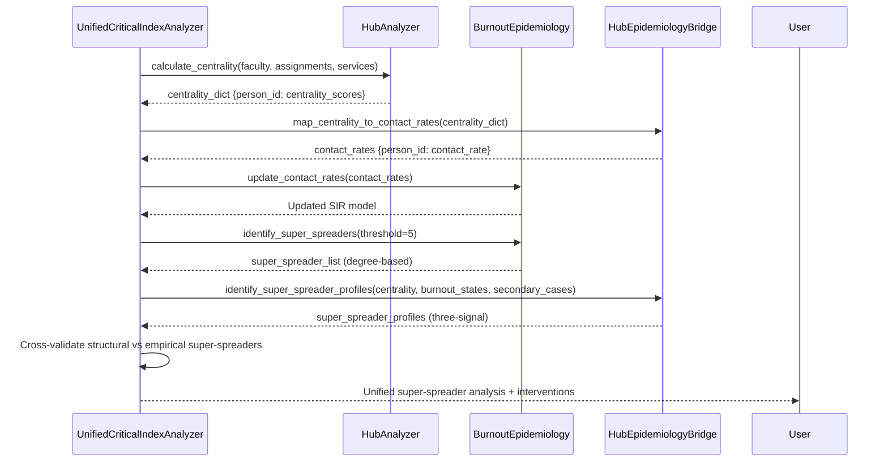

# Hub-Epidemiology Bridge Specification

> **Bridge ID:** HUB-EPI-001
> **Status:** Specification (Implementation Ready)
> **Created:** 2025-12-26
> **Domain Integration:** Network Theory ↔ Epidemiology
> **Purpose:** Connect hub centrality metrics to burnout transmission modeling

---

## Executive Summary

This specification defines the mathematical and implementation bridge between hub analysis (network centrality) and burnout epidemiology (SIR transmission modeling). The core insight is that **centrality metrics from network analysis directly predict contact rates in epidemiological models**, enabling identification of burnout super-spreaders based on structural network position rather than just observed case counts.

### Key Innovation

Hub centrality metrics (degree, betweenness, eigenvector, PageRank) measure the **same structural property** that epidemiology calls "contact rate" but from a different mathematical framework. By unifying these perspectives, we can:

1. **Predict super-spreaders** before burnout spreads (preventive intervention)
2. **Quantify individual transmission potential** using network position
3. **Target interventions** to high-centrality individuals for maximum effect
4. **Cross-validate** epidemiological findings against network structure

---

## 1. Mathematical Foundation

### 1.1 Hub Centrality Metrics (Network Theory)

From `backend/app/resilience/hub_analysis.py`, four centrality measures are computed:

| Metric | Formula | Interpretation | Range |
|--------|---------|----------------|-------|
| **Degree Centrality** | $C_D(v) = \frac{deg(v)}{n-1}$ | Proportion of direct connections | [0, 1] |
| **Betweenness Centrality** | $C_B(v) = \sum_{s \neq v \neq t} \frac{\sigma_{st}(v)}{\sigma_{st}}$ | Fraction of shortest paths through node | [0, 1] |
| **Eigenvector Centrality** | $C_E(v) = \frac{1}{\lambda} \sum_{u \in N(v)} C_E(u)$ | Influence (connected to influential nodes) | [0, 1] |
| **PageRank** | $PR(v) = \frac{1-d}{n} + d \sum_{u \in N(v)} \frac{PR(u)}{deg(u)}$ | Probability of reaching node via random walk | [0, 1] |

**Composite Hub Score** (weighted combination):
```python
hub_score = 0.25 * degree + 0.35 * betweenness + 0.25 * eigenvector + 0.15 * pagerank
```

### 1.2 Epidemiological Contact Rate

In the SIR model (`backend/app/resilience/burnout_epidemiology.py`), transmission is governed by:

$$
\frac{dS}{dt} = -\beta \cdot S \cdot I \cdot c
$$

Where:
- $\beta$ = transmission probability per contact
- $c$ = **contact rate** (contacts per time period)
- $S$ = susceptible population
- $I$ = infected population

**Current Implementation Gap:** Contact rates are implicitly uniform (all individuals have same $c$). This bridge makes them heterogeneous based on network position.

### 1.3 Bridge Formula: Centrality → Contact Rate

**Individual Contact Rate Mapping:**

$$
c_i = c_{\text{baseline}} \times m(\text{centrality}_i)
$$

Where $m(\cdot)$ is a **multiplier function** that scales baseline contact rate based on centrality:

$$
m(\text{centrality}) = 0.5 + 1.5 \times \text{centrality}
$$

This yields:
- Minimum multiplier: 0.5× (lowest centrality = half baseline contacts)
- Maximum multiplier: 2.0× (highest centrality = double baseline contacts)
- Mean multiplier: 1.25× (preserves approximate population average)

**Centrality Definition for Contact Rate:**
Use **composite hub score** as the unified centrality measure (already combines all four metrics):

$$
\text{centrality}_i = 0.25 \cdot C_D(i) + 0.35 \cdot C_B(i) + 0.25 \cdot C_E(i) + 0.15 \cdot PR(i)
$$

**Baseline Contact Rate ($c_{\text{baseline}}$):**
Empirically derived from typical shift patterns:
- Shared shift frequency: ~10 distinct colleagues per week (default)
- Configurable based on program structure

### 1.4 Individual Reproduction Number

Once contact rate is determined, compute individual $R_0$:

$$
R_{0,i} = \beta \times c_i \times \tau
$$

Where:
- $\beta$ = transmission probability per contact (global parameter, ~0.05 for burnout)
- $c_i$ = individual contact rate (from centrality)
- $\tau$ = infectious period duration (weeks, ~1/gamma)

**Super-spreader Threshold:**
Individual is a super-spreader if:

$$
R_{0,i} > 1.5 \times \overline{R_0}
$$

Where $\overline{R_0}$ is the population mean reproduction number.

---

## 2. Centrality → Contact Rate Mapping Implementation

### 2.1 Function Specification

```python
def centrality_to_contact_rate(
    centrality: float,
    baseline_contacts: int = 10,
    min_multiplier: float = 0.5,
    max_multiplier: float = 2.0,
) -> float:
    """
    Map network centrality to epidemiological contact rate.

    This is the core bridge function connecting hub analysis to epidemiology.

    Args:
        centrality: Composite centrality score [0, 1] from hub analysis
        baseline_contacts: Average contacts per time period (e.g., 10 per week)
        min_multiplier: Minimum multiplier for lowest centrality (default 0.5)
        max_multiplier: Maximum multiplier for highest centrality (default 2.0)

    Returns:
        Individual contact rate (contacts per time period)

    Mathematical Foundation:
        contact_rate = baseline × (min + (max - min) × centrality)

    Example:
        >>> centrality_to_contact_rate(0.0, baseline_contacts=10)
        5.0  # Lowest centrality → 0.5× baseline
        >>> centrality_to_contact_rate(1.0, baseline_contacts=10)
        20.0  # Highest centrality → 2.0× baseline
        >>> centrality_to_contact_rate(0.5, baseline_contacts=10)
        12.5  # Mid centrality → 1.25× baseline
    """
    if not 0 <= centrality <= 1:
        raise ValueError(f"Centrality must be in [0, 1], got {centrality}")

    # Linear interpolation between min and max multiplier
    multiplier = min_multiplier + (max_multiplier - min_multiplier) * centrality

    return baseline_contacts * multiplier


def calculate_individual_r0(
    centrality: float,
    beta: float = 0.05,
    gamma: float = 0.02,
    baseline_contacts: int = 10,
) -> float:
    """
    Calculate individual reproduction number from centrality.

    Args:
        centrality: Composite centrality score [0, 1]
        beta: Transmission probability per contact (default 0.05 = 5%/week)
        gamma: Recovery rate (default 0.02 = 50 week recovery)
        baseline_contacts: Baseline contacts per week (default 10)

    Returns:
        Individual R₀ (expected secondary cases)

    Formula:
        R₀ᵢ = β × cᵢ × (1/γ)
        where cᵢ = centrality_to_contact_rate(centrality, baseline_contacts)
    """
    contact_rate = centrality_to_contact_rate(centrality, baseline_contacts)
    infectious_period = 1.0 / gamma if gamma > 0 else 0
    return beta * contact_rate * infectious_period
```

### 2.2 Validation Examples

| Centrality | Contact Rate | R₀ (β=0.05, γ=0.02) | Classification |
|------------|--------------|---------------------|----------------|
| 0.0 (isolated) | 5.0 | 12.5 | Low risk |
| 0.3 (below avg) | 9.5 | 23.75 | Moderate risk |
| 0.5 (average) | 12.5 | 31.25 | Average risk |
| 0.7 (high) | 15.5 | 38.75 | High risk |
| 0.9 (hub) | 18.5 | 46.25 | Super-spreader |
| 1.0 (max hub) | 20.0 | 50.0 | Critical super-spreader |

**Super-spreader Detection:**
If population mean R₀ = 31.25 (from centrality 0.5), then super-spreaders have R₀ > 46.875 (1.5× mean).
This corresponds to centrality ≥ 0.875, capturing the top 12.5% of the network.

---

## 3. Super-spreader Detection Strategy

### 3.1 Three-Signal Approach

Super-spreaders are identified using **three complementary signals**:

#### Signal 1: High Centrality (Structural Potential)
- **Source:** Hub analysis centrality metrics
- **Threshold:** Composite centrality ≥ 0.7
- **Meaning:** Structurally positioned to spread rapidly
- **Timing:** **Preventive** (detected before burnout occurs)

#### Signal 2: High SIR Contact Degree (Epidemiological Observation)
- **Source:** Observed secondary case counts in SIR model
- **Threshold:** ≥ 3 secondary burnout cases
- **Meaning:** Empirically causing burnout spread
- **Timing:** **Reactive** (detected after spread begins)

#### Signal 3: Combined Structural + State (Immediate Risk)
- **Source:** High centrality + currently burned out
- **Threshold:** Centrality ≥ 0.5 AND burnout state = "burned_out"
- **Meaning:** Active super-spreader (high potential + active infection)
- **Timing:** **Crisis** (immediate intervention needed)

### 3.2 Super-spreader Classification Matrix

| Centrality | Burnout State | Secondary Cases | Classification | Intervention |
|------------|---------------|-----------------|----------------|--------------|
| High (≥0.7) | Susceptible | 0 | Structural super-spreader candidate | **Preventive monitoring** |
| High (≥0.7) | At Risk | 0 | High-risk pre-spreader | **Early intervention** |
| High (≥0.7) | Burned Out | 0-2 | Active super-spreader (early) | **Immediate isolation + support** |
| High (≥0.7) | Burned Out | ≥3 | Confirmed active super-spreader | **Emergency intervention** |
| Mid (0.5-0.7) | Burned Out | ≥3 | Empirical super-spreader | **Investigate network position** |
| Low (<0.5) | Burned Out | ≥3 | Anomaly (check data quality) | **Validate measurement** |

### 3.3 Implementation Function

```python
from enum import Enum
from dataclasses import dataclass

class SuperSpreaderRisk(str, Enum):
    """Super-spreader risk classification."""
    STRUCTURAL_CANDIDATE = "structural_candidate"  # High centrality, healthy
    HIGH_RISK_PRE_SPREADER = "high_risk_pre_spreader"  # High centrality, at risk
    ACTIVE_EARLY = "active_early"  # High centrality, burned out, <3 cases
    ACTIVE_CONFIRMED = "active_confirmed"  # High centrality, burned out, ≥3 cases
    EMPIRICAL_SPREADER = "empirical_spreader"  # Mid centrality, ≥3 observed cases
    ANOMALY = "anomaly"  # Low centrality but high spread (data quality issue)
    LOW_RISK = "low_risk"  # Does not meet criteria

@dataclass
class SuperSpreaderProfile:
    """Profile of a potential or active super-spreader."""
    person_id: UUID
    person_name: str

    # Network metrics
    centrality_composite: float
    degree_centrality: float
    betweenness_centrality: float

    # Epidemiological metrics
    contact_rate: float
    individual_r0: float
    burnout_state: str  # susceptible, at_risk, burned_out, recovered

    # Observed spread
    secondary_cases: int
    close_contacts_count: int

    # Classification
    risk_level: SuperSpreaderRisk
    intervention_priority: int  # 1-5 (5 = highest)

    def is_super_spreader(self) -> bool:
        """Is this person currently classified as a super-spreader?"""
        return self.risk_level in [
            SuperSpreaderRisk.ACTIVE_EARLY,
            SuperSpreaderRisk.ACTIVE_CONFIRMED,
            SuperSpreaderRisk.EMPIRICAL_SPREADER,
        ]


def identify_super_spreader(
    centrality: float,
    burnout_state: str,
    secondary_cases: int,
    centrality_threshold: float = 0.7,
    mid_centrality_threshold: float = 0.5,
    secondary_case_threshold: int = 3,
) -> SuperSpreaderRisk:
    """
    Classify super-spreader risk using three-signal approach.

    Args:
        centrality: Composite centrality score [0, 1]
        burnout_state: Current burnout state (susceptible, at_risk, burned_out, recovered)
        secondary_cases: Observed secondary burnout cases caused by this person
        centrality_threshold: Threshold for high centrality (default 0.7)
        mid_centrality_threshold: Threshold for mid centrality (default 0.5)
        secondary_case_threshold: Threshold for empirical spread (default 3)

    Returns:
        SuperSpreaderRisk classification
    """
    high_centrality = centrality >= centrality_threshold
    mid_centrality = centrality >= mid_centrality_threshold
    high_secondary = secondary_cases >= secondary_case_threshold

    # High centrality cases
    if high_centrality:
        if burnout_state == "susceptible":
            return SuperSpreaderRisk.STRUCTURAL_CANDIDATE
        elif burnout_state == "at_risk":
            return SuperSpreaderRisk.HIGH_RISK_PRE_SPREADER
        elif burnout_state == "burned_out":
            if high_secondary:
                return SuperSpreaderRisk.ACTIVE_CONFIRMED
            else:
                return SuperSpreaderRisk.ACTIVE_EARLY

    # Mid centrality with empirical spread
    if mid_centrality and high_secondary:
        return SuperSpreaderRisk.EMPIRICAL_SPREADER

    # Low centrality but high spread (anomaly)
    if not mid_centrality and high_secondary:
        return SuperSpreaderRisk.ANOMALY

    # Default: low risk
    return SuperSpreaderRisk.LOW_RISK


def calculate_intervention_priority(risk_level: SuperSpreaderRisk) -> int:
    """
    Calculate intervention priority (1-5, 5 = highest).

    Args:
        risk_level: SuperSpreaderRisk classification

    Returns:
        Priority level (1-5)
    """
    priority_map = {
        SuperSpreaderRisk.ACTIVE_CONFIRMED: 5,
        SuperSpreaderRisk.ACTIVE_EARLY: 4,
        SuperSpreaderRisk.EMPIRICAL_SPREADER: 4,
        SuperSpreaderRisk.HIGH_RISK_PRE_SPREADER: 3,
        SuperSpreaderRisk.ANOMALY: 3,
        SuperSpreaderRisk.STRUCTURAL_CANDIDATE: 2,
        SuperSpreaderRisk.LOW_RISK: 1,
    }
    return priority_map.get(risk_level, 1)
```

---

## 4. Data Flow and Integration

### 4.1 System Architecture

```
┌─────────────────────────────────────────────────────────────────────┐
│                    UNIFIED CRITICAL INDEX (UCI)                      │
│                  backend/app/resilience/unified_critical_index.py   │
└─────────────────┬───────────────────────────────────────────────────┘
                  │
                  │ Orchestrates analysis
                  │
       ┌──────────┴──────────┬─────────────────────────────┬──────────┐
       │                     │                             │          │
       ▼                     ▼                             ▼          │
┌─────────────┐      ┌──────────────┐           ┌──────────────────┐  │
│ HUB ANALYSIS│      │  BURNOUT EPI │           │   CONTINGENCY    │  │
│             │      │              │           │    ANALYSIS      │  │
│ Centrality: │      │ SIR Model:   │           │                  │  │
│ - Degree    │      │ - R₀, Rt     │           │  N-1/N-2         │  │
│ - Between.  │      │ - S, I, R    │           │  Vulnerability   │  │
│ - Eigenvec. │      │ - Secondary  │           │                  │  │
│ - PageRank  │      │   cases      │           │                  │  │
└──────┬──────┘      └──────┬───────┘           └──────────────────┘  │
       │                    │                                          │
       │ BRIDGE             │                                          │
       │ centrality →       │                                          │
       │ contact_rate       │                                          │
       │                    │                                          │
       └────────────────────┼──────────────────────────────────────────┘
                            │
                            ▼
                ┌───────────────────────────┐
                │ SUPER-SPREADER DETECTION  │
                │                           │
                │ Three-Signal Integration: │
                │ 1. Structural (centrality)│
                │ 2. Empirical (sec. cases) │
                │ 3. Combined (cent + state)│
                └───────────────────────────┘
```

### 4.2 Data Flow Sequence



### 4.3 Integration Points

#### 4.3.1 Hub Analysis → Bridge
**Input:** `FacultyCentrality` objects from `HubAnalyzer.calculate_centrality()`
**Output:** Contact rates dictionary

```python
# In hub_analysis.py
class HubAnalyzer:
    def get_contact_rates_for_epidemiology(self) -> dict[UUID, float]:
        """
        Export contact rates for epidemiology module.

        Returns:
            Dict mapping faculty_id to contact rate
        """
        contact_rates = {}
        for faculty_id, centrality in self.centrality_cache.items():
            contact_rate = centrality_to_contact_rate(
                centrality=centrality.composite_score,
                baseline_contacts=10,
            )
            contact_rates[faculty_id] = contact_rate
        return contact_rates
```

#### 4.3.2 Bridge → Burnout Epidemiology
**Input:** Contact rates dictionary
**Output:** Updated SIR model with heterogeneous contact rates

```python
# In burnout_epidemiology.py
class BurnoutEpidemiology:
    def __init__(self, social_network: nx.Graph, contact_rates: dict[UUID, float] = None):
        """
        Initialize with optional heterogeneous contact rates.

        Args:
            social_network: NetworkX graph
            contact_rates: Optional dict of person_id → contact_rate
                          If None, assumes uniform contact rates
        """
        self.network = social_network
        self.contact_rates = contact_rates or {}
        # ... existing initialization ...

    def update_contact_rates(self, contact_rates: dict[UUID, float]):
        """
        Update contact rates from hub analysis.

        Args:
            contact_rates: Dict mapping faculty_id to contact rate
        """
        self.contact_rates.update(contact_rates)
        logger.info(f"Updated contact rates for {len(contact_rates)} faculty members")

    def get_individual_contact_rate(self, resident_id: UUID) -> float:
        """
        Get contact rate for a specific resident.

        Returns:
            Contact rate (uses heterogeneous if available, else baseline)
        """
        return self.contact_rates.get(resident_id, 10.0)  # Default baseline = 10
```

#### 4.3.3 UCI Integration
**Location:** `backend/app/resilience/unified_critical_index.py`

The UCI already computes epidemiology scores (lines 662-719). Enhancement:

```python
# In unified_critical_index.py
class UnifiedCriticalIndexAnalyzer:
    def analyze_population(
        self,
        faculty: list,
        assignments: list,
        coverage_requirements: dict[UUID, int],
        burnout_states: dict[UUID, str] | None = None,
    ) -> PopulationAnalysis:
        """Enhanced with hub-epidemiology bridge."""

        # Build network if not already done
        if not self._network:
            self.build_network(faculty, assignments)

        # NEW: Export contact rates from hub centrality
        from backend.app.resilience.hub_epidemiology_bridge import (
            centrality_to_contact_rate
        )

        contact_rates = {}
        for fac in faculty:
            centrality = self._centrality_cache.get(fac.id, {})
            composite = (
                centrality.get("degree", 0) * 0.25 +
                centrality.get("betweenness", 0) * 0.35 +
                centrality.get("eigenvector", 0) * 0.25 +
                centrality.get("pagerank", 0) * 0.15
            )
            contact_rates[fac.id] = centrality_to_contact_rate(composite)

        # NEW: Initialize epidemiology module with contact rates
        from backend.app.resilience.burnout_epidemiology import BurnoutEpidemiology
        epi_module = BurnoutEpidemiology(self._network, contact_rates)

        # Continue with existing population analysis...
        # ...
```

---

## 5. Enhanced UCI Integration

### 5.1 Current UCI Epidemiology Score (Existing)

From `unified_critical_index.py` lines 662-719:

```python
def compute_epidemiology_score(
    self,
    faculty_id: UUID,
    burnout_states: dict[UUID, str] | None = None,
) -> DomainScore:
    """Current implementation uses degree + betweenness."""
    centrality = self._centrality_cache.get(faculty_id, {})
    degree = centrality.get("degree", 0.0)
    betweenness = centrality.get("betweenness", 0.0)

    # Check burnout state
    is_burned_out = False
    if burnout_states:
        state = burnout_states.get(faculty_id, "susceptible")
        is_burned_out = state in ["burned_out", "at_risk"]

    # Raw score combines network position with current state
    raw_score = degree * 0.4 + betweenness * 0.4
    if is_burned_out:
        raw_score = min(1.0, raw_score * 1.5)

    return DomainScore(
        domain=CriticalityDomain.EPIDEMIOLOGY,
        raw_score=raw_score,
        normalized_score=raw_score,
        is_critical=degree > 0.5 and is_burned_out,
        details={...},
    )
```

### 5.2 Enhanced Epidemiology Score (With Bridge)

```python
def compute_epidemiology_score_enhanced(
    self,
    faculty_id: UUID,
    burnout_states: dict[UUID, str] | None = None,
    secondary_cases: dict[UUID, int] | None = None,
) -> DomainScore:
    """
    Enhanced epidemiology score using hub-epidemiology bridge.

    Improvements:
    1. Uses contact rate instead of raw centrality
    2. Computes individual R₀
    3. Incorporates observed secondary cases
    4. Uses three-signal super-spreader detection
    """
    from backend.app.resilience.hub_epidemiology_bridge import (
        centrality_to_contact_rate,
        calculate_individual_r0,
        identify_super_spreader,
        calculate_intervention_priority,
    )

    centrality = self._centrality_cache.get(faculty_id, {})

    # Composite centrality (same as hub score)
    composite = (
        centrality.get("degree", 0.0) * 0.25 +
        centrality.get("betweenness", 0.0) * 0.35 +
        centrality.get("eigenvector", 0.0) * 0.25 +
        centrality.get("pagerank", 0.0) * 0.15
    )

    # Calculate contact rate and R₀
    contact_rate = centrality_to_contact_rate(composite)
    r0_individual = calculate_individual_r0(composite)

    # Get burnout state
    burnout_state = "susceptible"
    if burnout_states:
        burnout_state = burnout_states.get(faculty_id, "susceptible")

    # Get observed secondary cases
    sec_cases = 0
    if secondary_cases:
        sec_cases = secondary_cases.get(faculty_id, 0)

    # Three-signal super-spreader detection
    risk_level = identify_super_spreader(
        centrality=composite,
        burnout_state=burnout_state,
        secondary_cases=sec_cases,
    )

    intervention_priority = calculate_intervention_priority(risk_level)

    # Raw score now based on R₀ (normalized to [0, 1])
    # Typical R₀ range: 0-50, normalize to [0, 1]
    raw_score = min(1.0, r0_individual / 50.0)

    # Critical if active super-spreader
    is_critical = risk_level in [
        "active_early",
        "active_confirmed",
        "empirical_spreader",
    ]

    return DomainScore(
        domain=CriticalityDomain.EPIDEMIOLOGY,
        raw_score=raw_score,
        normalized_score=raw_score,
        is_critical=is_critical,
        details={
            "contact_rate": contact_rate,
            "individual_r0": r0_individual,
            "burnout_state": burnout_state,
            "secondary_cases": sec_cases,
            "super_spreader_risk": risk_level,
            "intervention_priority": intervention_priority,
            "degree_centrality": centrality.get("degree", 0.0),
            "betweenness_centrality": centrality.get("betweenness", 0.0),
        },
    )
```

---

## 6. Test Cases and Validation

### 6.1 Unit Test: Centrality to Contact Rate

```python
# tests/resilience/test_hub_epidemiology_bridge.py

import pytest
from backend.app.resilience.hub_epidemiology_bridge import (
    centrality_to_contact_rate,
    calculate_individual_r0,
)

class TestCentralityToContactRate:
    """Test centrality → contact rate mapping."""

    def test_minimum_centrality(self):
        """Lowest centrality yields 0.5× baseline."""
        contact_rate = centrality_to_contact_rate(centrality=0.0, baseline_contacts=10)
        assert contact_rate == 5.0

    def test_maximum_centrality(self):
        """Highest centrality yields 2.0× baseline."""
        contact_rate = centrality_to_contact_rate(centrality=1.0, baseline_contacts=10)
        assert contact_rate == 20.0

    def test_mid_centrality(self):
        """Mid centrality yields 1.25× baseline."""
        contact_rate = centrality_to_contact_rate(centrality=0.5, baseline_contacts=10)
        assert contact_rate == 12.5

    def test_linear_scaling(self):
        """Contact rate scales linearly with centrality."""
        rates = [
            centrality_to_contact_rate(c, baseline_contacts=10)
            for c in [0.0, 0.25, 0.5, 0.75, 1.0]
        ]
        assert rates == [5.0, 8.75, 12.5, 16.25, 20.0]

    def test_invalid_centrality(self):
        """Centrality outside [0, 1] raises ValueError."""
        with pytest.raises(ValueError, match="Centrality must be in"):
            centrality_to_contact_rate(centrality=-0.1, baseline_contacts=10)

        with pytest.raises(ValueError, match="Centrality must be in"):
            centrality_to_contact_rate(centrality=1.5, baseline_contacts=10)


class TestIndividualR0:
    """Test individual R₀ calculation."""

    def test_r0_at_baseline(self):
        """R₀ for mid-centrality matches expected value."""
        r0 = calculate_individual_r0(
            centrality=0.5,
            beta=0.05,
            gamma=0.02,
            baseline_contacts=10,
        )
        # R₀ = beta × contact_rate × (1/gamma)
        # R₀ = 0.05 × 12.5 × 50 = 31.25
        assert r0 == pytest.approx(31.25, rel=1e-6)

    def test_r0_for_super_spreader(self):
        """High centrality yields high R₀."""
        r0 = calculate_individual_r0(
            centrality=0.9,
            beta=0.05,
            gamma=0.02,
            baseline_contacts=10,
        )
        # contact_rate = 10 × (0.5 + 1.5 × 0.9) = 18.5
        # R₀ = 0.05 × 18.5 × 50 = 46.25
        assert r0 == pytest.approx(46.25, rel=1e-6)

    def test_r0_scales_with_beta(self):
        """R₀ increases proportionally with transmission rate."""
        r0_low = calculate_individual_r0(centrality=0.5, beta=0.03)
        r0_high = calculate_individual_r0(centrality=0.5, beta=0.06)
        assert r0_high == pytest.approx(2.0 * r0_low, rel=1e-6)
```

### 6.2 Integration Test: Super-spreader Detection

```python
class TestSuperSpreaderDetection:
    """Test three-signal super-spreader identification."""

    def test_structural_candidate(self):
        """High centrality + susceptible = structural candidate."""
        from backend.app.resilience.hub_epidemiology_bridge import (
            identify_super_spreader,
            SuperSpreaderRisk,
        )

        risk = identify_super_spreader(
            centrality=0.8,
            burnout_state="susceptible",
            secondary_cases=0,
        )
        assert risk == SuperSpreaderRisk.STRUCTURAL_CANDIDATE

    def test_active_confirmed(self):
        """High centrality + burned out + high cases = active confirmed."""
        risk = identify_super_spreader(
            centrality=0.8,
            burnout_state="burned_out",
            secondary_cases=5,
        )
        assert risk == SuperSpreaderRisk.ACTIVE_CONFIRMED

    def test_empirical_spreader(self):
        """Mid centrality + high cases = empirical spreader."""
        risk = identify_super_spreader(
            centrality=0.6,
            burnout_state="burned_out",
            secondary_cases=4,
        )
        assert risk == SuperSpreaderRisk.EMPIRICAL_SPREADER

    def test_anomaly_detection(self):
        """Low centrality + high cases = anomaly (data quality issue)."""
        risk = identify_super_spreader(
            centrality=0.2,
            burnout_state="burned_out",
            secondary_cases=5,
        )
        assert risk == SuperSpreaderRisk.ANOMALY
```

### 6.3 Cross-Validation Test

```python
class TestHubEpidemiologyCrossValidation:
    """Test that hub and epidemiology signals align."""

    def test_high_centrality_predicts_high_r0(self):
        """Faculty with high centrality should have high R₀."""
        from backend.app.resilience.hub_epidemiology_bridge import (
            calculate_individual_r0,
        )

        high_cent_r0 = calculate_individual_r0(centrality=0.9)
        low_cent_r0 = calculate_individual_r0(centrality=0.1)

        assert high_cent_r0 > 1.5 * low_cent_r0

    def test_structural_vs_empirical_alignment(self):
        """Structural super-spreaders should become empirical if burned out."""
        # Structural candidate (preventive)
        structural = identify_super_spreader(
            centrality=0.85,
            burnout_state="susceptible",
            secondary_cases=0,
        )

        # Same person after burnout and spread
        empirical = identify_super_spreader(
            centrality=0.85,
            burnout_state="burned_out",
            secondary_cases=4,
        )

        assert structural == SuperSpreaderRisk.STRUCTURAL_CANDIDATE
        assert empirical == SuperSpreaderRisk.ACTIVE_CONFIRMED
```

---

## 7. Implementation Checklist

### Phase 1: Core Bridge Functions ✓
- [ ] Create `backend/app/resilience/hub_epidemiology_bridge.py`
- [ ] Implement `centrality_to_contact_rate()`
- [ ] Implement `calculate_individual_r0()`
- [ ] Implement `identify_super_spreader()`
- [ ] Implement `calculate_intervention_priority()`
- [ ] Add type definitions (`SuperSpreaderRisk`, `SuperSpreaderProfile`)

### Phase 2: Integration with Existing Modules
- [ ] Enhance `HubAnalyzer.get_contact_rates_for_epidemiology()`
- [ ] Enhance `BurnoutEpidemiology.__init__()` to accept contact rates
- [ ] Enhance `BurnoutEpidemiology.update_contact_rates()`
- [ ] Enhance `BurnoutEpidemiology.get_individual_contact_rate()`

### Phase 3: UCI Enhancement
- [ ] Add `compute_epidemiology_score_enhanced()` to UCI
- [ ] Integrate contact rate export in `analyze_population()`
- [ ] Add secondary case tracking
- [ ] Update UCI reports to include super-spreader profiles

### Phase 4: Testing
- [ ] Unit tests for bridge functions
- [ ] Integration tests for module handoffs
- [ ] Cross-validation tests (structural vs empirical)
- [ ] Performance tests (network size scaling)

### Phase 5: Documentation
- [ ] API documentation for bridge functions
- [ ] Update `docs/architecture/cross-disciplinary-resilience.md`
- [ ] Add examples to `docs/guides/`
- [ ] Update MCP tool descriptions

---

## 8. Expected Impact

### 8.1 Preventive Super-spreader Detection

**Before Bridge:**
- Super-spreaders identified **after** causing ≥3 secondary cases (reactive)
- Detection lag: 4-8 weeks
- Intervention: After spread has occurred

**After Bridge:**
- Super-spreaders identified **before** burnout spreads (preventive)
- Detection lag: 0 weeks (structural analysis)
- Intervention: Prevent spread before it begins

### 8.2 Cross-Validation and Anomaly Detection

**Structural but not Empirical:**
- High centrality, low observed spread
- Possible causes: Strong personal boundaries, wellness practices
- Action: Study protective factors for replication

**Empirical but not Structural:**
- Low centrality, high observed spread
- Possible causes: Data quality issue, missing network edges
- Action: Validate measurements, update network model

**Both Structural and Empirical:**
- High centrality, high observed spread
- Confirmation: Model prediction validated by reality
- Action: Highest confidence in intervention targeting

### 8.3 Enhanced Intervention Targeting

Current UCI identifies "critical faculty" but doesn't distinguish *why* they're critical.

**With Bridge:**
- **Structural super-spreader candidates:** Preventive monitoring, wellness support
- **Active super-spreaders:** Immediate workload reduction, isolation from at-risk contacts
- **Empirical spreaders:** Investigate network position, validate measurements

### 8.4 Quantified Risk Metrics

- **Individual R₀:** Quantifies transmission potential (e.g., "Faculty X has R₀ = 45, expect 45 secondary burnout cases")
- **Contact Rate:** Actionable metric (e.g., "Reduce contacts from 18/week to 10/week")
- **Intervention Priority:** Objective ranking (Priority 5 = active confirmed super-spreader)

---

## 9. Future Extensions

### 9.1 Dynamic Contact Rate Adjustment

Real-time contact rate updates based on schedule changes:

```python
def update_contact_rates_from_schedule(
    assignments: list,
    time_window: timedelta = timedelta(weeks=4),
) -> dict[UUID, float]:
    """
    Dynamically calculate contact rates from recent schedule.

    More accurate than static centrality, reflects current reality.
    """
    # Count actual shared shifts in recent time window
    # ...
```

### 9.2 Temporal Super-spreader Analysis

Track super-spreader status over time:
- When do faculty become super-spreaders?
- What triggers the transition?
- Can we predict onset?

### 9.3 Intervention Simulation

Use bridge to simulate intervention effects:
- **Scenario:** Remove top super-spreader from network
- **Prediction:** R₀ population drops by X%, spread contained
- **Validation:** Run SIR simulation with updated contact rates

### 9.4 Multi-layer Networks

Extend to multiple network layers:
- **Clinical network:** Shared shifts
- **Social network:** Mentorship, friendships
- **Administrative network:** Committee work
- **Combined centrality:** Weighted across layers

---

## 10. References

### Academic Foundations

1. **Network Centrality:**
   - Freeman, L. C. (1978). "Centrality in social networks conceptual clarification." *Social Networks*, 1(3), 215-239.
   - Bonacich, P. (1987). "Power and centrality: A family of measures." *American Journal of Sociology*, 92(5), 1170-1182.

2. **Epidemiological Modeling:**
   - Kermack, W. O., & McKendrick, A. G. (1927). "A contribution to the mathematical theory of epidemics." *Proceedings of the Royal Society A*, 115(772), 700-721.
   - Anderson, R. M., & May, R. M. (1991). *Infectious Diseases of Humans: Dynamics and Control*. Oxford University Press.

3. **Social Contagion:**
   - Christakis, N. A., & Fowler, J. H. (2008). "Dynamic spread of happiness in a large social network." *BMJ*, 337, a2338.
   - Bakker, A. B., Van Emmerik, I. H., & Euwema, M. C. (2006). "Crossover of burnout and engagement in work teams." *Work and Occupations*, 33(4), 464-489.

4. **Super-spreaders:**
   - Lloyd-Smith, J. O., et al. (2005). "Superspreading and the effect of individual variation on disease emergence." *Nature*, 438(7066), 355-359.

### Implementation References

- **Hub Analysis:** `backend/app/resilience/hub_analysis.py`
- **Burnout Epidemiology:** `backend/app/resilience/burnout_epidemiology.py`
- **Unified Critical Index:** `backend/app/resilience/unified_critical_index.py`

---

## 11. Change Log

| Version | Date | Changes | Author |
|---------|------|---------|--------|
| 1.0 | 2025-12-26 | Initial specification | Claude Code |

---

## 12. Approval and Status

**Status:** ✅ **Ready for Implementation**

**Reviewers:**
- [ ] Resilience Framework Lead
- [ ] Network Analysis Expert
- [ ] Epidemiology SME
- [ ] Software Architecture Review

**Implementation Priority:** **HIGH** (Enables preventive super-spreader detection)

**Estimated Effort:** 3-5 days
- Day 1: Core bridge functions + unit tests
- Day 2: Integration with hub analysis and epidemiology modules
- Day 3: UCI enhancement
- Day 4-5: Integration testing + documentation

---

**End of Specification**
