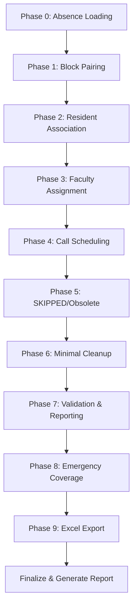

# n8n Cloud Workflow Summary

**Source:** aniseed.app.n8n.cloud
**Total Workflows:** 100+
**Last Explored:** 2025-12-21

---

## Master Orchestrator Architecture

The scheduling system uses a **10-phase workflow pipeline**:

---

## Key Workflows

### Master Orchestrator
**ID:** `8NEHGi7nGpqOitME`
- Coordinates all phases
- Handles success/error branching
- Generates final report

### Phase 2: Smart Resident Association (Absence-Aware)
**ID:** `DUVgfqE35w9Fteik`
- Fetches Master Assignments from Airtable
- Fetches Residency Block Schedule
- Smart Association Engine (code node)
- Batch updates with rate limiting

##***REMOVED*** Master Assignment Generator
**Multiple versions** - handles:
- PCAT (Procedure Clinic Attending Time)
- Call/leave conflict detection
- ChatGPT/Claude integration variants

---

## Workflow Categories

| Category | Count | Examples |
|----------|-------|----------|
| **Phase Workflows** | 10+ | Phase 0, 1, 2, 3, etc. |
| **Generators** | 15+ | Faculty Call Generator, Master Assignment Generator |
| **Processors** | 5+ | Block Pairing Processor, Master Assignments Pairing |
| **Schedulers** | 8+ | Master Scheduler v7.0, Perplexity Automated |
| **Utilities** | Various | Google Calendar sync, Excel export |

---

## Integration Points

- **Airtable**: Primary data store (fetch/update nodes)
- **Google Calendar**: Calendar sync
- **AI Services**: Perplexity, ChatGPT, Claude integrations
- **HTTP Requests**: Custom API calls with rate limiting

---

## Implementation Notes

1. **Rate Limiting**: Uses `wait` nodes between batch operations
2. **Batch Processing**: `splitInBatches` for Airtable updates
3. **Error Handling**: Check Execution Success → Success/Error branches
4. **Code Nodes**: Heavy use for business logic (Smart Association Engine)

---

## Relevant for Local Implementation

The n8n workflows reveal:
1. **10-phase scheduling pipeline** to replicate
2. **Absence-aware** resident association logic
3. **Rate limiting patterns** for Airtable API
4. **Faculty assignment** with conflict detection
5. **Emergency coverage** as a distinct phase
