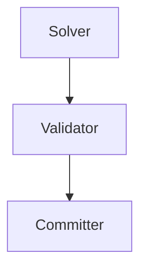
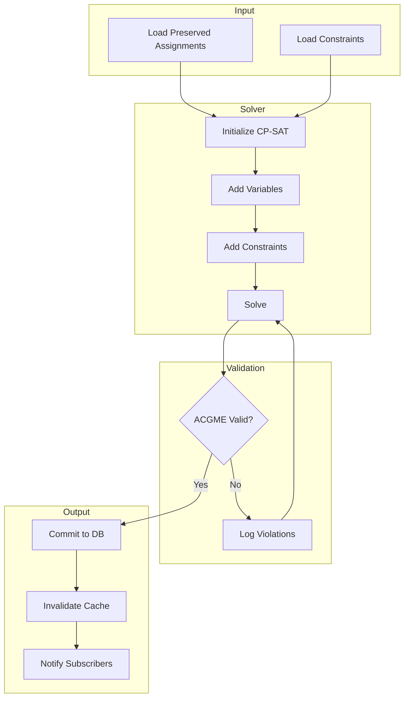
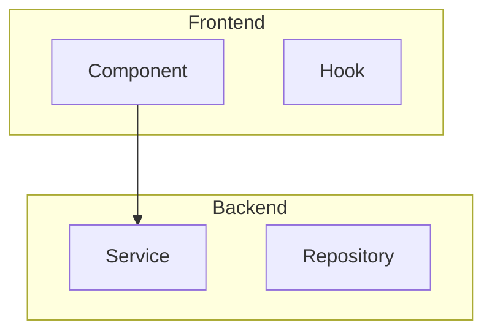

# Mermaid Diagrams & Graph RAG Enhancement Guide

> **Purpose:** Comprehensive guide for augmenting local AI capabilities with mermaid diagrams and graph-based RAG
> **Last Updated:** 2026-01-28
> **Status:** Implementation Roadmap

---

## Executive Summary

This document outlines strategies for enhancing AI-assisted development by leveraging mermaid diagrams as compressed context and implementing graph-based RAG for relationship-aware retrieval. Based on analysis of current capabilities and industry best practices.

### Key Principles

1. **Context is king** - Rich, pre-loaded context beats iterative exploration
2. **Diagrams compress knowledge** - Mermaid syntax is highly machine-readable
3. **Relationships matter** - Graph RAG enables "what connects to what" queries
4. **Automate quality gates** - Stop hooks prevent drift and errors
5. **Optimize for AI consumption** - Some file formats work better for machines than humans

---

## Part 1: Current State Analysis

### 1.1 Mermaid Diagram Inventory

The codebase contains **19 mermaid diagrams** across **8 files**:

| File | Diagram Count | Topics |
|------|---------------|--------|
| `MCP_ORCHESTRATION_PATTERNS.md` | 5 | DAG orchestration, spawn patterns |
| `ENGINE_ASSIGNMENT_FLOW.md` | 4 | Scheduling engine pipeline |
| `TOOL_COMPOSITION_PATTERNS.md` | 3 | Tool chaining, validation flows |
| `RESILIENCE_FRAMEWORK.md` | 2 | Fallback cascades, circuit breakers |
| `SWAP_SYSTEM.md` | 2 | Swap request lifecycle |
| `DELEGATION_PATTERNS.md` | 1 | Command hierarchy |
| `AUTH_FLOW.md` | 1 | Authentication sequence |
| `DATA_FLOW.md` | 1 | Request/response pipeline |

**Locations:**
```
docs/architecture/           # Primary location for system diagrams
docs/rag-knowledge/          # Some embedded in knowledge docs
.claude/dontreadme/          # Agent-specific diagrams
```

### 1.2 RAG System Architecture

**Current Implementation:**

```
┌─────────────────────────────────────────────────────────────┐
│                    RAG Pipeline (Current)                    │
├─────────────────────────────────────────────────────────────┤
│                                                              │
│  docs/rag-knowledge/*.md                                     │
│         │                                                    │
│         ▼                                                    │
│  ┌─────────────────┐                                         │
│  │  Chunking       │  500 tokens, 50 overlap                 │
│  │  (sentence-aware)│                                        │
│  └────────┬────────┘                                         │
│           │                                                  │
│           ▼                                                  │
│  ┌─────────────────┐                                         │
│  │  Embedding      │  all-MiniLM-L6-v2 (384 dim)            │
│  │  Generation     │                                         │
│  └────────┬────────┘                                         │
│           │                                                  │
│           ▼                                                  │
│  ┌─────────────────┐                                         │
│  │  pgvector       │  HNSW + IVFFlat indexes                │
│  │  Storage        │                                         │
│  └────────┬────────┘                                         │
│           │                                                  │
│           ▼                                                  │
│  ┌─────────────────┐                                         │
│  │  Cosine         │  Pure vector similarity                │
│  │  Similarity     │  No relationship awareness             │
│  └─────────────────┘                                         │
│                                                              │
└─────────────────────────────────────────────────────────────┘
```

**Statistics:**
- **23 documents** indexed
- **~2,000+ chunks** in vector store
- **12 doc_types** categorized
- **Sub-50ms** query latency

### 1.3 Context Loading Mechanisms

| Mechanism | Current State | Gap |
|-----------|---------------|-----|
| `session-start.sh` | Loads CLAUDE.md, git status | No diagram loading |
| `stop-verify.sh` | Checks uncommitted changes | No quality gates |
| Slash commands | 35 custom commands | No diagram-specific commands |
| RAG preload | Manual via MCP tools | No automatic context injection |

---

## Part 2: Gap Analysis

### 2.1 Mermaid Diagrams Not Indexed

**Problem:** Diagrams exist but RAG treats them as regular text chunks.

**Impact:**
- AI cannot directly query "show me the scheduling flow"
- Diagram context lost in chunking
- Relationships encoded in diagrams not searchable

**Example of lost context:**


When chunked as text, the relationship `Solver → Validator → Committer` is not preserved as structured data.

### 2.2 No Relationship-Aware Retrieval

**Problem:** Vector similarity finds "similar text" but cannot answer:
- "What depends on the validator?"
- "What happens after schedule generation?"
- "Show me all paths to the database"

**Impact:**
- Multi-hop reasoning requires multiple queries
- AI must manually trace relationships
- Architecture understanding is shallow

### 2.3 Context Not Pre-Loaded

**Problem:** Each session starts with minimal context, requiring exploration.

**Impact:**
- Repeated file reads across sessions
- Slower time-to-productivity
- Inconsistent context quality

### 2.4 Quality Gates Not Enforced

**Problem:** Stop hooks warn but don't block on errors.

**Impact:**
- TypeScript errors can persist across sessions
- Linting issues accumulate
- Schema drift goes unnoticed

---

## Part 3: Enhancement Architecture

### 3.1 Target State Architecture

```
┌─────────────────────────────────────────────────────────────────────┐
│                    Enhanced RAG Pipeline (Target)                    │
├─────────────────────────────────────────────────────────────────────┤
│                                                                      │
│  docs/rag-knowledge/*.md          docs/architecture/*.mmd            │
│         │                                  │                         │
│         │                                  │                         │
│         ▼                                  ▼                         │
│  ┌─────────────────┐              ┌─────────────────┐               │
│  │  Text Chunking  │              │  Diagram Parser │               │
│  │  (current)      │              │  (NEW)          │               │
│  └────────┬────────┘              └────────┬────────┘               │
│           │                                │                         │
│           │                    ┌───────────┴───────────┐            │
│           │                    │                       │            │
│           ▼                    ▼                       ▼            │
│  ┌─────────────────┐  ┌─────────────────┐  ┌─────────────────┐     │
│  │  Embedding      │  │  Entity         │  │  Relation       │     │
│  │  Generation     │  │  Extraction     │  │  Extraction     │     │
│  └────────┬────────┘  └────────┬────────┘  └────────┬────────┘     │
│           │                    │                    │               │
│           ▼                    ▼                    ▼               │
│  ┌─────────────────┐  ┌─────────────────┐  ┌─────────────────┐     │
│  │  pgvector       │  │  Entity Store   │  │  Relation Store │     │
│  │  (vectors)      │  │  (metadata)     │  │  (graph edges)  │     │
│  └────────┬────────┘  └────────┬────────┘  └────────┬────────┘     │
│           │                    │                    │               │
│           └────────────────────┼────────────────────┘               │
│                                │                                    │
│                                ▼                                    │
│                    ┌─────────────────────┐                         │
│                    │  Hybrid Query       │                         │
│                    │  Engine             │                         │
│                    │  - Vector similarity│                         │
│                    │  - Entity lookup    │                         │
│                    │  - Graph traversal  │                         │
│                    └─────────────────────┘                         │
│                                                                     │
└─────────────────────────────────────────────────────────────────────┘
```

### 3.2 Component Specifications

#### 3.2.1 Diagram Parser

**Purpose:** Extract structured data from mermaid syntax.

**Input:** Raw mermaid code block
**Output:**
```python
{
    "diagram_type": "flowchart",  # flowchart, sequence, class, etc.
    "title": "Schedule Generation Flow",
    "nodes": [
        {"id": "A", "label": "Load Preserved", "type": "process"},
        {"id": "B", "label": "Run Solver", "type": "process"},
        {"id": "C", "label": "Valid?", "type": "decision"}
    ],
    "edges": [
        {"source": "A", "target": "B", "label": None, "type": "flow"},
        {"source": "B", "target": "C", "label": None, "type": "flow"},
        {"source": "C", "target": "D", "label": "Yes", "type": "conditional"}
    ],
    "raw_mermaid": "graph TD\n    A[Load Preserved] --> B[Run Solver]..."
}
```

#### 3.2.2 Entity Store Schema

```sql
CREATE TABLE diagram_entities (
    id UUID PRIMARY KEY,
    entity_name VARCHAR(255) NOT NULL,
    entity_type VARCHAR(50),  -- component, service, database, etc.
    diagram_source VARCHAR(255),  -- source file
    description TEXT,
    metadata JSONB,
    embedding vector(384),
    created_at TIMESTAMP DEFAULT NOW()
);

CREATE INDEX idx_entity_name ON diagram_entities(entity_name);
CREATE INDEX idx_entity_embedding ON diagram_entities
    USING hnsw (embedding vector_cosine_ops);
```

#### 3.2.3 Relation Store Schema

```sql
CREATE TABLE diagram_relations (
    id UUID PRIMARY KEY,
    source_entity_id UUID REFERENCES diagram_entities(id),
    target_entity_id UUID REFERENCES diagram_entities(id),
    relation_type VARCHAR(50),  -- flow, depends, calls, contains
    relation_label VARCHAR(255),
    diagram_source VARCHAR(255),
    metadata JSONB,
    created_at TIMESTAMP DEFAULT NOW()
);

CREATE INDEX idx_relation_source ON diagram_relations(source_entity_id);
CREATE INDEX idx_relation_target ON diagram_relations(target_entity_id);
CREATE INDEX idx_relation_type ON diagram_relations(relation_type);
```

#### 3.2.4 Hybrid Query Engine

```python
class HybridRAGQuery:
    """Combines vector, entity, and graph queries."""

    async def search(
        self,
        query: str,
        mode: Literal["vector", "entity", "graph", "hybrid"] = "hybrid",
        include_relationships: bool = True,
        max_hops: int = 2
    ) -> RAGResult:
        """
        Modes:
        - vector: Traditional cosine similarity
        - entity: Direct entity name lookup
        - graph: Relationship traversal
        - hybrid: All three combined with ranking
        """
        pass

    async def find_related(
        self,
        entity_name: str,
        relation_types: list[str] | None = None,
        direction: Literal["in", "out", "both"] = "both"
    ) -> list[Entity]:
        """Find entities related to a given entity."""
        pass

    async def trace_path(
        self,
        from_entity: str,
        to_entity: str,
        max_depth: int = 5
    ) -> list[list[Relation]]:
        """Find all paths between two entities."""
        pass
```

---

## Part 4: Implementation Roadmap

### Phase 1: Quick Wins (Week 1)

#### 4.1.1 Create Diagram Bundle

**Goal:** Single file with all mermaid diagrams for easy preloading.

**Implementation:**
```bash
#!/bin/bash
# scripts/generate-diagram-bundle.sh

OUTPUT="docs/rag-knowledge/DIAGRAM_BUNDLE.md"

cat > "$OUTPUT" << 'HEADER'
# Architecture Diagram Bundle

> **Purpose:** Consolidated mermaid diagrams for AI context preloading
> **Auto-generated:** Do not edit manually
> **Source:** docs/architecture/*.md

---

HEADER

# Extract diagrams from architecture docs
for file in docs/architecture/*.md; do
    if grep -q '```mermaid' "$file"; then
        echo "## $(basename "$file" .md)" >> "$OUTPUT"
        echo "" >> "$OUTPUT"
        echo "**Source:** \`$file\`" >> "$OUTPUT"
        echo "" >> "$OUTPUT"

        # Extract mermaid blocks with context
        awk '/```mermaid/,/```/' "$file" >> "$OUTPUT"
        echo "" >> "$OUTPUT"
        echo "---" >> "$OUTPUT"
        echo "" >> "$OUTPUT"
    fi
done

echo "Generated: $(date -u +%Y-%m-%dT%H:%M:%SZ)" >> "$OUTPUT"
```

#### 4.1.2 Add Diagrams Doc Type

**Goal:** Index diagrams as a distinct RAG category.

**Changes to `backend/app/schemas/rag.py`:**
```python
class DocumentType(str, Enum):
    # Existing types...
    ACGME_RULES = "acgme_rules"
    SCHEDULING_POLICY = "scheduling_policy"
    # ...

    # NEW
    ARCHITECTURE_DIAGRAMS = "architecture_diagrams"
```

**Ingestion:**
```python
# Ingest diagram bundle
content = open("docs/rag-knowledge/DIAGRAM_BUNDLE.md").read()

mcp__residency-scheduler__rag_ingest(
    content=content,
    doc_type="architecture_diagrams",
    metadata={
        "source": "DIAGRAM_BUNDLE.md",
        "diagram_count": 19,
        "generated": "2026-01-28"
    }
)
```

#### 4.1.3 Enhanced Session Start Hook

**Goal:** Preload diagram context at session start.

**Changes to `.claude/hooks/session-start.sh`:**
```bash
#!/bin/bash

# Existing content...
echo "=== Session Start ==="
git branch --show-current
git status --short

# NEW: Preload architecture diagrams
echo ""
echo "=== Architecture Context ==="
if [ -f "docs/rag-knowledge/DIAGRAM_BUNDLE.md" ]; then
    echo "Loading diagram bundle ($(wc -l < docs/rag-knowledge/DIAGRAM_BUNDLE.md) lines)..."
    cat docs/rag-knowledge/DIAGRAM_BUNDLE.md
fi
```

#### 4.1.4 Quality Gate Stop Hook

**Goal:** Block session end on quality issues.

**New file `.claude/hooks/stop-quality-gate.sh`:**
```bash
#!/bin/bash
# Quality gate enforcement on session stop

ERRORS=0
WARNINGS=""

# TypeScript type check
if [ -d "frontend" ] && [ -f "frontend/package.json" ]; then
    echo "Checking TypeScript..."
    cd frontend
    if ! npm run typecheck --silent 2>/dev/null; then
        ERRORS=$((ERRORS + 1))
        WARNINGS="$WARNINGS\n- TypeScript errors detected"
    fi
    cd ..
fi

# Python linting
if [ -d "backend" ]; then
    echo "Checking Python lint..."
    cd backend
    if ! ruff check . --quiet 2>/dev/null; then
        ERRORS=$((ERRORS + 1))
        WARNINGS="$WARNINGS\n- Python linting errors"
    fi
    cd ..
fi

# API types freshness
if [ -f "frontend/package.json" ]; then
    cd frontend
    if ! npm run generate:types:check --silent 2>/dev/null; then
        ERRORS=$((ERRORS + 1))
        WARNINGS="$WARNINGS\n- API types out of sync with backend"
    fi
    cd ..
fi

# Report
if [ $ERRORS -gt 0 ]; then
    echo ""
    echo "================================"
    echo "QUALITY GATE FAILED ($ERRORS issues)"
    echo "================================"
    echo -e "$WARNINGS"
    echo ""
    echo "Fix these issues before ending the session."
    exit 1
fi

echo "Quality gates passed."
exit 0
```

### Phase 2: Diagram-Aware RAG (Week 2-3)

#### 4.2.1 Mermaid Parser Service

**New file `backend/app/services/diagram_service.py`:**
```python
"""Service for parsing and indexing mermaid diagrams."""

import re
from dataclasses import dataclass
from typing import Literal


@dataclass
class DiagramNode:
    """A node in a mermaid diagram."""
    id: str
    label: str
    node_type: str | None = None


@dataclass
class DiagramEdge:
    """An edge between nodes in a mermaid diagram."""
    source: str
    target: str
    label: str | None = None
    edge_type: str = "flow"


@dataclass
class ParsedDiagram:
    """Parsed representation of a mermaid diagram."""
    diagram_type: Literal["flowchart", "sequence", "class", "er", "state", "other"]
    title: str | None
    nodes: list[DiagramNode]
    edges: list[DiagramEdge]
    raw_mermaid: str
    source_file: str | None = None


class DiagramService:
    """Parse and index mermaid diagrams for RAG."""

    # Patterns for mermaid syntax
    FLOWCHART_NODE = re.compile(
        r'([A-Za-z0-9_]+)\s*[\[\(\{]([^\]\)\}]+)[\]\)\}]'
    )
    FLOWCHART_EDGE = re.compile(
        r'([A-Za-z0-9_]+)\s*--?>?\s*(?:\|([^|]+)\|)?\s*([A-Za-z0-9_]+)'
    )
    DIAGRAM_TYPE = re.compile(r'^(graph|flowchart|sequenceDiagram|classDiagram|erDiagram|stateDiagram)')

    def extract_diagrams_from_markdown(self, content: str) -> list[str]:
        """Extract mermaid code blocks from markdown."""
        pattern = r'```mermaid\n(.*?)```'
        matches = re.findall(pattern, content, re.DOTALL)
        return matches

    def parse_diagram(
        self,
        mermaid_code: str,
        source_file: str | None = None
    ) -> ParsedDiagram:
        """Parse a mermaid diagram into structured data."""
        lines = mermaid_code.strip().split('\n')

        # Detect diagram type
        diagram_type = "other"
        for line in lines:
            match = self.DIAGRAM_TYPE.match(line.strip())
            if match:
                type_str = match.group(1).lower()
                if type_str in ("graph", "flowchart"):
                    diagram_type = "flowchart"
                elif type_str == "sequencediagram":
                    diagram_type = "sequence"
                elif type_str == "classdiagram":
                    diagram_type = "class"
                elif type_str == "erdiagram":
                    diagram_type = "er"
                elif type_str == "statediagram":
                    diagram_type = "state"
                break

        # Extract title from comments
        title = None
        for line in lines:
            if line.strip().startswith('%%') and 'title' in line.lower():
                title = line.replace('%%', '').replace('title:', '').strip()
                break

        # Parse nodes and edges (flowchart-specific for now)
        nodes = {}
        edges = []

        if diagram_type == "flowchart":
            for line in lines:
                # Find nodes
                for match in self.FLOWCHART_NODE.finditer(line):
                    node_id, label = match.groups()
                    if node_id not in nodes:
                        nodes[node_id] = DiagramNode(
                            id=node_id,
                            label=label.strip(),
                            node_type=self._infer_node_type(label)
                        )

                # Find edges
                for match in self.FLOWCHART_EDGE.finditer(line):
                    source, label, target = match.groups()
                    edges.append(DiagramEdge(
                        source=source,
                        target=target,
                        label=label.strip() if label else None
                    ))

        return ParsedDiagram(
            diagram_type=diagram_type,
            title=title,
            nodes=list(nodes.values()),
            edges=edges,
            raw_mermaid=mermaid_code,
            source_file=source_file
        )

    def _infer_node_type(self, label: str) -> str | None:
        """Infer node type from label text."""
        label_lower = label.lower()
        if any(kw in label_lower for kw in ['database', 'db', 'store']):
            return 'database'
        if any(kw in label_lower for kw in ['api', 'endpoint', 'route']):
            return 'api'
        if any(kw in label_lower for kw in ['service', 'handler']):
            return 'service'
        if any(kw in label_lower for kw in ['?', 'valid', 'check']):
            return 'decision'
        return 'process'

    def to_entity_metadata(self, diagram: ParsedDiagram) -> list[dict]:
        """Convert parsed diagram to entity metadata for RAG storage."""
        entities = []

        for node in diagram.nodes:
            entities.append({
                "entity_type": "diagram_node",
                "entity_id": node.id,
                "entity_label": node.label,
                "node_type": node.node_type,
                "diagram_type": diagram.diagram_type,
                "diagram_title": diagram.title,
                "source_file": diagram.source_file,
                "relations": [
                    {
                        "type": "connects_to",
                        "target": edge.target,
                        "label": edge.label
                    }
                    for edge in diagram.edges
                    if edge.source == node.id
                ]
            })

        return entities
```

#### 4.2.2 Entity-Aware RAG Queries

**Extension to `backend/app/services/rag_service.py`:**
```python
async def search_by_entity(
    self,
    entity_name: str,
    include_related: bool = True,
    max_hops: int = 1
) -> list[RAGDocument]:
    """
    Search for documents mentioning a specific entity.

    Args:
        entity_name: Name of the entity (e.g., "Validator", "Solver")
        include_related: Also return documents about related entities
        max_hops: How many relationship hops to traverse

    Returns:
        List of relevant documents with entity context
    """
    # Direct entity search
    direct_results = await self.search(
        query=entity_name,
        min_similarity=0.7
    )

    if not include_related:
        return direct_results

    # Find related entities via metadata
    related_entities = set()
    for doc in direct_results:
        if doc.metadata and "relations" in doc.metadata:
            for relation in doc.metadata["relations"]:
                related_entities.add(relation["target"])

    # Search for related entity documents
    related_results = []
    for related in related_entities:
        results = await self.search(
            query=related,
            min_similarity=0.7,
            top_k=3
        )
        related_results.extend(results)

    # Deduplicate and rank
    seen_ids = {doc.id for doc in direct_results}
    unique_related = [
        doc for doc in related_results
        if doc.id not in seen_ids
    ]

    return direct_results + unique_related[:5]
```

### Phase 3: Graph RAG (Week 4+)

#### 4.3.1 Graph Storage Options

| Option | Pros | Cons | Recommendation |
|--------|------|------|----------------|
| **PostgreSQL + recursive CTE** | No new infra, SQL familiarity | Complex queries, limited traversal | **Phase 3a** |
| **pgRouting extension** | Graph algorithms built-in | Still SQL-based | Phase 3b |
| **Neo4j** | Purpose-built, Cypher queries | New infrastructure | Phase 3c |
| **NetworkX in-memory** | Simple, fast for small graphs | No persistence, memory limits | Prototyping |

**Recommended approach:** Start with PostgreSQL + recursive CTEs for relationship traversal, migrate to Neo4j only if graph complexity warrants it.

#### 4.3.2 PostgreSQL Graph Queries

```sql
-- Find all entities reachable from "Solver" within 3 hops
WITH RECURSIVE entity_graph AS (
    -- Base case: starting entity
    SELECT
        e.id,
        e.entity_name,
        r.target_entity_id,
        1 as depth,
        ARRAY[e.id] as path
    FROM diagram_entities e
    JOIN diagram_relations r ON e.id = r.source_entity_id
    WHERE e.entity_name = 'Solver'

    UNION ALL

    -- Recursive case: follow relationships
    SELECT
        e.id,
        e.entity_name,
        r.target_entity_id,
        eg.depth + 1,
        eg.path || e.id
    FROM entity_graph eg
    JOIN diagram_entities e ON eg.target_entity_id = e.id
    JOIN diagram_relations r ON e.id = r.source_entity_id
    WHERE eg.depth < 3
      AND NOT (e.id = ANY(eg.path))  -- Prevent cycles
)
SELECT DISTINCT entity_name, depth
FROM entity_graph
ORDER BY depth;
```

#### 4.3.3 MCP Tool Extensions

```python
@mcp_tool
async def rag_graph_search(
    entity: str,
    relation_type: str | None = None,
    direction: Literal["in", "out", "both"] = "both",
    max_hops: int = 2
) -> dict:
    """
    Search the knowledge graph for related entities.

    Args:
        entity: Starting entity name
        relation_type: Filter by relation type (flow, depends, calls)
        direction: Search incoming, outgoing, or both directions
        max_hops: Maximum relationship depth to traverse

    Returns:
        Graph of related entities with paths
    """
    pass


@mcp_tool
async def rag_trace_path(
    from_entity: str,
    to_entity: str
) -> dict:
    """
    Find all paths between two entities in the knowledge graph.

    Args:
        from_entity: Starting entity name
        to_entity: Target entity name

    Returns:
        List of paths with intermediate entities
    """
    pass
```

---

## Part 5: Developer Workflow Enhancements

### 5.1 Recommended Shell Aliases

Add to `.bashrc` or `.zshrc`:

```bash
# Claude Code context loading aliases
alias cdi='claude --append "$(cat docs/rag-knowledge/DIAGRAM_BUNDLE.md)"'
alias carch='claude --append "$(cat docs/architecture/*.md)"'
alias crag='claude --append "Run rag_search for any domain questions"'
alias cdocs='claude --append "$(cat CLAUDE.md docs/development/BEST_PRACTICES_AND_GOTCHAS.md)"'

# Project-specific quick commands
alias cstart='claude --append "$(cat CLAUDE.md)" --append "$(cat docs/rag-knowledge/DIAGRAM_BUNDLE.md)"'
alias cplan='claude --dangerously-skip-permissions "Create a plan for:"'

# Development workflow
alias ctest='claude "Run pytest and fix any failures"'
alias clint='claude "Run ruff check and fix issues"'
alias ctypes='claude "Check TypeScript and fix errors"'
```

### 5.2 Slash Command Additions

**New command `/load-diagrams`:**
```
# .claude/commands/load-diagrams.md
Read and internalize all architecture diagrams:
1. Read docs/rag-knowledge/DIAGRAM_BUNDLE.md
2. Summarize the key flows you've learned
3. Be ready to reference these diagrams in responses
```

**New command `/graph-query`:**
```
# .claude/commands/graph-query.md
Query the knowledge graph for entity relationships:

Usage: /graph-query <entity-name>

Example: /graph-query Validator

This will show:
- What flows into this entity
- What this entity connects to
- Related documentation
```

### 5.3 Context Preloading Patterns

#### Pattern A: Full Context Load (expensive but thorough)
```bash
claude --append "$(cat CLAUDE.md)" \
       --append "$(cat docs/rag-knowledge/DIAGRAM_BUNDLE.md)" \
       --append "$(cat docs/development/BEST_PRACTICES_AND_GOTCHAS.md)"
```

#### Pattern B: Domain-Specific Load
```bash
# Scheduling work
claude --append "$(cat docs/rag-knowledge/scheduling-*.md)"

# Auth work
claude --append "$(cat docs/architecture/AUTH_FLOW.md)" \
       --append "$(cat backend/app/core/security.py)"

# Frontend work
claude --append "$(cat frontend/src/types/api-generated.ts)" \
       --append "$(cat docs/development/FRONTEND_PATTERNS.md)"
```

#### Pattern C: RAG-First (let AI pull context)
```bash
claude "Before starting, use rag_search to find relevant context for: [task description]"
```

---

## Part 6: AI-Optimized File Formats

### 6.1 The `.ai.mmd` Convention

Create pure mermaid files optimized for AI consumption:

```
docs/diagrams/
├── scheduling-engine.ai.mmd      # Scheduling flow
├── validation-pipeline.ai.mmd   # Validation process
├── swap-lifecycle.ai.mmd        # Swap request flow
└── auth-sequence.ai.mmd         # Authentication
```

**Format:**


**Benefits:**
- Metadata in comments (PURPOSE, DOMAIN, ENTITIES)
- Self-documenting
- Easy to index and search
- Minimal prose, maximum structure

### 6.2 Diagram Metadata Standards

All diagrams should include:

```mermaid
%% FILE: <filename>
%% PURPOSE: <one-line description>
%% DOMAIN: <scheduling|auth|resilience|data|frontend>
%% ENTITIES: <comma-separated list of key nodes>
%% UPDATED: <YYYY-MM-DD>
%% RELATES_TO: <other diagram files>
```

---

## Part 7: Quality Gates Implementation

### 7.1 Stop Hook Configuration

Update `.claude/settings.json` (or equivalent):

```json
{
  "hooks": {
    "stop": {
      "script": ".claude/hooks/stop-quality-gate.sh",
      "blocking": true,
      "timeout": 60000
    }
  }
}
```

### 7.2 Quality Checks Matrix

| Check | Command | Blocking | Rationale |
|-------|---------|----------|-----------|
| TypeScript | `npm run typecheck` | Yes | Type errors cause runtime failures |
| ESLint | `npm run lint` | No | Style issues are warnings |
| Ruff | `ruff check .` | Yes | Python errors are critical |
| Ruff Format | `ruff format --check .` | No | Formatting is cosmetic |
| API Types | `npm run generate:types:check` | Yes | Schema drift causes bugs |
| Tests | `pytest --tb=no -q` | No | Tests run separately |

### 7.3 Conditional Auto-Commit

**Script for auto-committing clean code:**

```bash
#!/bin/bash
# scripts/auto-commit-if-clean.sh

# Run all quality checks
CLEAN=true

cd frontend && npm run typecheck --silent || CLEAN=false
cd ../backend && ruff check . --quiet || CLEAN=false
cd ../frontend && npm run generate:types:check --silent || CLEAN=false

if [ "$CLEAN" = true ]; then
    echo "All checks passed. Auto-committing..."
    git add -A
    git commit -m "Auto-commit: all quality checks passed

https://claude.ai/code/session_$(date +%s)"
    echo "Committed successfully."
else
    echo "Quality checks failed. Fix issues before committing."
    exit 1
fi
```

---

## Part 8: Monitoring & Metrics

### 8.1 RAG Health Dashboard

Track these metrics:

| Metric | Target | Alert Threshold |
|--------|--------|-----------------|
| Total chunks | >2000 | <1500 |
| Query latency (p95) | <100ms | >500ms |
| Embedding coverage | 100% docs | <90% |
| Stale documents | 0 | >5 |
| Graph entities | >50 | <30 |
| Graph relations | >100 | <50 |

### 8.2 Context Quality Signals

Track in session metadata:

```json
{
  "session_id": "abc123",
  "context_loaded": {
    "diagram_bundle": true,
    "claude_md": true,
    "rag_queries": 12,
    "files_read": 34
  },
  "quality_gates": {
    "typescript": "pass",
    "ruff": "pass",
    "api_types": "pass"
  },
  "commits": 3,
  "errors_fixed": 7
}
```

---

## Part 9: Migration Checklist

### 9.1 Phase 1 Checklist (Quick Wins)

- [ ] Create `scripts/generate-diagram-bundle.sh`
- [ ] Generate initial `DIAGRAM_BUNDLE.md`
- [ ] Add `architecture_diagrams` doc_type
- [ ] Ingest diagram bundle into RAG
- [ ] Update `session-start.sh` to load diagrams
- [ ] Create `stop-quality-gate.sh`
- [ ] Add recommended aliases to documentation
- [ ] Create `/load-diagrams` slash command

### 9.2 Phase 2 Checklist (Diagram-Aware RAG)

- [ ] Implement `DiagramService` for mermaid parsing
- [ ] Add entity extraction to ingestion pipeline
- [ ] Extend RAG schema for entity metadata
- [ ] Implement `search_by_entity` method
- [ ] Add entity-aware MCP tools
- [ ] Create `.ai.mmd` files for key diagrams
- [ ] Update diagram metadata standards

### 9.3 Phase 3 Checklist (Graph RAG)

- [ ] Design graph schema (entities, relations)
- [ ] Implement relationship storage
- [ ] Add recursive CTE queries
- [ ] Implement `rag_graph_search` MCP tool
- [ ] Implement `rag_trace_path` MCP tool
- [ ] Add graph visualization endpoint
- [ ] Performance testing at scale

---

## Appendix A: Mermaid Syntax Reference

### Flowchart Nodes

```mermaid
graph TD
    A[Rectangle]           %% Standard process
    B(Rounded)             %% Alternative process
    C{Diamond}             %% Decision
    D[(Database)]          %% Database
    E((Circle))            %% Start/End
    F>Flag]                %% Flag/Note
    G{{Hexagon}}           %% Preparation
```

### Edge Types

```mermaid
graph LR
    A --> B                %% Arrow
    A --- B                %% Line
    A -.-> B               %% Dotted arrow
    A ==> B                %% Thick arrow
    A --text--> B          %% Arrow with text
    A -->|text| B          %% Arrow with text (alt)
```

### Subgraphs



---

## Appendix B: Example Queries

### Vector Search (Current)
```
"How does schedule validation work?"
→ Returns: Chunks mentioning validation, ACGME, constraints
```

### Entity Search (Phase 2)
```
"What is the Validator?"
→ Returns: Validator node definition, connected edges, related docs
```

### Graph Search (Phase 3)
```
"What depends on the Solver?"
→ Returns: Validator, Committer, with relationship paths
```

### Path Query (Phase 3)
```
"How does data flow from API to Database?"
→ Returns: API → Controller → Service → Repository → Database
```

---

## Appendix C: References

- **Mermaid Documentation:** https://mermaid.js.org/
- **pgvector:** https://github.com/pgvector/pgvector
- **Sentence Transformers:** https://www.sbert.net/
- **Graph RAG Papers:**
  - "From Local to Global: A Graph RAG Approach" (Microsoft Research)
  - "Knowledge Graphs for RAG" (various)

---

*Document Version: 1.0 | Created: 2026-01-28 | Author: Claude (Session review-mermaid-graph-rag)*
