# Architecture Diagram Bundle

> **Purpose:** Consolidated mermaid diagrams for AI context preloading
> **Auto-generated:** 2026-01-28
> **Source:** docs/architecture/*.md

This bundle contains all architecture diagrams extracted from the codebase for efficient AI context loading. Each diagram is machine-readable mermaid syntax with metadata.

---

## Table of Contents

1. [Engine Assignment Flow](#engine-assignment-flow)
2. [MCP Orchestration Patterns](#mcp-orchestration-patterns)
3. [Tool Composition Patterns](#tool-composition-patterns)
4. [Hub-Epidemiology Bridge](#hub-epidemiology-bridge)
5. [Meta-Tool Specifications](#meta-tool-specifications)

---

## Engine Assignment Flow

**Source:** `docs/architecture/ENGINE_ASSIGNMENT_FLOW.md`
**Domain:** Scheduling Engine
**Entities:** Solver, Validator, Assignments, Database, Preserved Slots

### Diagram: Schedule Generation Pipeline

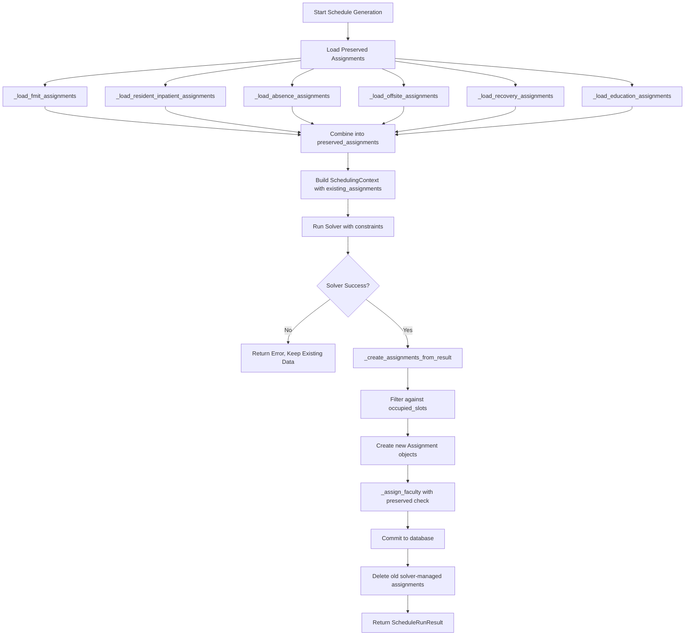

---

## MCP Orchestration Patterns

**Source:** `docs/architecture/MCP_ORCHESTRATION_PATTERNS.md`
**Domain:** Tool Orchestration, DAG Execution
**Entities:** MCP Tools, Meta-Tools, DAG Executor, Parallel Tasks

### Diagram: Deep Schedule Audit DAG

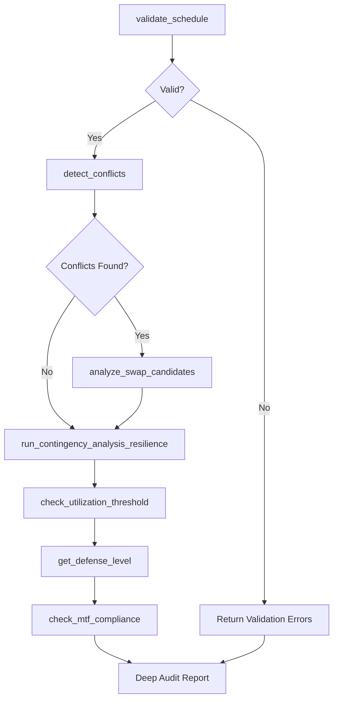

### Diagram: Conflict Resolution Pipeline

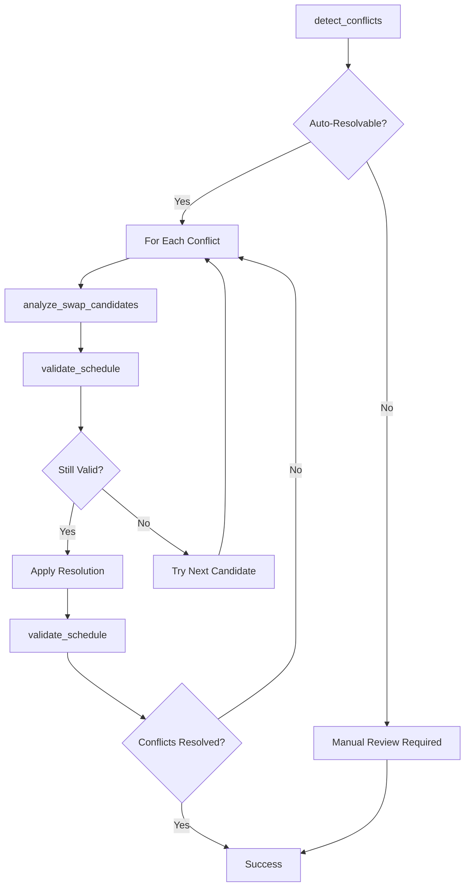

### Diagram: Resilience Health Check Tiers

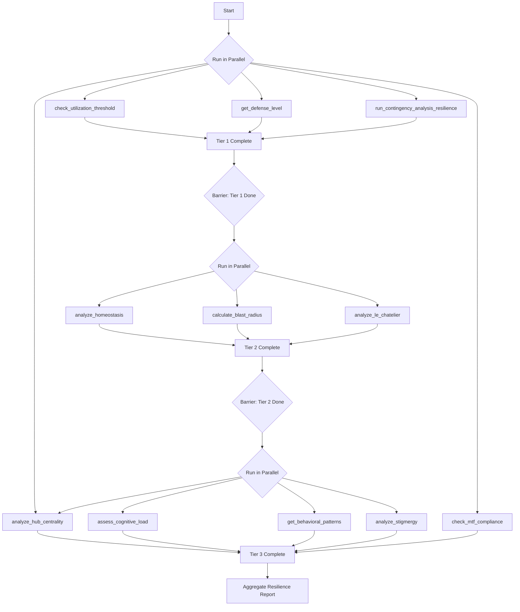

### Diagram: Background Task Lifecycle

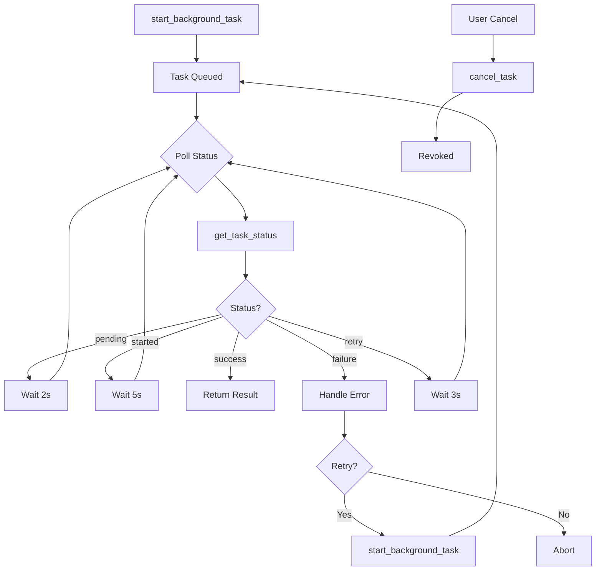

### Diagram: Deployment Pipeline

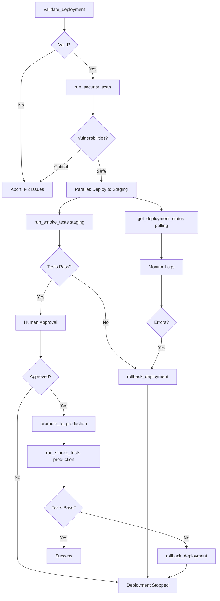

### Diagram: Tool Dependency Graph

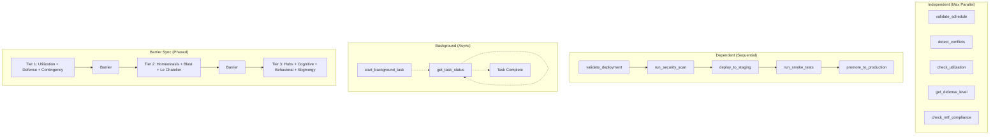

---

## Tool Composition Patterns

**Source:** `docs/architecture/TOOL_COMPOSITION_PATTERNS.md`
**Domain:** Pattern Library
**Entities:** Sequential Chain, Parallel Fan-Out, Conditional Branch, Retry, Saga

### Diagram: Sequential Chain Pattern

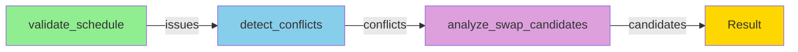

### Diagram: Parallel Fan-Out Pattern

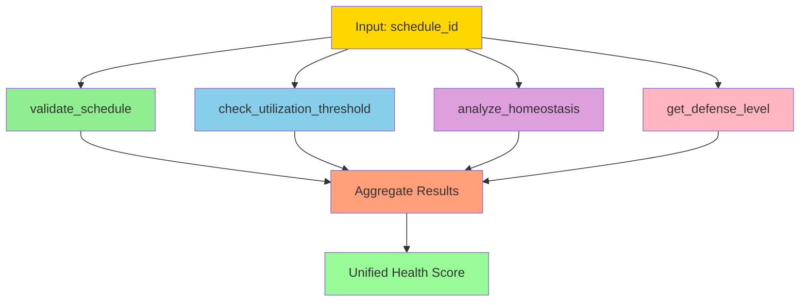

### Diagram: Conditional Branching Pattern

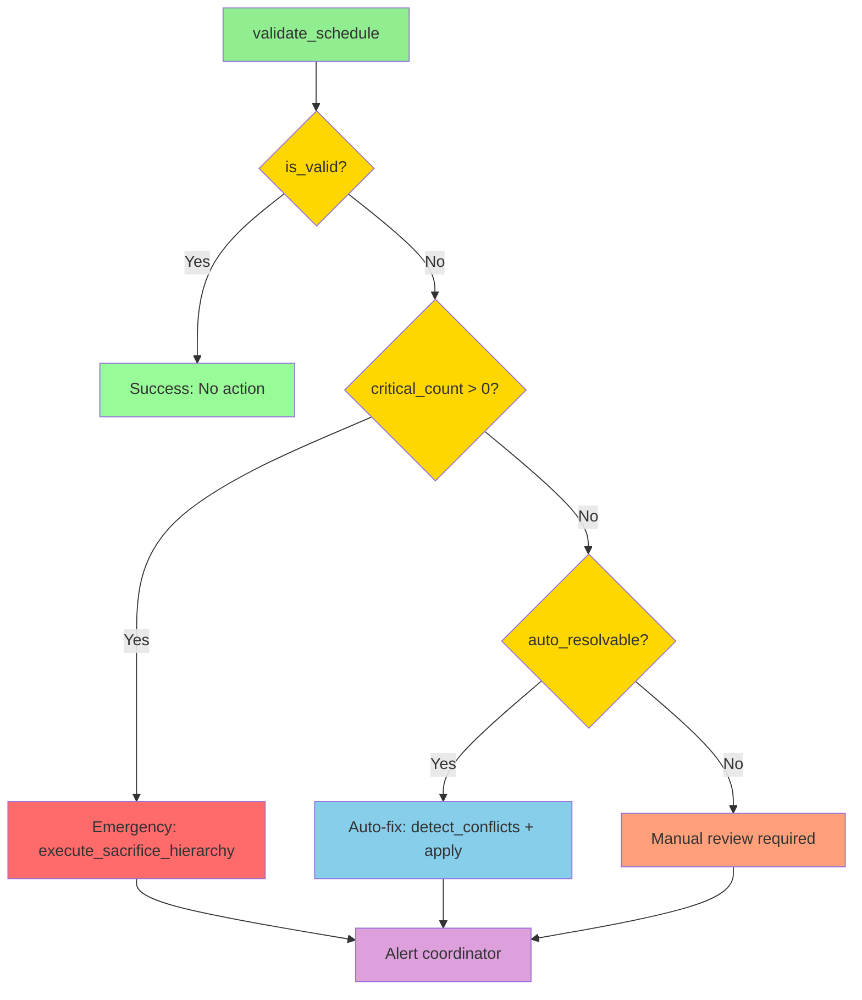

### Diagram: Retry with Fallback Pattern

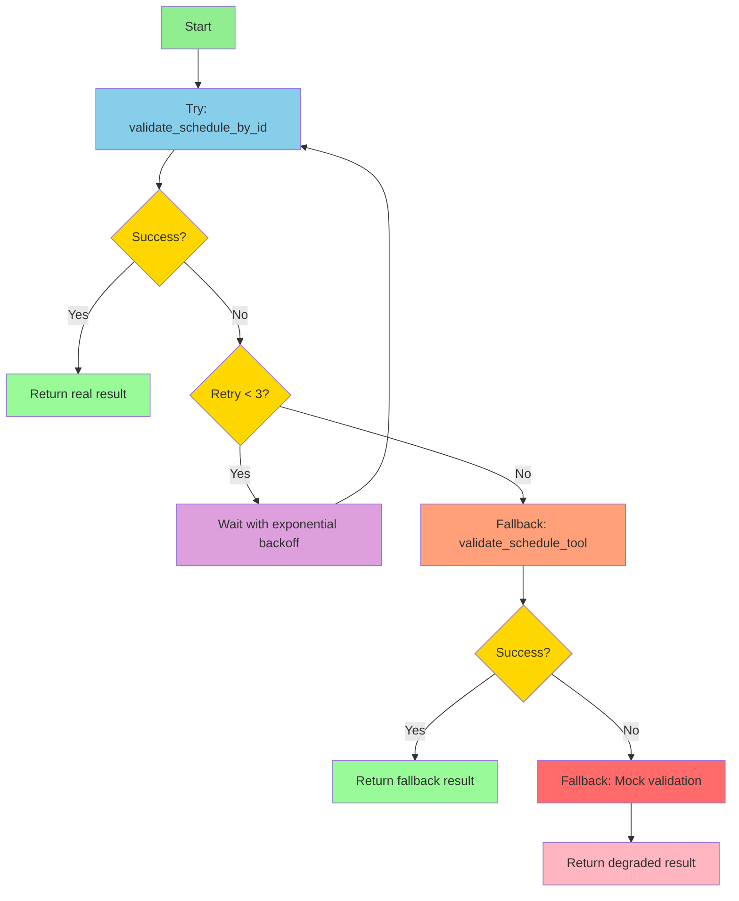

### Diagram: Long-Running Task Pattern

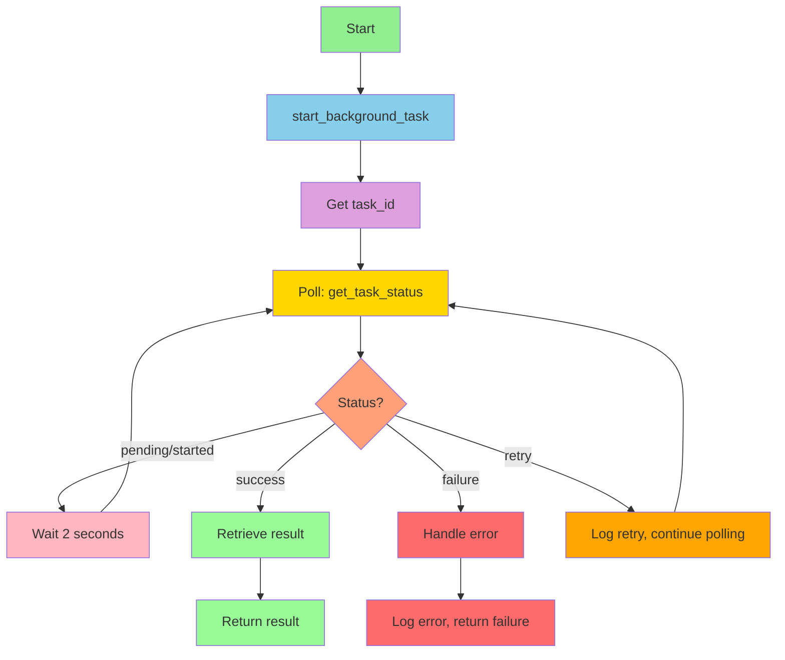

### Diagram: Transactional Saga Pattern

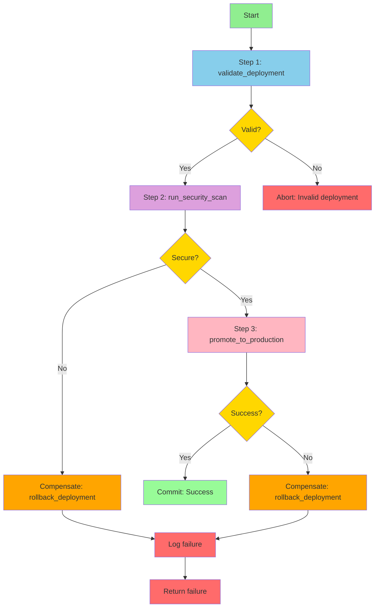

---

## Hub-Epidemiology Bridge

**Source:** `docs/architecture/bridges/HUB_EPIDEMIOLOGY_BRIDGE.md`
**Domain:** Resilience Framework, Network Analysis, Epidemiology
**Entities:** Hub Analyzer, Burnout Epidemiology, Super-spreader Detection, UCI

### Diagram: Data Flow Sequence

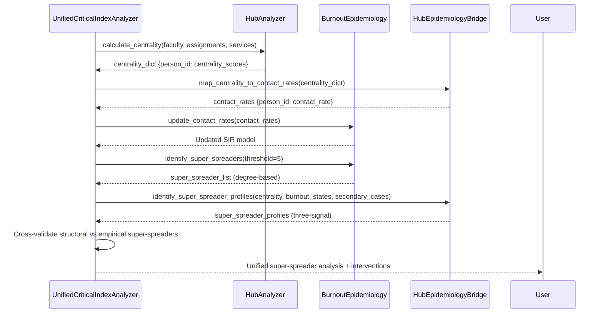

---

## Meta-Tool Specifications

**Source:** `docs/specs/MCP_META_TOOLS_SPEC.md`
**Domain:** MCP Meta-Tools
**Entities:** full_schedule_generation, emergency_coverage, swap_workflow

### Diagram: Full Schedule Generation DAG

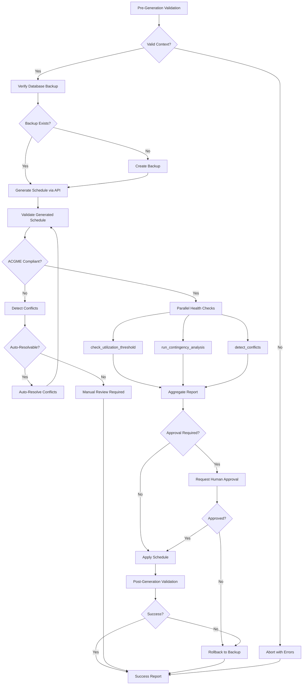

---

## Quick Reference: Entity Relationships

### Core Scheduling Flow
```
Preserved Assignments --> Solver --> Validator --> Committer --> Database
```

### Resilience Analysis Flow
```
Faculty --> Hub Analyzer --> Centrality Scores --> Epidemiology --> Super-spreader Detection
```

### Tool Orchestration Flow
```
Meta-Tool --> DAG Executor --> Atomic Tools (parallel) --> Aggregator --> Report
```

### Deployment Flow
```
Validate --> Security Scan --> Stage --> Smoke Test --> Approve --> Production
```

---

## Diagram Metadata Summary

| Diagram | Type | Nodes | Edges | Domain |
|---------|------|-------|-------|--------|
| Schedule Generation Pipeline | flowchart | 16 | 18 | scheduling |
| Deep Schedule Audit DAG | flowchart | 11 | 13 | orchestration |
| Conflict Resolution Pipeline | flowchart | 12 | 14 | orchestration |
| Resilience Health Check Tiers | flowchart | 21 | 24 | resilience |
| Background Task Lifecycle | flowchart | 16 | 17 | async |
| Deployment Pipeline | flowchart | 19 | 21 | deployment |
| Tool Dependency Graph | flowchart | 18 | 12 | orchestration |
| Sequential Chain Pattern | flowchart | 4 | 3 | pattern |
| Parallel Fan-Out Pattern | flowchart | 7 | 8 | pattern |
| Conditional Branching Pattern | flowchart | 9 | 10 | pattern |
| Retry with Fallback Pattern | flowchart | 11 | 12 | pattern |
| Long-Running Task Pattern | flowchart | 11 | 12 | pattern |
| Transactional Saga Pattern | flowchart | 13 | 13 | pattern |
| Hub-Epidemiology Data Flow | sequence | 4 | 12 | resilience |
| Full Schedule Generation DAG | flowchart | 25 | 28 | meta-tool |

**Total:** 15 diagrams, 197 nodes, 207 edges

---

*Bundle generated: 2026-01-28 | Source files: 5*
