# Architecture Diagram Bundle

> **Purpose:** Consolidated mermaid diagrams for AI context preloading
> **Auto-generated:** Do not edit manually - run `scripts/generate-diagram-bundle.sh`
> **doc_type:** architecture_diagrams

This bundle contains all architecture diagrams extracted from the codebase for efficient AI context loading. Each diagram is machine-readable mermaid syntax with source attribution.

---

## Quick Stats

- **Files scanned:** 8
- **Total diagrams:** 42
- **Generated:** 2026-01-29T01:00:05Z

---

## ENGINE_ASSIGNMENT_FLOW

**Source:** `docs/architecture/ENGINE_ASSIGNMENT_FLOW.md`
**Diagrams:** 1


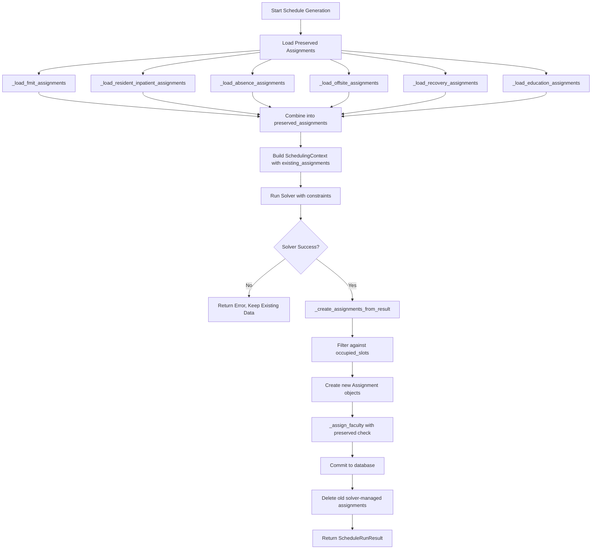

---

## MCP_ORCHESTRATION_PATTERNS

**Source:** `docs/architecture/MCP_ORCHESTRATION_PATTERNS.md`
**Diagrams:** 6


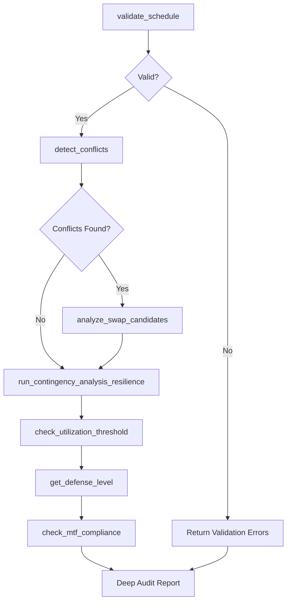


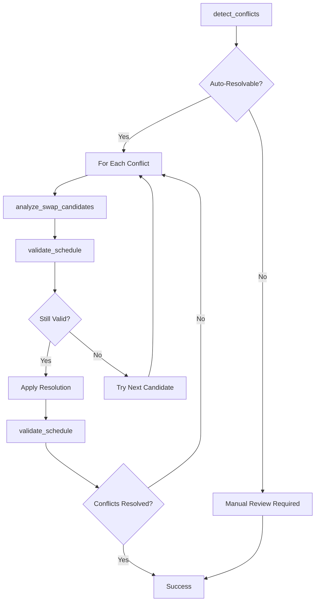


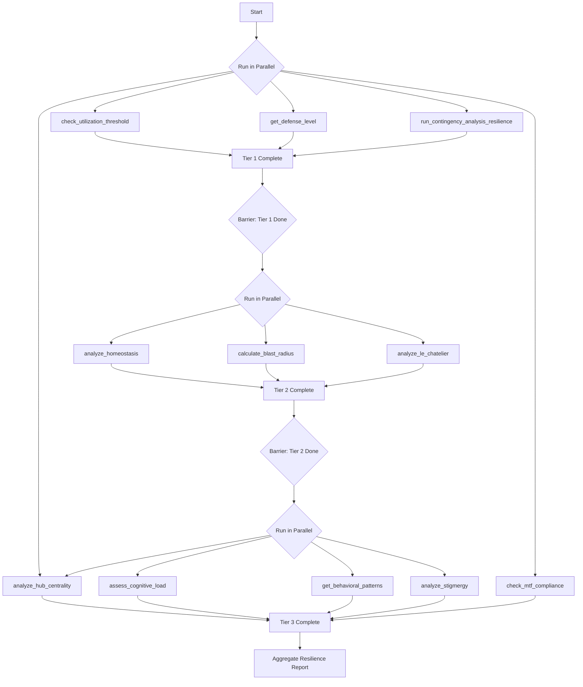


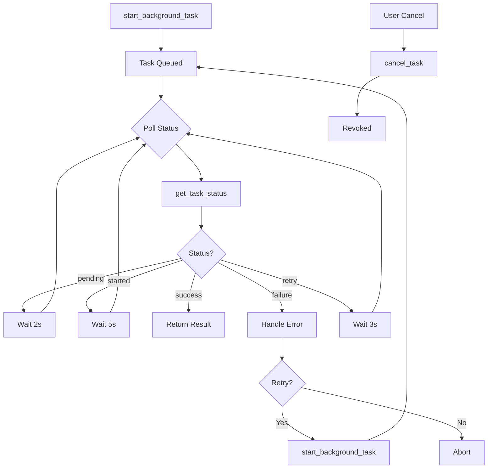


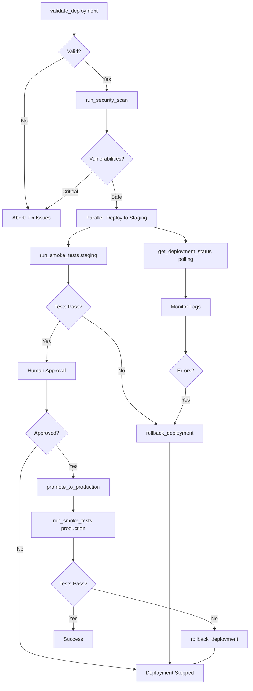


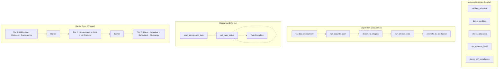

---

## TOOL_COMPOSITION_PATTERNS

**Source:** `docs/architecture/TOOL_COMPOSITION_PATTERNS.md`
**Diagrams:** 6


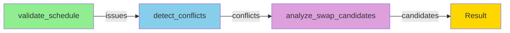


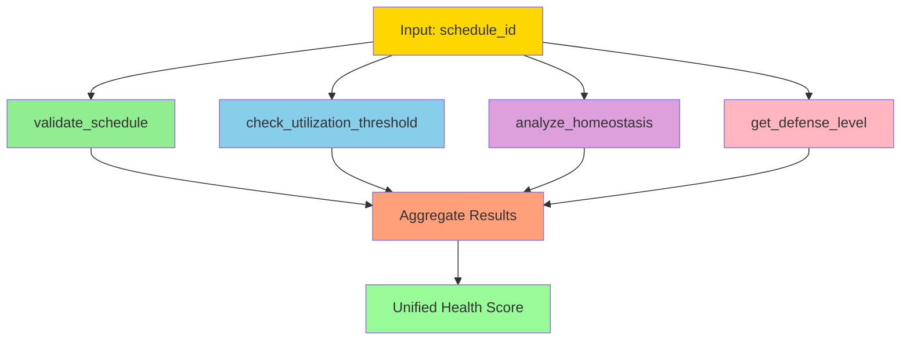


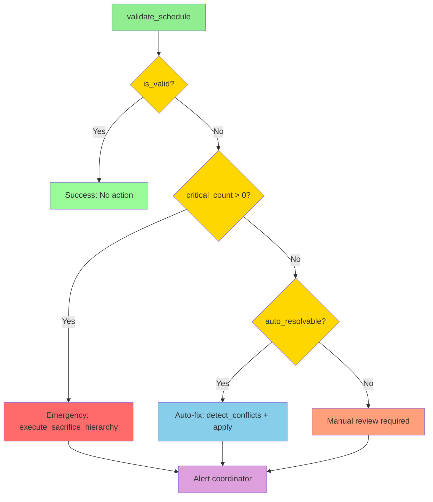


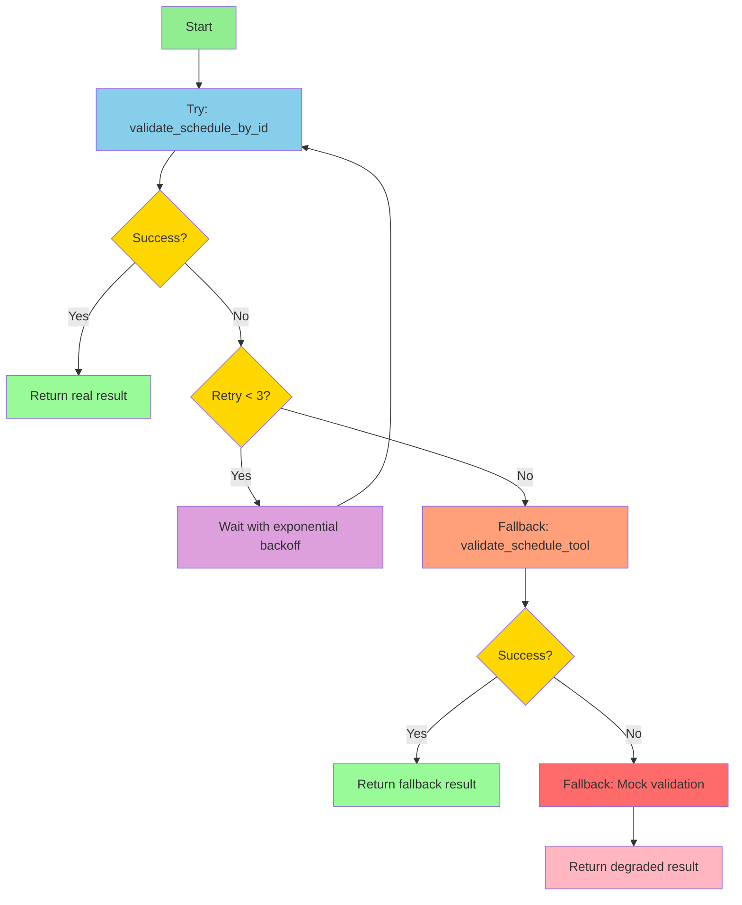


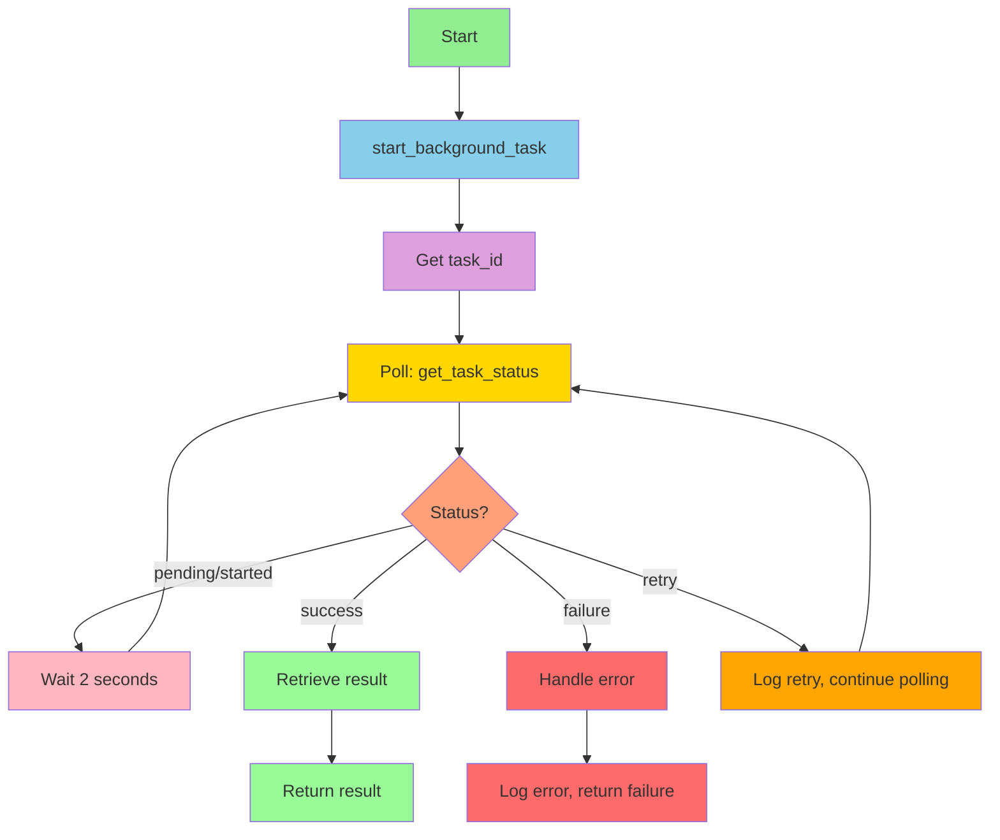


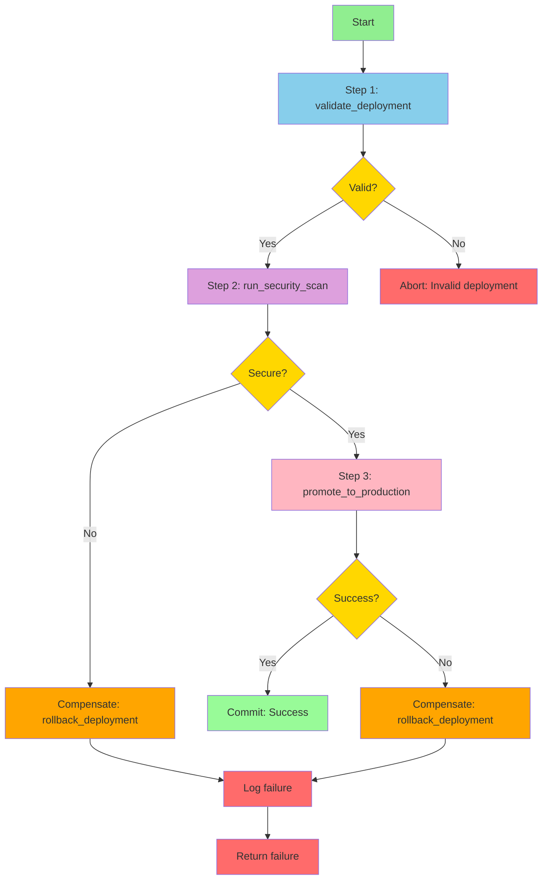

---

## HUB_EPIDEMIOLOGY_BRIDGE

**Source:** `docs/architecture/bridges/HUB_EPIDEMIOLOGY_BRIDGE.md`
**Diagrams:** 1


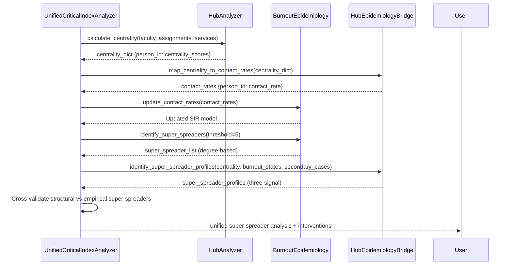

---

## N8N_WORKFLOW_SUMMARY

**Source:** `docs/data/N8N_WORKFLOW_SUMMARY.md`
**Diagrams:** 1


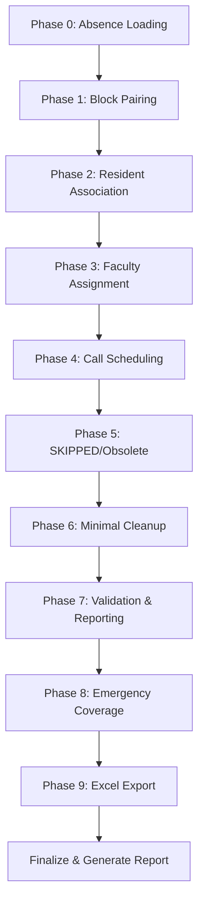

---

## AUDIENCE_AUTH_USAGE

**Source:** `docs/development/AUDIENCE_AUTH_USAGE.md`
**Diagrams:** 1


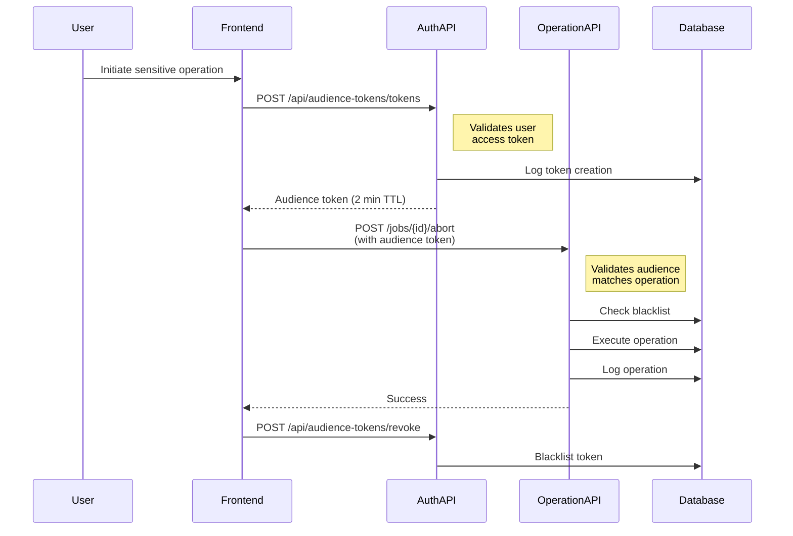

---

## MERMAID_GRAPH_RAG_ENHANCEMENT

**Source:** `docs/development/MERMAID_GRAPH_RAG_ENHANCEMENT.md`
**Diagrams:** 9


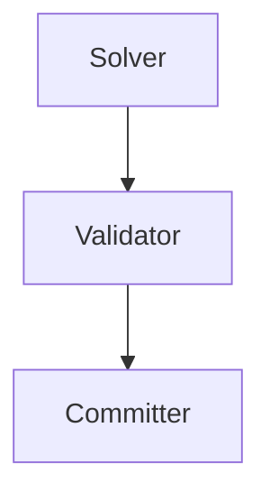


```mermaid
        echo "## $(basename "$file" .md)" >> "$OUTPUT"
        echo "" >> "$OUTPUT"
        echo "**Source:** \`$file\`" >> "$OUTPUT"
        echo "" >> "$OUTPUT"

        # Extract mermaid blocks with context

```mermaid
        echo "" >> "$OUTPUT"
        echo "---" >> "$OUTPUT"
        echo "" >> "$OUTPUT"
    fi
done

echo "Generated: $(date -u +%Y-%m-%dT%H:%M:%SZ)" >> "$OUTPUT"
```


```mermaid
        matches = re.findall(pattern, content, re.DOTALL)
        return matches

    def parse_diagram(
        self,
        mermaid_code: str,
        source_file: str | None = None
    ) -> ParsedDiagram:
        """Parse a mermaid diagram into structured data."""
        lines = mermaid_code.strip().split('\n')

        # Detect diagram type
        diagram_type = "other"
        for line in lines:
            match = self.DIAGRAM_TYPE.match(line.strip())
            if match:
                type_str = match.group(1).lower()
                if type_str in ("graph", "flowchart"):
                    diagram_type = "flowchart"
                elif type_str == "sequencediagram":
                    diagram_type = "sequence"
                elif type_str == "classdiagram":
                    diagram_type = "class"
                elif type_str == "erdiagram":
                    diagram_type = "er"
                elif type_str == "statediagram":
                    diagram_type = "state"
                break

        # Extract title from comments
        title = None
        for line in lines:
            if line.strip().startswith('%%') and 'title' in line.lower():
                title = line.replace('%%', '').replace('title:', '').strip()
                break

        # Parse nodes and edges (flowchart-specific for now)
        nodes = {}
        edges = []

        if diagram_type == "flowchart":
            for line in lines:
                # Find nodes
                for match in self.FLOWCHART_NODE.finditer(line):
                    node_id, label = match.groups()
                    if node_id not in nodes:
                        nodes[node_id] = DiagramNode(
                            id=node_id,
                            label=label.strip(),
                            node_type=self._infer_node_type(label)
                        )

                # Find edges
                for match in self.FLOWCHART_EDGE.finditer(line):
                    source, label, target = match.groups()
                    edges.append(DiagramEdge(
                        source=source,
                        target=target,
                        label=label.strip() if label else None
                    ))

        return ParsedDiagram(
            diagram_type=diagram_type,
            title=title,
            nodes=list(nodes.values()),
            edges=edges,
            raw_mermaid=mermaid_code,
            source_file=source_file
        )

    def _infer_node_type(self, label: str) -> str | None:
        """Infer node type from label text."""
        label_lower = label.lower()
        if any(kw in label_lower for kw in ['database', 'db', 'store']):
            return 'database'
        if any(kw in label_lower for kw in ['api', 'endpoint', 'route']):
            return 'api'
        if any(kw in label_lower for kw in ['service', 'handler']):
            return 'service'
        if any(kw in label_lower for kw in ['?', 'valid', 'check']):
            return 'decision'
        return 'process'

    def to_entity_metadata(self, diagram: ParsedDiagram) -> list[dict]:
        """Convert parsed diagram to entity metadata for RAG storage."""
        entities = []

        for node in diagram.nodes:
            entities.append({
                "entity_type": "diagram_node",
                "entity_id": node.id,
                "entity_label": node.label,
                "node_type": node.node_type,
                "diagram_type": diagram.diagram_type,
                "diagram_title": diagram.title,
                "source_file": diagram.source_file,
                "relations": [
                    {
                        "type": "connects_to",
                        "target": edge.target,
                        "label": edge.label
                    }
                    for edge in diagram.edges
                    if edge.source == node.id
                ]
            })

        return entities
```


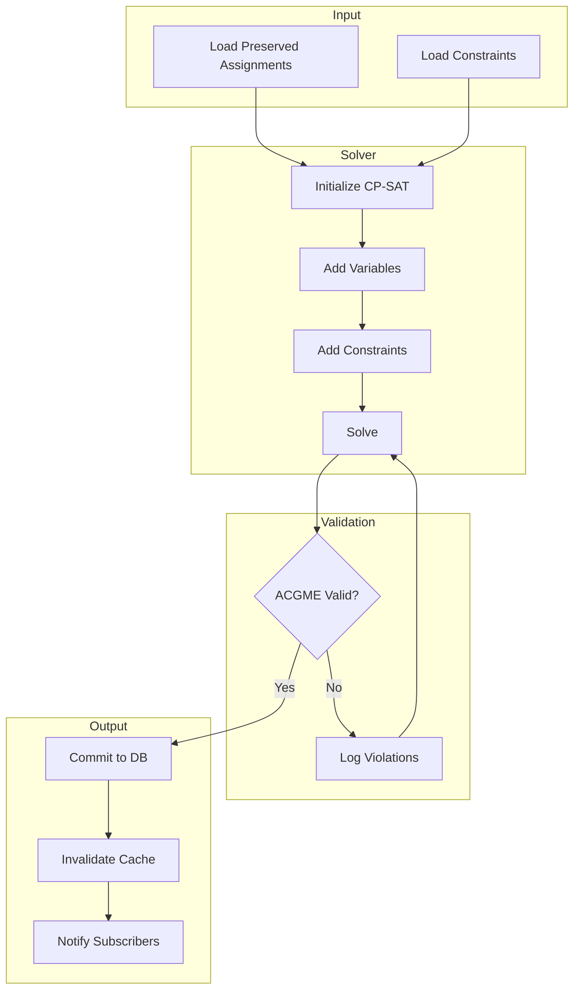


```mermaid
%% FILE: <filename>
%% PURPOSE: <one-line description>
%% DOMAIN: <scheduling|auth|resilience|data|frontend>
%% ENTITIES: <comma-separated list of key nodes>
%% UPDATED: <YYYY-MM-DD>
%% RELATES_TO: <other diagram files>
```


```mermaid
graph TD
    A[Rectangle]           %% Standard process
    B(Rounded)             %% Alternative process
    C{Diamond}             %% Decision
    D[(Database)]          %% Database
    E((Circle))            %% Start/End
    F>Flag]                %% Flag/Note
    G{{Hexagon}}           %% Preparation
```


```mermaid
graph LR
    A --> B                %% Arrow
    A --- B                %% Line
    A -.-> B               %% Dotted arrow
    A ==> B                %% Thick arrow
    A --text--> B          %% Arrow with text
    A -->|text| B          %% Arrow with text (alt)
```


```mermaid
graph TD
    subgraph Backend
        A[Service]
        B[Repository]
    end
    subgraph Frontend
        C[Component]
        D[Hook]
    end
    C --> A
```

---

## MCP_META_TOOLS_SPEC

**Source:** `docs/specs/MCP_META_TOOLS_SPEC.md`
**Diagrams:** 2


```mermaid
graph TD
    A[Pre-Generation Validation] --> B{Valid Context?}
    B -->|No| Z[Abort with Errors]
    B -->|Yes| C[Verify Database Backup]

    C --> D{Backup Exists?}
    D -->|No| E[Create Backup]
    D -->|Yes| F[Generate Schedule via API]
    E --> F

    F --> G[Validate Generated Schedule]
    G --> H{ACGME Compliant?}

    H -->|No| I[Detect Conflicts]
    I --> J{Auto-Resolvable?}
    J -->|Yes| K[Auto-Resolve Conflicts]
    K --> G
    J -->|No| L[Manual Review Required]

    H -->|Yes| M[Parallel Health Checks]
    M --> N[check_utilization_threshold]
    M --> O[run_contingency_analysis]
    M --> P[detect_conflicts]

    N --> Q[Aggregate Report]
    O --> Q
    P --> Q

    Q --> R{Approval Required?}
    R -->|Yes| S[Request Human Approval]
    R -->|No| T[Apply Schedule]
    S --> U{Approved?}
    U -->|Yes| T
    U -->|No| V[Rollback to Backup]

    T --> W[Post-Generation Validation]
    W --> X{Success?}
    X -->|No| V
    X -->|Yes| Y[Success Report]

    L --> Y
    V --> Y
    Z --> Y
```


```mermaid
graph TD
    A[Detect Coverage Gaps] --> B{Gaps Found?}
    B -->|No| Z[No Action Needed]
    B -->|Yes| C[Parallel Analysis]

    C --> D[run_contingency_analysis]
    C --> E[analyze_swap_candidates for each gap]
    C --> F[get_static_fallbacks]

    D --> G[Aggregate Options]
    E --> G
    F --> G

    G --> H[Rank Solutions]
    H --> I{Best Solution?}

    I -->|Swap| J[Validate Swap]
    I -->|Fallback| K[Validate Fallback]
    I -->|Load Shed| L[execute_sacrifice_hierarchy simulate]

    J --> M{Valid?}
    K --> M
    L --> M

    M -->|Yes| N{Auto-Apply?}
    M -->|No| O[Try Next Option]

    N -->|Yes| P[Apply Solution]
    N -->|No| Q[Request Approval]

    P --> R[Verify Resolution]
    Q --> S{Approved?}
    S -->|Yes| P
    S -->|No| O

    R --> T{Gaps Closed?}
    T -->|No| O
    T -->|Yes| U[Success Report]

    O --> H
    Z --> U
```

---

## Regeneration

To regenerate this bundle:

```bash
./scripts/generate-diagram-bundle.sh
```

To check if bundle is stale:

```bash
./scripts/generate-diagram-bundle.sh --check
```

---

*This file is auto-generated. Do not edit manually.*
