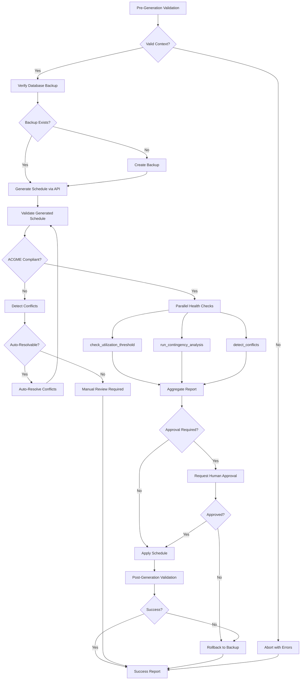
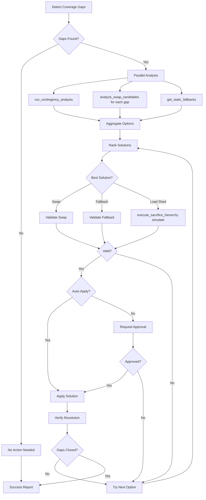

# MCP Meta-Tools Implementation Specification

> **Version:** 1.0.0
> **Created:** 2025-12-26
> **Status:** Implementation-Ready Specification
> **Dependencies:** MCP Orchestration Patterns v1.0.0, FastMCP 0.2.0+

---

## Table of Contents

1. [Overview](#overview)
2. [Meta-Tool Architecture](#meta-tool-architecture)
3. [Meta-Tool Specifications](#meta-tool-specifications)
4. [Tool Definitions](#tool-definitions)
5. [Prompt Templates](#prompt-templates)
6. [Resource Management](#resource-management)
7. [Testing Strategy](#testing-strategy)
8. [Implementation Roadmap](#implementation-roadmap)

---

## Overview

### Purpose

This specification defines **5 composite meta-tools** that orchestrate the existing 34+ MCP tools into coherent, high-level workflows. These meta-tools reduce cognitive load for AI assistants and provide one-call solutions for complex multi-step operations.

### Design Philosophy

1. **Composability**: Meta-tools are built from atomic tools
2. **Declarative DAGs**: Workflow structure is explicit and inspectable
3. **Fail-Safe**: Errors in non-critical tools don't abort the entire workflow
4. **Observable**: Every step emits status for monitoring
5. **Rollback-Ready**: State-changing operations support automatic rollback

### Existing Foundation

**Current State (from MCP Tools Audit):**
- **29 MCP tools** implemented (10 placeholders)
- **2 MCP resources** exposed
- **FastMCP framework** in place
- **Backend API client** implemented
- **Async task management** functional

**Gap:** No orchestration layer to compose tools into workflows.

---

## Meta-Tool Architecture

### Layer Structure

```
┌─────────────────────────────────────────────────────────────┐
│                     AI Assistant Layer                       │
│  (Claude Code, Claude Web, Direct API calls)                │
└─────────────────────────────────────────────────────────────┘
                            ↓
┌─────────────────────────────────────────────────────────────┐
│                   Meta-Tool Layer (NEW)                      │
│  • full_schedule_generation                                 │
│  • emergency_coverage_repair                                │
│  • swap_workflow_complete                                   │
│  • resilience_dashboard_snapshot                            │
│  • weekly_health_report                                     │
└─────────────────────────────────────────────────────────────┘
                            ↓
┌─────────────────────────────────────────────────────────────┐
│                  Orchestration Engine (NEW)                  │
│  • DAG Executor                                             │
│  • Parallel Task Manager                                   │
│  • Error Recovery Handler                                  │
│  • Result Aggregator                                       │
└─────────────────────────────────────────────────────────────┘
                            ↓
┌─────────────────────────────────────────────────────────────┐
│                   Atomic Tool Layer (Existing)               │
│  34+ individual MCP tools (validate, detect, analyze, etc.) │
└─────────────────────────────────────────────────────────────┘
                            ↓
┌─────────────────────────────────────────────────────────────┐
│                    Backend Services                          │
│  FastAPI, Celery, PostgreSQL, Redis, Resilience Framework  │
└─────────────────────────────────────────────────────────────┘
```

### Tool Composition DAG Pattern

```python
from dataclasses import dataclass, field
from typing import Callable, Any
from enum import Enum

class ExecutionStrategy(Enum):
    """How to execute DAG nodes."""
    SEQUENTIAL = "sequential"      # One at a time, strict order
    PARALLEL = "parallel"          # All at once
    PHASED = "phased"              # Groups with barriers
    CONDITIONAL = "conditional"    # Branch based on results

@dataclass
class DAGNode:
    """Node in a tool execution DAG."""
    name: str
    tool: Callable
    dependencies: list[str] = field(default_factory=list)
    strategy: ExecutionStrategy = ExecutionStrategy.SEQUENTIAL
    required: bool = True  # If True, failure aborts DAG
    timeout_seconds: float = 30.0
    retry_count: int = 0

@dataclass
class DAGDefinition:
    """Complete DAG definition for a meta-tool."""
    name: str
    description: str
    nodes: list[DAGNode]
    strategy: ExecutionStrategy
    timeout_seconds: float = 300.0  # 5 minutes default
    rollback_on_failure: bool = False

    def to_mermaid(self) -> str:
        """Generate Mermaid diagram of DAG."""
        # Implementation in orchestration/dag_visualizer.py
        pass
```

### Error Handling and Rollback

```python
from typing import Protocol

class Rollbackable(Protocol):
    """Protocol for operations that support rollback."""

    async def execute(self) -> Any:
        """Execute the operation."""
        ...

    async def rollback(self) -> None:
        """Rollback the operation."""
        ...

    async def verify(self) -> bool:
        """Verify operation succeeded."""
        ...

class TransactionalOperation:
    """Wrapper for operations with automatic rollback."""

    def __init__(
        self,
        operation: Rollbackable,
        validation: Callable[[], bool],
        rollback_on_validation_failure: bool = True
    ):
        self.operation = operation
        self.validation = validation
        self.rollback_on_validation_failure = rollback_on_validation_failure
        self._executed = False
        self._snapshot = None

    async def __aenter__(self):
        """Take snapshot before operation."""
        self._snapshot = await self._create_snapshot()
        return self

    async def __aexit__(self, exc_type, exc_val, exc_tb):
        """Rollback on exception."""
        if exc_type is not None:
            await self._rollback()
        elif self._executed and not await self.validation():
            if self.rollback_on_validation_failure:
                await self._rollback()
        return False  # Don't suppress exceptions

    async def execute(self) -> Any:
        """Execute with validation."""
        result = await self.operation.execute()
        self._executed = True

        if not await self.operation.verify():
            raise ValidationError("Operation verification failed")

        return result

    async def _create_snapshot(self) -> Any:
        """Create state snapshot for rollback."""
        # Implementation depends on backend
        pass

    async def _rollback(self) -> None:
        """Rollback to snapshot."""
        if self._snapshot:
            await self.operation.rollback()
```

---

## Meta-Tool Specifications

### Meta-Tool 1: `full_schedule_generation`

**Purpose:** End-to-end schedule generation with validation, conflict resolution, and resilience checks.

**Signature:**
```python
async def full_schedule_generation(
    start_date: str,
    end_date: str,
    algorithm: str = "cp_sat",
    auto_resolve_conflicts: bool = True,
    require_approval: bool = True,
    backup_verification: bool = True,
    max_iterations: int = 5
) -> ScheduleGenerationReport
```

**DAG Structure:**


**Implementation:**
```python
# mcp-server/src/scheduler_mcp/meta_tools/schedule_generation.py

from typing import Any
from pydantic import BaseModel
from scheduler_mcp.orchestration.dag_executor import DAGExecutor, DAGNode, ExecutionStrategy
from scheduler_mcp.api_client import get_api_client

class ScheduleGenerationReport(BaseModel):
    """Result of full schedule generation."""
    status: str  # "success", "validation_failed", "approval_rejected", "conflict_unresolved"
    schedule_id: str | None
    validation: dict[str, Any]
    conflicts: dict[str, Any] | None
    resilience: dict[str, Any] | None
    backup_id: str | None
    approval_required: bool
    approval_granted: bool | None
    iterations: int
    execution_time_ms: int
    errors: list[str] = []

async def full_schedule_generation(
    start_date: str,
    end_date: str,
    algorithm: str = "cp_sat",
    auto_resolve_conflicts: bool = True,
    require_approval: bool = True,
    backup_verification: bool = True,
    max_iterations: int = 5
) -> ScheduleGenerationReport:
    """
    Generate a complete schedule with validation and conflict resolution.

    This meta-tool orchestrates:
    1. Pre-generation validation (context, constraints)
    2. Database backup verification
    3. Schedule generation via OR-Tools solver
    4. ACGME compliance validation
    5. Conflict detection and auto-resolution
    6. Resilience health checks (utilization, contingency)
    7. Human approval gate (optional)
    8. Post-generation validation
    9. Rollback on failure

    Args:
        start_date: Schedule start date (YYYY-MM-DD)
        end_date: Schedule end date (YYYY-MM-DD)
        algorithm: Solver to use ("cp_sat", "greedy", "hybrid")
        auto_resolve_conflicts: Automatically resolve conflicts if possible
        require_approval: Require human approval before applying
        backup_verification: Verify database backup exists
        max_iterations: Max conflict resolution iterations

    Returns:
        ScheduleGenerationReport with status and detailed results

    Raises:
        ValueError: Invalid date range or algorithm
        RuntimeError: Backend unavailable or backup missing
    """
    import time
    from scheduler_mcp.tools import (
        validate_schedule,
        detect_conflicts,
        check_utilization_threshold,
        run_contingency_analysis_resilience
    )

    start_time = time.time()
    report = ScheduleGenerationReport(
        status="pending",
        schedule_id=None,
        validation={},
        conflicts=None,
        resilience=None,
        backup_id=None,
        approval_required=require_approval,
        approval_granted=None,
        iterations=0,
        execution_time_ms=0,
        errors=[]
    )

    api_client = await get_api_client()

    try:
        # Step 1: Pre-generation validation
        # Verify date range is valid, faculty available, etc.
        pre_validation = await api_client.validate_generation_context(
            start_date=start_date,
            end_date=end_date
        )

        if not pre_validation["valid"]:
            report.status = "validation_failed"
            report.errors.extend(pre_validation["errors"])
            return report

        # Step 2: Verify backup exists (safety gate)
        if backup_verification:
            backup = await api_client.verify_backup_exists()
            if not backup["exists"]:
                # Create backup
                backup = await api_client.create_backup(
                    description=f"Pre-generation backup for {start_date} to {end_date}"
                )
            report.backup_id = backup["backup_id"]

        # Step 3: Generate schedule
        generation_result = await api_client.generate_schedule(
            start_date=start_date,
            end_date=end_date,
            algorithm=algorithm,
            dry_run=require_approval  # Don't apply if approval needed
        )

        report.schedule_id = generation_result["schedule_id"]

        # Step 4: Validate generated schedule
        iteration = 0
        while iteration < max_iterations:
            validation = await validate_schedule(
                start_date=start_date,
                end_date=end_date
            )

            report.validation = validation.model_dump()

            if validation.is_valid:
                break

            # Step 5: Detect and resolve conflicts
            conflicts = await detect_conflicts(
                start_date=start_date,
                end_date=end_date,
                include_auto_resolution=auto_resolve_conflicts
            )

            report.conflicts = conflicts.model_dump()

            if not auto_resolve_conflicts or conflicts.auto_resolvable_count == 0:
                report.status = "conflict_unresolved"
                return report

            # Auto-resolve conflicts
            for conflict in conflicts.conflicts:
                if not conflict.auto_resolution_available:
                    continue

                # Apply resolution
                await api_client.apply_conflict_resolution(
                    conflict_id=conflict.conflict_id,
                    resolution=conflict.resolution_options[0]
                )

            iteration += 1

        report.iterations = iteration

        # Step 6: Resilience health checks (parallel)
        import asyncio

        resilience_tasks = [
            check_utilization_threshold(
                available_faculty=await _get_faculty_count(api_client),
                required_blocks=await _get_block_count(api_client, start_date, end_date)
            ),
            run_contingency_analysis_resilience(
                analyze_n1=True,
                analyze_n2=False  # N-2 too slow for generation
            )
        ]

        resilience_results = await asyncio.gather(*resilience_tasks, return_exceptions=True)

        report.resilience = {
            "utilization": resilience_results[0].model_dump() if not isinstance(resilience_results[0], Exception) else None,
            "contingency": resilience_results[1].model_dump() if not isinstance(resilience_results[1], Exception) else None
        }

        # Step 7: Human approval gate
        if require_approval:
            # Request approval from human
            # Implementation depends on notification system
            approval = await _request_approval(
                schedule_id=report.schedule_id,
                validation=report.validation,
                resilience=report.resilience
            )

            report.approval_granted = approval

            if not approval:
                report.status = "approval_rejected"
                # Rollback if needed
                if not generation_result.get("dry_run"):
                    await api_client.rollback_to_backup(backup_id=report.backup_id)
                return report

        # Step 8: Apply schedule (if not already applied)
        if require_approval and generation_result.get("dry_run"):
            await api_client.apply_schedule(schedule_id=report.schedule_id)

        # Step 9: Post-generation validation
        final_validation = await validate_schedule(
            start_date=start_date,
            end_date=end_date
        )

        if not final_validation.is_valid:
            report.status = "validation_failed"
            report.errors.append("Post-generation validation failed")
            # Rollback
            await api_client.rollback_to_backup(backup_id=report.backup_id)
            return report

        report.status = "success"

    except Exception as e:
        report.status = "error"
        report.errors.append(str(e))

        # Rollback on error
        if report.backup_id:
            try:
                await api_client.rollback_to_backup(backup_id=report.backup_id)
            except Exception as rollback_error:
                report.errors.append(f"Rollback failed: {rollback_error}")

    finally:
        report.execution_time_ms = int((time.time() - start_time) * 1000)

    return report


async def _get_faculty_count(api_client) -> int:
    """Get count of active faculty."""
    result = await api_client.get("/api/v1/persons/count", params={"role": "FACULTY"})
    return result["count"]


async def _get_block_count(api_client, start_date: str, end_date: str) -> int:
    """Get count of blocks in date range."""
    result = await api_client.get("/api/v1/blocks/count", params={
        "start_date": start_date,
        "end_date": end_date
    })
    return result["count"]


async def _request_approval(schedule_id: str, validation: dict, resilience: dict) -> bool:
    """
    Request human approval for schedule.

    TODO: Integrate with notification system
    For now, this is a placeholder that always returns True.
    """
    # Implementation depends on notification/approval system
    # Could be:
    # - Email with approval link
    # - Slack message with approve/reject buttons
    # - Web UI notification
    return True
```

**Estimated Execution Time:** 2-5 minutes (depending on schedule size and conflicts)

**Rollback Mechanism:** Automatic rollback to database backup on validation failure

**Human Approval:** Optional gate before applying schedule to production

---

### Meta-Tool 2: `emergency_coverage_repair`

**Purpose:** Detect and fix coverage gaps caused by emergency absences (deployment, illness, etc.)

**Signature:**
```python
async def emergency_coverage_repair(
    affected_person_id: str,
    absence_start: str,
    absence_end: str,
    scenario: str = "emergency_absence",
    auto_apply_swaps: bool = False,
    use_fallback: bool = True,
    max_swaps: int = 10
) -> CoverageRepairReport
```

**DAG Structure:**


**Implementation:**
```python
# mcp-server/src/scheduler_mcp/meta_tools/coverage_repair.py

from pydantic import BaseModel
from typing import Any

class CoverageRepairReport(BaseModel):
    """Result of emergency coverage repair."""
    status: str  # "success", "partial", "failed", "manual_required"
    gaps_detected: int
    gaps_resolved: int
    gaps_remaining: int
    solutions_applied: list[dict[str, Any]]
    fallback_used: bool
    load_shedding_required: bool
    approval_required: bool
    execution_time_ms: int
    errors: list[str] = []

async def emergency_coverage_repair(
    affected_person_id: str,
    absence_start: str,
    absence_end: str,
    scenario: str = "emergency_absence",
    auto_apply_swaps: bool = False,
    use_fallback: bool = True,
    max_swaps: int = 10
) -> CoverageRepairReport:
    """
    Detect and repair coverage gaps from emergency absences.

    This meta-tool orchestrates:
    1. Contingency analysis to identify gaps
    2. Swap candidate matching for each gap
    3. Static fallback schedule lookup
    4. Load shedding if necessary (simulate only)
    5. Solution ranking and validation
    6. Automatic or manual application

    Args:
        affected_person_id: Person who is unavailable
        absence_start: Absence start date (YYYY-MM-DD)
        absence_end: Absence end date (YYYY-MM-DD)
        scenario: Scenario type ("emergency_absence", "deployment", "illness")
        auto_apply_swaps: Automatically apply valid swaps without approval
        use_fallback: Use pre-computed fallback schedules if available
        max_swaps: Maximum number of swaps to attempt

    Returns:
        CoverageRepairReport with gaps resolved and actions taken
    """
    import time
    import asyncio
    from scheduler_mcp.tools import (
        run_contingency_analysis,
        analyze_swap_candidates,
        get_static_fallbacks,
        execute_sacrifice_hierarchy,
        validate_schedule
    )
    from scheduler_mcp.api_client import get_api_client

    start_time = time.time()
    report = CoverageRepairReport(
        status="pending",
        gaps_detected=0,
        gaps_resolved=0,
        gaps_remaining=0,
        solutions_applied=[],
        fallback_used=False,
        load_shedding_required=False,
        approval_required=not auto_apply_swaps,
        execution_time_ms=0,
        errors=[]
    )

    api_client = await get_api_client()

    try:
        # Step 1: Detect coverage gaps via contingency analysis
        contingency = await run_contingency_analysis(
            scenario=scenario,
            affected_person_ids=[affected_person_id],
            start_date=absence_start,
            end_date=absence_end
        )

        gaps = contingency.coverage_gaps
        report.gaps_detected = len(gaps)
        report.gaps_remaining = len(gaps)

        if len(gaps) == 0:
            report.status = "success"
            return report

        # Step 2: Parallel solution analysis
        solution_tasks = []

        # For each gap, find swap candidates
        for gap in gaps:
            solution_tasks.append(
                analyze_swap_candidates(
                    requester_person_id=affected_person_id,
                    assignment_id=gap["assignment_id"],
                    max_candidates=5
                )
            )

        # Also check for fallback schedules
        if use_fallback:
            solution_tasks.append(
                get_static_fallbacks(
                    start_date=absence_start,
                    end_date=absence_end
                )
            )

        # Run all analyses in parallel
        solution_results = await asyncio.gather(*solution_tasks, return_exceptions=True)

        # Step 3: Rank and apply solutions
        swap_results = solution_results[:-1] if use_fallback else solution_results
        fallback_result = solution_results[-1] if use_fallback else None

        # Collect all swap options
        all_swap_options = []
        for i, result in enumerate(swap_results):
            if isinstance(result, Exception):
                report.errors.append(f"Gap {i} analysis failed: {result}")
                continue

            if result.candidates:
                all_swap_options.append({
                    "gap_index": i,
                    "gap": gaps[i],
                    "candidates": result.candidates
                })

        # Try swaps first (highest priority)
        swaps_applied = 0
        for option in all_swap_options:
            if swaps_applied >= max_swaps:
                break

            gap = option["gap"]
            best_candidate = option["candidates"][0]

            # Validate swap
            # NOTE: This requires a dry-run swap validation endpoint
            validation = await api_client.validate_swap(
                assignment_id=gap["assignment_id"],
                candidate_person_id=best_candidate.person_id,
                dry_run=True
            )

            if not validation["valid"]:
                report.errors.append(f"Swap invalid for gap {option['gap_index']}")
                continue

            # Apply swap (or request approval)
            if auto_apply_swaps:
                await api_client.execute_swap(
                    assignment_id=gap["assignment_id"],
                    candidate_person_id=best_candidate.person_id
                )

                report.solutions_applied.append({
                    "type": "swap",
                    "gap": gap,
                    "candidate": best_candidate.person_id
                })

                report.gaps_resolved += 1
                swaps_applied += 1
            else:
                # Request approval
                # TODO: Integrate with approval system
                pass

        report.gaps_remaining = report.gaps_detected - report.gaps_resolved

        # Step 4: Use fallback if gaps remain
        if report.gaps_remaining > 0 and use_fallback and fallback_result:
            if not isinstance(fallback_result, Exception) and fallback_result.fallback_schedules:
                # Apply fallback schedule
                fallback = fallback_result.fallback_schedules[0]

                await api_client.apply_fallback_schedule(
                    fallback_id=fallback["id"],
                    start_date=absence_start,
                    end_date=absence_end
                )

                report.fallback_used = True
                report.gaps_resolved = report.gaps_detected
                report.gaps_remaining = 0

                report.solutions_applied.append({
                    "type": "fallback",
                    "fallback_id": fallback["id"]
                })

        # Step 5: Load shedding (simulate only, requires approval)
        if report.gaps_remaining > 0:
            load_shedding = await execute_sacrifice_hierarchy(
                simulate_only=True,
                trigger_reason=f"Emergency absence: {affected_person_id}"
            )

            if load_shedding.load_shedding_required:
                report.load_shedding_required = True
                report.errors.append(
                    f"Critical: Load shedding required to cover {report.gaps_remaining} gaps. "
                    "Manual intervention needed."
                )

        # Determine final status
        if report.gaps_resolved == report.gaps_detected:
            report.status = "success"
        elif report.gaps_resolved > 0:
            report.status = "partial"
        else:
            report.status = "failed" if not report.load_shedding_required else "manual_required"

    except Exception as e:
        report.status = "error"
        report.errors.append(str(e))

    finally:
        report.execution_time_ms = int((time.time() - start_time) * 1000)

    return report
```

**Estimated Execution Time:** 30-90 seconds

**Approval Required:** Yes (unless auto_apply_swaps=True)

---

### Meta-Tool 3: `swap_workflow_complete`

**Purpose:** Full swap lifecycle from request to execution with validation

**Signature:**
```python
async def swap_workflow_complete(
    requester_person_id: str,
    assignment_id: str,
    target_person_id: str | None = None,
    auto_match: bool = True,
    require_mutual_benefit: bool = True,
    dry_run: bool = False
) -> SwapWorkflowReport
```

**Implementation:**
```python
# mcp-server/src/scheduler_mcp/meta_tools/swap_workflow.py

from pydantic import BaseModel
from typing import Any

class SwapWorkflowReport(BaseModel):
    """Result of complete swap workflow."""
    status: str  # "success", "no_candidates", "validation_failed", "rejected"
    swap_request_id: str | None
    matched_candidate: str | None
    swap_executed: bool
    validation: dict[str, Any] | None
    acgme_impact: dict[str, Any] | None
    rollback_window_hours: int = 24
    execution_time_ms: int
    errors: list[str] = []

async def swap_workflow_complete(
    requester_person_id: str,
    assignment_id: str,
    target_person_id: str | None = None,
    auto_match: bool = True,
    require_mutual_benefit: bool = True,
    dry_run: bool = False
) -> SwapWorkflowReport:
    """
    Complete swap workflow from request to execution.

    Orchestrates:
    1. Swap candidate matching (if not specified)
    2. Mutual benefit validation
    3. ACGME compliance check
    4. Swap execution
    5. Post-swap validation

    Args:
        requester_person_id: Person requesting swap
        assignment_id: Assignment to swap
        target_person_id: Specific swap partner (or None for auto-match)
        auto_match: Automatically find best swap partner
        require_mutual_benefit: Both parties must benefit from swap
        dry_run: Simulate only, don't execute

    Returns:
        SwapWorkflowReport with execution status
    """
    import time
    from scheduler_mcp.tools import (
        analyze_swap_candidates,
        validate_schedule
    )
    from scheduler_mcp.api_client import get_api_client

    start_time = time.time()
    report = SwapWorkflowReport(
        status="pending",
        swap_request_id=None,
        matched_candidate=target_person_id,
        swap_executed=False,
        validation=None,
        acgme_impact=None,
        execution_time_ms=0,
        errors=[]
    )

    api_client = await get_api_client()

    try:
        # Step 1: Find swap candidate (if not specified)
        if target_person_id is None and auto_match:
            candidates = await analyze_swap_candidates(
                requester_person_id=requester_person_id,
                assignment_id=assignment_id,
                max_candidates=5
            )

            if not candidates.candidates:
                report.status = "no_candidates"
                return report

            # Filter by mutual benefit if required
            if require_mutual_benefit:
                beneficial = [c for c in candidates.candidates if c.mutual_benefit]
                if not beneficial:
                    report.status = "no_candidates"
                    report.errors.append("No mutually beneficial candidates found")
                    return report
                target_person_id = beneficial[0].person_id
            else:
                target_person_id = candidates.candidates[0].person_id

            report.matched_candidate = target_person_id

        # Step 2: Validate swap (dry-run)
        validation = await api_client.validate_swap(
            requester_person_id=requester_person_id,
            assignment_id=assignment_id,
            target_person_id=target_person_id,
            dry_run=True
        )

        report.validation = validation

        if not validation["valid"]:
            report.status = "validation_failed"
            report.errors.extend(validation.get("errors", []))
            return report

        # Step 3: Check ACGME impact
        # Get assignment details to find dates
        assignment = await api_client.get_assignment(assignment_id)

        acgme_check = await validate_schedule(
            start_date=assignment["block"]["date"],
            end_date=assignment["block"]["date"],
            checks=["work_hours", "supervision", "rest_periods"]
        )

        report.acgme_impact = {
            "before_swap": acgme_check.model_dump(),
            "estimated_after": validation.get("acgme_impact", {})
        }

        # Step 4: Execute swap (unless dry-run)
        if not dry_run:
            swap_result = await api_client.execute_swap(
                requester_person_id=requester_person_id,
                assignment_id=assignment_id,
                target_person_id=target_person_id
            )

            report.swap_request_id = swap_result["swap_request_id"]
            report.swap_executed = True

            # Step 5: Post-swap validation
            post_validation = await validate_schedule(
                start_date=assignment["block"]["date"],
                end_date=assignment["block"]["date"]
            )

            if not post_validation.is_valid:
                # Rollback swap
                await api_client.rollback_swap(swap_request_id=report.swap_request_id)
                report.status = "validation_failed"
                report.errors.append("Post-swap validation failed, swap rolled back")
                return report

        report.status = "success"

    except Exception as e:
        report.status = "error"
        report.errors.append(str(e))

    finally:
        report.execution_time_ms = int((time.time() - start_time) * 1000)

    return report
```

**Estimated Execution Time:** 10-30 seconds

---

### Meta-Tool 4: `resilience_dashboard_snapshot`

**Purpose:** All resilience metrics in one call for dashboard display

**Signature:**
```python
async def resilience_dashboard_snapshot(
    include_tier1: bool = True,
    include_tier2: bool = True,
    include_tier3: bool = True,
    include_mtf: bool = True
) -> ResilienceDashboardSnapshot
```

**Implementation:**
```python
# mcp-server/src/scheduler_mcp/meta_tools/resilience_dashboard.py

from pydantic import BaseModel
from typing import Any

class ResilienceDashboardSnapshot(BaseModel):
    """Complete resilience dashboard snapshot."""
    overall_severity: str  # "healthy", "warning", "critical", "emergency"
    tier1: dict[str, Any] | None  # Core: Utilization, Defense, Contingency
    tier2: dict[str, Any] | None  # Strategic: Homeostasis, Blast, Le Chatelier
    tier3: dict[str, Any] | None  # Advanced: Hubs, Cognitive, Behavioral, Stigmergy
    mtf: dict[str, Any] | None    # Military compliance
    timestamp: str
    execution_time_ms: int
    errors: list[str] = []

async def resilience_dashboard_snapshot(
    include_tier1: bool = True,
    include_tier2: bool = True,
    include_tier3: bool = True,
    include_mtf: bool = True
) -> ResilienceDashboardSnapshot:
    """
    Generate complete resilience dashboard snapshot.

    Executes all resilience tools in parallel tiers with barrier synchronization.

    Tier 1 (Critical): Utilization + Defense + Contingency
    Tier 2 (Strategic): Homeostasis + Blast Radius + Le Chatelier
    Tier 3 (Advanced): Hubs + Cognitive + Behavioral + Stigmergy
    Military: MTF Compliance

    Args:
        include_tier1: Include core resilience metrics
        include_tier2: Include strategic metrics
        include_tier3: Include advanced analytics
        include_mtf: Include military compliance

    Returns:
        ResilienceDashboardSnapshot with all metrics
    """
    import time
    import asyncio
    from datetime import datetime
    from scheduler_mcp.tools import (
        check_utilization_threshold,
        get_defense_level,
        run_contingency_analysis_resilience,
        analyze_homeostasis,
        calculate_blast_radius,
        analyze_le_chatelier,
        analyze_hub_centrality,
        assess_cognitive_load,
        get_behavioral_patterns,
        analyze_stigmergy,
        check_mtf_compliance
    )
    from scheduler_mcp.api_client import get_api_client

    start_time = time.time()
    snapshot = ResilienceDashboardSnapshot(
        overall_severity="unknown",
        tier1=None,
        tier2=None,
        tier3=None,
        mtf=None,
        timestamp=datetime.utcnow().isoformat(),
        execution_time_ms=0,
        errors=[]
    )

    api_client = await get_api_client()

    try:
        # Tier 1: Core (Parallel)
        if include_tier1:
            tier1_tasks = [
                check_utilization_threshold(
                    available_faculty=await _get_faculty_count(api_client),
                    required_blocks=await _get_total_blocks(api_client)
                ),
                get_defense_level(
                    coverage_rate=await _get_coverage_rate(api_client)
                ),
                run_contingency_analysis_resilience(
                    analyze_n1=True,
                    analyze_n2=True
                )
            ]

            tier1_results = await asyncio.gather(*tier1_tasks, return_exceptions=True)

            snapshot.tier1 = {
                "utilization": tier1_results[0].model_dump() if not isinstance(tier1_results[0], Exception) else None,
                "defense": tier1_results[1].model_dump() if not isinstance(tier1_results[1], Exception) else None,
                "contingency": tier1_results[2].model_dump() if not isinstance(tier1_results[2], Exception) else None
            }

            # Collect errors
            for i, result in enumerate(tier1_results):
                if isinstance(result, Exception):
                    snapshot.errors.append(f"Tier 1 tool {i} failed: {result}")

        # Barrier: Wait for Tier 1

        # Tier 2: Strategic (Parallel)
        if include_tier2:
            tier2_tasks = [
                analyze_homeostasis(
                    metrics=await _get_current_metrics(api_client)
                ),
                calculate_blast_radius(
                    check_all_zones=True
                ),
                analyze_le_chatelier(
                    include_stress_prediction=True
                )
            ]

            tier2_results = await asyncio.gather(*tier2_tasks, return_exceptions=True)

            snapshot.tier2 = {
                "homeostasis": tier2_results[0].model_dump() if not isinstance(tier2_results[0], Exception) else None,
                "blast_radius": tier2_results[1].model_dump() if not isinstance(tier2_results[1], Exception) else None,
                "le_chatelier": tier2_results[2].model_dump() if not isinstance(tier2_results[2], Exception) else None
            }

            for i, result in enumerate(tier2_results):
                if isinstance(result, Exception):
                    snapshot.errors.append(f"Tier 2 tool {i} failed: {result}")

        # Barrier: Wait for Tier 2

        # Tier 3: Advanced (Parallel)
        if include_tier3:
            tier3_tasks = [
                analyze_hub_centrality(),
                assess_cognitive_load(
                    include_queue_status=True
                ),
                get_behavioral_patterns(),
                analyze_stigmergy(
                    include_suggestions=True
                )
            ]

            tier3_results = await asyncio.gather(*tier3_tasks, return_exceptions=True)

            snapshot.tier3 = {
                "hubs": tier3_results[0].model_dump() if not isinstance(tier3_results[0], Exception) else None,
                "cognitive": tier3_results[1].model_dump() if not isinstance(tier3_results[1], Exception) else None,
                "behavioral": tier3_results[2].model_dump() if not isinstance(tier3_results[2], Exception) else None,
                "stigmergy": tier3_results[3].model_dump() if not isinstance(tier3_results[3], Exception) else None
            }

            for i, result in enumerate(tier3_results):
                if isinstance(result, Exception):
                    snapshot.errors.append(f"Tier 3 tool {i} failed: {result}")

        # Military Compliance (Independent)
        if include_mtf:
            mtf_result = await check_mtf_compliance(
                check_circuit_breaker=True,
                generate_sitrep=True
            )
            snapshot.mtf = mtf_result.model_dump()

        # Aggregate overall severity
        snapshot.overall_severity = _aggregate_severity(snapshot)

    except Exception as e:
        snapshot.errors.append(f"Critical error: {e}")

    finally:
        snapshot.execution_time_ms = int((time.time() - start_time) * 1000)

    return snapshot


def _aggregate_severity(snapshot: ResilienceDashboardSnapshot) -> str:
    """
    Determine overall system severity from all metrics.

    Rules:
    - Any EMERGENCY tier → emergency
    - Any CRITICAL tier → critical
    - Any WARNING tier → warning
    - Otherwise → healthy
    """
    severity_levels = []

    # Check Tier 1
    if snapshot.tier1:
        if snapshot.tier1.get("utilization"):
            severity_levels.append(snapshot.tier1["utilization"].get("severity", "healthy"))
        if snapshot.tier1.get("defense"):
            severity_levels.append(snapshot.tier1["defense"].get("level", "GREEN"))
        if snapshot.tier1.get("contingency"):
            if not snapshot.tier1["contingency"].get("n1_compliant"):
                severity_levels.append("critical")

    # Check Tier 2
    if snapshot.tier2:
        if snapshot.tier2.get("homeostasis"):
            severity_levels.append(snapshot.tier2["homeostasis"].get("stability", "healthy"))
        if snapshot.tier2.get("blast_radius"):
            if snapshot.tier2["blast_radius"].get("critical_zones", 0) > 0:
                severity_levels.append("critical")

    # Check MTF
    if snapshot.mtf:
        if snapshot.mtf.get("circuit_breaker_triggered"):
            severity_levels.append("emergency")

    # Aggregate
    if "emergency" in severity_levels or "BLACK" in severity_levels:
        return "emergency"
    elif "critical" in severity_levels or "RED" in severity_levels:
        return "critical"
    elif "warning" in severity_levels or "ORANGE" in severity_levels or "YELLOW" in severity_levels:
        return "warning"
    else:
        return "healthy"


async def _get_faculty_count(api_client) -> int:
    result = await api_client.get("/api/v1/persons/count", params={"role": "FACULTY"})
    return result["count"]


async def _get_total_blocks(api_client) -> int:
    result = await api_client.get("/api/v1/blocks/count")
    return result["count"]


async def _get_coverage_rate(api_client) -> float:
    result = await api_client.get("/api/v1/analytics/coverage-rate")
    return result["rate"]


async def _get_current_metrics(api_client) -> dict:
    result = await api_client.get("/api/v1/analytics/current-metrics")
    return result
```

**Estimated Execution Time:** 5-15 seconds (with parallelization)

---

### Meta-Tool 5: `weekly_health_report`

**Purpose:** Scheduled comprehensive health check for program coordinators

**Signature:**
```python
async def weekly_health_report(
    report_date: str | None = None,
    lookback_days: int = 7,
    lookahead_days: int = 14,
    include_recommendations: bool = True,
    format: str = "json"
) -> WeeklyHealthReport
```

**Implementation:**
```python
# mcp-server/src/scheduler_mcp/meta_tools/weekly_report.py

from pydantic import BaseModel
from typing import Any

class WeeklyHealthReport(BaseModel):
    """Weekly health report for program coordinator."""
    report_date: str
    period_start: str
    period_end: str

    # Summary metrics
    compliance_summary: dict[str, Any]
    conflict_summary: dict[str, Any]
    utilization_summary: dict[str, Any]
    resilience_summary: dict[str, Any]

    # Alerts
    critical_alerts: list[dict[str, Any]]
    warnings: list[dict[str, Any]]

    # Upcoming concerns
    expiring_credentials: list[dict[str, Any]]
    upcoming_absences: list[dict[str, Any]]
    predicted_violations: list[dict[str, Any]]

    # Recommendations
    recommendations: list[dict[str, Any]] | None

    execution_time_ms: int
    errors: list[str] = []

async def weekly_health_report(
    report_date: str | None = None,
    lookback_days: int = 7,
    lookahead_days: int = 14,
    include_recommendations: bool = True,
    format: str = "json"
) -> WeeklyHealthReport:
    """
    Generate comprehensive weekly health report.

    Includes:
    - Past week compliance summary
    - Current conflicts
    - Utilization trends
    - Resilience status
    - Upcoming concerns (credentials, absences)
    - Predictive violations
    - Recommendations

    Args:
        report_date: Report date (defaults to today)
        lookback_days: Days to look back for trends
        lookahead_days: Days to look ahead for predictions
        include_recommendations: Include AI-generated recommendations
        format: Output format ("json", "html", "pdf")

    Returns:
        WeeklyHealthReport with comprehensive health metrics
    """
    import time
    import asyncio
    from datetime import datetime, timedelta
    from scheduler_mcp.tools import (
        validate_schedule,
        detect_conflicts,
        check_utilization_threshold,
        resilience_dashboard_snapshot
    )
    from scheduler_mcp.api_client import get_api_client

    start_time = time.time()

    # Calculate dates
    if report_date is None:
        report_date = datetime.utcnow().date()
    else:
        report_date = datetime.fromisoformat(report_date).date()

    period_start = report_date - timedelta(days=lookback_days)
    period_end = report_date + timedelta(days=lookahead_days)

    report = WeeklyHealthReport(
        report_date=str(report_date),
        period_start=str(period_start),
        period_end=str(period_end),
        compliance_summary={},
        conflict_summary={},
        utilization_summary={},
        resilience_summary={},
        critical_alerts=[],
        warnings=[],
        expiring_credentials=[],
        upcoming_absences=[],
        predicted_violations=[],
        recommendations=None,
        execution_time_ms=0,
        errors=[]
    )

    api_client = await get_api_client()

    try:
        # Parallel data gathering
        tasks = [
            # Past week validation
            validate_schedule(
                start_date=str(period_start),
                end_date=str(report_date)
            ),
            # Current conflicts
            detect_conflicts(
                start_date=str(report_date),
                end_date=str(report_date + timedelta(days=7))
            ),
            # Utilization
            check_utilization_threshold(
                available_faculty=await _get_faculty_count(api_client),
                required_blocks=await _get_block_count(
                    api_client,
                    str(report_date),
                    str(period_end)
                )
            ),
            # Resilience snapshot
            resilience_dashboard_snapshot(
                include_tier1=True,
                include_tier2=True,
                include_tier3=False  # Skip advanced for weekly report
            ),
            # Expiring credentials
            api_client.get("/api/v1/credentials/expiring", params={
                "days_ahead": lookahead_days
            }),
            # Upcoming absences
            api_client.get("/api/v1/absences/upcoming", params={
                "days_ahead": lookahead_days
            })
        ]

        results = await asyncio.gather(*tasks, return_exceptions=True)

        # Process results
        validation_result = results[0] if not isinstance(results[0], Exception) else None
        conflicts_result = results[1] if not isinstance(results[1], Exception) else None
        utilization_result = results[2] if not isinstance(results[2], Exception) else None
        resilience_result = results[3] if not isinstance(results[3], Exception) else None
        credentials_result = results[4] if not isinstance(results[4], Exception) else None
        absences_result = results[5] if not isinstance(results[5], Exception) else None

        # Compliance summary
        if validation_result:
            report.compliance_summary = {
                "is_valid": validation_result.is_valid,
                "compliance_rate": validation_result.overall_compliance_rate,
                "total_violations": validation_result.total_issues,
                "critical_violations": validation_result.critical_issues,
                "by_category": {
                    "work_hours": len([i for i in validation_result.issues if i.constraint == "EightyHourRule"]),
                    "rest_periods": len([i for i in validation_result.issues if i.constraint == "OneInSevenRule"]),
                    "supervision": len([i for i in validation_result.issues if "Supervision" in i.constraint])
                }
            }

            # Critical alerts
            if validation_result.critical_issues > 0:
                report.critical_alerts.append({
                    "type": "compliance",
                    "severity": "critical",
                    "message": f"{validation_result.critical_issues} critical ACGME violations detected",
                    "details": validation_result.issues[:5]  # Top 5
                })

        # Conflict summary
        if conflicts_result:
            report.conflict_summary = {
                "total_conflicts": conflicts_result.total_conflicts,
                "auto_resolvable": conflicts_result.auto_resolvable_count,
                "manual_required": conflicts_result.total_conflicts - conflicts_result.auto_resolvable_count
            }

            if conflicts_result.total_conflicts > 0:
                report.warnings.append({
                    "type": "conflicts",
                    "severity": "warning",
                    "message": f"{conflicts_result.total_conflicts} scheduling conflicts detected",
                    "auto_resolvable": conflicts_result.auto_resolvable_count
                })

        # Utilization summary
        if utilization_result:
            report.utilization_summary = {
                "current_utilization": utilization_result.current_utilization,
                "severity": utilization_result.severity,
                "above_threshold": utilization_result.above_threshold,
                "recommendation": utilization_result.recommendation
            }

            if utilization_result.above_threshold:
                report.critical_alerts.append({
                    "type": "utilization",
                    "severity": "critical" if utilization_result.severity == "CRITICAL" else "warning",
                    "message": f"Utilization at {utilization_result.current_utilization:.1f}% (threshold: 80%)",
                    "recommendation": utilization_result.recommendation
                })

        # Resilience summary
        if resilience_result:
            report.resilience_summary = {
                "overall_severity": resilience_result.overall_severity,
                "n1_compliant": resilience_result.tier1.get("contingency", {}).get("n1_compliant", True) if resilience_result.tier1 else True,
                "defense_level": resilience_result.tier1.get("defense", {}).get("level", "GREEN") if resilience_result.tier1 else "GREEN"
            }

            if resilience_result.overall_severity in ["critical", "emergency"]:
                report.critical_alerts.append({
                    "type": "resilience",
                    "severity": "critical",
                    "message": f"System resilience at {resilience_result.overall_severity} level",
                    "details": resilience_result.tier1
                })

        # Expiring credentials
        if credentials_result:
            report.expiring_credentials = credentials_result.get("credentials", [])

            if len(report.expiring_credentials) > 0:
                report.warnings.append({
                    "type": "credentials",
                    "severity": "warning",
                    "message": f"{len(report.expiring_credentials)} credentials expiring in next {lookahead_days} days",
                    "details": report.expiring_credentials[:5]
                })

        # Upcoming absences
        if absences_result:
            report.upcoming_absences = absences_result.get("absences", [])

            if len(report.upcoming_absences) > 0:
                report.warnings.append({
                    "type": "absences",
                    "severity": "warning",
                    "message": f"{len(report.upcoming_absences)} absences scheduled in next {lookahead_days} days",
                    "details": report.upcoming_absences
                })

        # Generate recommendations (if requested)
        if include_recommendations:
            report.recommendations = await _generate_recommendations(
                report,
                api_client
            )

    except Exception as e:
        report.errors.append(str(e))

    finally:
        report.execution_time_ms = int((time.time() - start_time) * 1000)

    return report


async def _generate_recommendations(
    report: WeeklyHealthReport,
    api_client
) -> list[dict[str, Any]]:
    """
    Generate AI recommendations based on report findings.

    Uses heuristics and backend analytics to suggest actions.
    """
    recommendations = []

    # Recommendation 1: Compliance violations
    if report.compliance_summary.get("total_violations", 0) > 0:
        recommendations.append({
            "priority": "high",
            "category": "compliance",
            "title": "Address ACGME violations",
            "description": f"Review {report.compliance_summary['total_violations']} violations and adjust schedule",
            "actions": [
                "Run conflict auto-resolver",
                "Review work hour assignments",
                "Consider load shedding if critical"
            ]
        })

    # Recommendation 2: High utilization
    if report.utilization_summary.get("above_threshold"):
        recommendations.append({
            "priority": "high",
            "category": "utilization",
            "title": "Reduce faculty utilization",
            "description": f"Current utilization {report.utilization_summary['current_utilization']:.1f}% exceeds 80% threshold",
            "actions": [
                "Review upcoming assignments",
                "Consider hiring temp staff",
                "Activate contingency plans"
            ]
        })

    # Recommendation 3: Expiring credentials
    if len(report.expiring_credentials) > 0:
        recommendations.append({
            "priority": "medium",
            "category": "credentials",
            "title": "Renew expiring credentials",
            "description": f"{len(report.expiring_credentials)} credentials expiring soon",
            "actions": [
                "Send renewal reminders",
                "Block future assignments if not renewed",
                "Review credential invariants"
            ]
        })

    # Recommendation 4: Upcoming absences
    if len(report.upcoming_absences) > 5:
        recommendations.append({
            "priority": "medium",
            "category": "absences",
            "title": "Plan coverage for absences",
            "description": f"{len(report.upcoming_absences)} absences scheduled",
            "actions": [
                "Run contingency analysis",
                "Pre-arrange swaps",
                "Review fallback schedules"
            ]
        })

    return recommendations
```

**Estimated Execution Time:** 10-30 seconds

**Scheduling:** Can be automated to run weekly via Celery beat

---

## Tool Definitions

### FastMCP Tool Registration

```python
# mcp-server/src/scheduler_mcp/meta_tools/__init__.py

from fastmcp import FastMCP
from .schedule_generation import full_schedule_generation
from .coverage_repair import emergency_coverage_repair
from .swap_workflow import swap_workflow_complete
from .resilience_dashboard import resilience_dashboard_snapshot
from .weekly_report import weekly_health_report

def register_meta_tools(mcp: FastMCP):
    """Register all meta-tools with MCP server."""

    @mcp.tool()
    async def full_schedule_generation_tool(
        start_date: str,
        end_date: str,
        algorithm: str = "cp_sat",
        auto_resolve_conflicts: bool = True,
        require_approval: bool = True,
        backup_verification: bool = True,
        max_iterations: int = 5
    ) -> dict:
        """
        Generate a complete schedule with validation and conflict resolution.

        This meta-tool orchestrates multiple steps:
        1. Pre-generation validation
        2. Database backup verification
        3. Schedule generation via OR-Tools solver
        4. ACGME compliance validation
        5. Conflict detection and auto-resolution
        6. Resilience health checks
        7. Human approval gate (optional)
        8. Post-generation validation
        9. Rollback on failure

        Returns detailed report with status and metrics.
        """
        result = await full_schedule_generation(
            start_date=start_date,
            end_date=end_date,
            algorithm=algorithm,
            auto_resolve_conflicts=auto_resolve_conflicts,
            require_approval=require_approval,
            backup_verification=backup_verification,
            max_iterations=max_iterations
        )
        return result.model_dump()

    @mcp.tool()
    async def emergency_coverage_repair_tool(
        affected_person_id: str,
        absence_start: str,
        absence_end: str,
        scenario: str = "emergency_absence",
        auto_apply_swaps: bool = False,
        use_fallback: bool = True,
        max_swaps: int = 10
    ) -> dict:
        """
        Detect and repair coverage gaps from emergency absences.

        Handles:
        - Military deployments
        - Medical emergencies
        - Unexpected absences

        Strategies:
        1. Swap matching
        2. Fallback schedule activation
        3. Load shedding (if critical)

        Returns repair report with gaps resolved.
        """
        result = await emergency_coverage_repair(
            affected_person_id=affected_person_id,
            absence_start=absence_start,
            absence_end=absence_end,
            scenario=scenario,
            auto_apply_swaps=auto_apply_swaps,
            use_fallback=use_fallback,
            max_swaps=max_swaps
        )
        return result.model_dump()

    @mcp.tool()
    async def swap_workflow_complete_tool(
        requester_person_id: str,
        assignment_id: str,
        target_person_id: str | None = None,
        auto_match: bool = True,
        require_mutual_benefit: bool = True,
        dry_run: bool = False
    ) -> dict:
        """
        Complete swap workflow from request to execution.

        Steps:
        1. Candidate matching (if not specified)
        2. Mutual benefit validation
        3. ACGME compliance check
        4. Swap execution
        5. Post-swap validation

        Supports 24-hour rollback window.
        """
        result = await swap_workflow_complete(
            requester_person_id=requester_person_id,
            assignment_id=assignment_id,
            target_person_id=target_person_id,
            auto_match=auto_match,
            require_mutual_benefit=require_mutual_benefit,
            dry_run=dry_run
        )
        return result.model_dump()

    @mcp.tool()
    async def resilience_dashboard_snapshot_tool(
        include_tier1: bool = True,
        include_tier2: bool = True,
        include_tier3: bool = True,
        include_mtf: bool = True
    ) -> dict:
        """
        Generate complete resilience dashboard snapshot.

        Executes all resilience tools in parallel:
        - Tier 1: Utilization, Defense, Contingency
        - Tier 2: Homeostasis, Blast Radius, Le Chatelier
        - Tier 3: Hubs, Cognitive, Behavioral, Stigmergy
        - Military: MTF Compliance

        Returns comprehensive health metrics in 5-15 seconds.
        """
        result = await resilience_dashboard_snapshot(
            include_tier1=include_tier1,
            include_tier2=include_tier2,
            include_tier3=include_tier3,
            include_mtf=include_mtf
        )
        return result.model_dump()

    @mcp.tool()
    async def weekly_health_report_tool(
        report_date: str | None = None,
        lookback_days: int = 7,
        lookahead_days: int = 14,
        include_recommendations: bool = True,
        format: str = "json"
    ) -> dict:
        """
        Generate comprehensive weekly health report.

        Includes:
        - Past week compliance summary
        - Current conflicts
        - Utilization trends
        - Resilience status
        - Upcoming concerns (credentials, absences)
        - Predictive violations
        - AI-generated recommendations

        Designed for weekly review by Program Coordinator.
        """
        result = await weekly_health_report(
            report_date=report_date,
            lookback_days=lookback_days,
            lookahead_days=lookahead_days,
            include_recommendations=include_recommendations,
            format=format
        )
        return result.model_dump()
```

### Input/Output Schemas

All meta-tools use Pydantic models for validation:

```python
# Inputs are validated via function signatures with type hints
# Outputs are validated via Pydantic BaseModel subclasses

# Example validation:
from pydantic import BaseModel, Field, validator

class ScheduleGenerationRequest(BaseModel):
    """Request for schedule generation (not directly used, function signature defines this)."""
    start_date: str = Field(..., pattern=r"^\d{4}-\d{2}-\d{2}$")
    end_date: str = Field(..., pattern=r"^\d{4}-\d{2}-\d{2}$")
    algorithm: str = Field("cp_sat", pattern=r"^(cp_sat|greedy|hybrid)$")

    @validator("end_date")
    def end_after_start(cls, v, values):
        if "start_date" in values and v <= values["start_date"]:
            raise ValueError("end_date must be after start_date")
        return v
```

### Dependency Declarations

Meta-tools declare dependencies on atomic tools:

```python
# Each meta-tool has a DEPENDENCIES constant
DEPENDENCIES = [
    "validate_schedule",
    "detect_conflicts",
    "check_utilization_threshold",
    "run_contingency_analysis_resilience"
]

# Validation at runtime:
async def validate_dependencies(required: list[str], mcp: FastMCP):
    """Ensure all required tools are registered."""
    available = {tool.name for tool in mcp.tools}
    missing = set(required) - available

    if missing:
        raise RuntimeError(f"Missing required tools: {missing}")
```

---

## Prompt Templates

### Template 1: Schedule Generation Workflow

```python
# mcp-server/src/scheduler_mcp/prompts/schedule_generation.py

SCHEDULE_GENERATION_PROMPT = """
You are assisting with generating a new residency schedule for {date_range}.

Execute the `full_schedule_generation` meta-tool with these parameters:
- start_date: {start_date}
- end_date: {end_date}
- algorithm: cp_sat (recommended for optimal solutions)
- auto_resolve_conflicts: true
- require_approval: true (safety gate)

After execution:

1. **Review the report**:
   - Status: {status}
   - Validation: {validation.total_issues} issues found
   - Conflicts: {conflicts.total_conflicts} conflicts ({conflicts.auto_resolvable} auto-resolved)
   - Utilization: {resilience.utilization.current_utilization}%

2. **If status is "success"**:
   - Schedule is valid and ready for approval
   - Summarize key metrics for Program Director
   - Request approval to apply

3. **If status is "conflict_unresolved"**:
   - {conflicts.manual_required} conflicts require manual resolution
   - List conflicts and suggest resolutions
   - Offer to run `emergency_coverage_repair` for each conflict

4. **If status is "validation_failed"**:
   - {validation.critical_issues} critical ACGME violations
   - Explain violations in plain language
   - Suggest constraint adjustments

5. **If status is "approval_rejected"**:
   - Schedule was rolled back
   - Ask for feedback on why rejected
   - Offer to regenerate with different algorithm

Always explain technical results in clinician-friendly language.
Avoid jargon like "CP-SAT" or "Pareto frontier" unless specifically asked.
"""

def render_schedule_generation_prompt(
    start_date: str,
    end_date: str,
    report: dict
) -> str:
    """Render prompt template with actual data."""
    from datetime import datetime

    start = datetime.fromisoformat(start_date)
    end = datetime.fromisoformat(end_date)
    date_range = f"{start.strftime('%B %Y')} to {end.strftime('%B %Y')}"

    return SCHEDULE_GENERATION_PROMPT.format(
        date_range=date_range,
        start_date=start_date,
        end_date=end_date,
        status=report.get("status"),
        validation=report.get("validation", {}),
        conflicts=report.get("conflicts", {}),
        resilience=report.get("resilience", {})
    )
```

### Template 2: Emergency Coverage Response

```python
EMERGENCY_COVERAGE_PROMPT = """
EMERGENCY: Faculty {person_id} is unavailable due to {reason} from {absence_start} to {absence_end}.

Execute the `emergency_coverage_repair` meta-tool immediately:
- affected_person_id: {person_id}
- absence_start: {absence_start}
- absence_end: {absence_end}
- scenario: {scenario}
- auto_apply_swaps: false (require approval for safety)

After execution:

1. **Report coverage gaps**:
   - {gaps_detected} gaps detected
   - {gaps_resolved} gaps resolved
   - {gaps_remaining} gaps remaining

2. **For each resolved gap**:
   - Solution type: {solution_type} (swap, fallback, or load_shed)
   - Personnel involved
   - ACGME impact

3. **For remaining gaps**:
   - Explain why auto-resolution failed
   - List manual options
   - Estimate impact if left unresolved

4. **If load shedding required**:
   - CRITICAL: System at capacity
   - Explain load shedding hierarchy
   - Request approval for specific items to shed

5. **Action items**:
   - Approve recommended swaps
   - Notify affected faculty
   - Update backup schedules

Use URGENT tone. Prioritize immediate coverage over perfection.
"""
```

### Template 3: Weekly Report Review

```python
WEEKLY_REPORT_PROMPT = """
Weekly Health Report for {report_date}

Execute the `weekly_health_report` meta-tool:
- lookback_days: 7 (past week)
- lookahead_days: 14 (next 2 weeks)
- include_recommendations: true

Present results as:

## Executive Summary
- Overall health: {overall_status}
- Critical alerts: {critical_count}
- Warnings: {warning_count}

## Compliance Status
- Past week compliance rate: {compliance_rate}%
- Violations: {total_violations}
  - Work hours: {work_hour_violations}
  - Rest periods: {rest_violations}
  - Supervision: {supervision_violations}

## Current Conflicts
- Total: {total_conflicts}
- Auto-resolvable: {auto_resolvable}
- Manual required: {manual_required}

## Utilization
- Current: {utilization}%
- Trend: {trend} (↑ increasing, ↓ decreasing, → stable)
- Above threshold: {above_threshold}

## Upcoming Concerns
- Credentials expiring (next 14 days): {expiring_credentials}
- Scheduled absences: {upcoming_absences}
- Predicted violations: {predicted_violations}

## Recommendations
{recommendations}

## Action Items
1. [Priority] {action_1}
2. [Priority] {action_2}
...

Keep summary to 1 page. Use visual indicators (✓, ⚠️, ❌) for quick scanning.
"""
```

### Dynamic Prompt Generation

```python
# mcp-server/src/scheduler_mcp/prompts/generator.py

from typing import Any

class PromptGenerator:
    """Generate dynamic prompts for meta-tool workflows."""

    def __init__(self):
        self.templates = {
            "schedule_generation": SCHEDULE_GENERATION_PROMPT,
            "emergency_coverage": EMERGENCY_COVERAGE_PROMPT,
            "weekly_report": WEEKLY_REPORT_PROMPT
        }

    def generate(
        self,
        template_name: str,
        context: dict[str, Any]
    ) -> str:
        """
        Generate prompt from template and context.

        Args:
            template_name: Name of template
            context: Variables to inject

        Returns:
            Rendered prompt string
        """
        template = self.templates.get(template_name)
        if not template:
            raise ValueError(f"Unknown template: {template_name}")

        return template.format(**context)

    def add_template(self, name: str, template: str):
        """Register new template."""
        self.templates[name] = template

# Singleton
_prompt_generator = PromptGenerator()

def get_prompt_generator() -> PromptGenerator:
    return _prompt_generator
```

---

## Resource Management

### MCP Resources for Schedule State

```python
# mcp-server/src/scheduler_mcp/resources.py (additions)

from fastmcp import FastMCP

def register_meta_tool_resources(mcp: FastMCP):
    """Register resources for meta-tool state tracking."""

    @mcp.resource("schedule://generation/status")
    async def schedule_generation_status() -> str:
        """
        Current status of schedule generation operations.

        Returns JSON with:
        - active_generations: List of in-progress generation tasks
        - last_generation: Most recent generation result
        - upcoming_generations: Scheduled generation tasks
        """
        from scheduler_mcp.api_client import get_api_client

        api_client = await get_api_client()

        # Get active generation tasks
        active = await api_client.get("/api/v1/schedule/generation/active")

        # Get last generation result
        last = await api_client.get("/api/v1/schedule/generation/last")

        # Get scheduled generations
        upcoming = await api_client.get("/api/v1/schedule/generation/scheduled")

        return {
            "active_generations": active.get("generations", []),
            "last_generation": last.get("result", {}),
            "upcoming_generations": upcoming.get("scheduled", [])
        }

    @mcp.resource("resilience://dashboard/live")
    async def resilience_dashboard_live() -> str:
        """
        Live resilience dashboard data (cached for 5 minutes).

        Returns complete resilience snapshot.
        """
        from scheduler_mcp.meta_tools import resilience_dashboard_snapshot

        # Cache implementation
        cache_key = "resilience_dashboard_live"
        cached = await _get_from_cache(cache_key)

        if cached:
            return cached

        # Generate fresh snapshot
        snapshot = await resilience_dashboard_snapshot()

        # Cache for 5 minutes
        await _set_cache(cache_key, snapshot.model_dump(), ttl=300)

        return snapshot.model_dump()

    @mcp.resource("reports://weekly/latest")
    async def weekly_report_latest() -> str:
        """
        Latest weekly health report.

        Returns most recent weekly report or generates new one if none exists.
        """
        from scheduler_mcp.api_client import get_api_client
        from scheduler_mcp.meta_tools import weekly_health_report

        api_client = await get_api_client()

        # Try to get cached weekly report
        latest = await api_client.get("/api/v1/reports/weekly/latest")

        if latest.get("report"):
            return latest["report"]

        # Generate new report
        report = await weekly_health_report()

        # Cache in backend
        await api_client.post("/api/v1/reports/weekly", json=report.model_dump())

        return report.model_dump()

# Cache implementation (simple in-memory, could use Redis)
_cache: dict[str, tuple[Any, float]] = {}

async def _get_from_cache(key: str) -> Any | None:
    """Get from cache if not expired."""
    import time

    if key in _cache:
        value, expiry = _cache[key]
        if time.time() < expiry:
            return value
        else:
            del _cache[key]

    return None

async def _set_cache(key: str, value: Any, ttl: int):
    """Set cache with TTL in seconds."""
    import time

    _cache[key] = (value, time.time() + ttl)
```

### Caching Strategies

**Cache Tiers:**

1. **Hot Path (in-memory):** 5-minute TTL
   - Resilience dashboard snapshot
   - Weekly health report

2. **Warm Path (Redis):** 15-minute TTL
   - Coverage heatmaps
   - Utilization trends

3. **Cold Path (Database):** No TTL, explicit invalidation
   - Schedule generation results
   - Compliance reports

**Invalidation Events:**

- **Schedule modified** → Invalidate all schedule-related caches
- **Assignment changed** → Invalidate coverage, utilization
- **Person updated** → Invalidate person-specific caches

```python
# Cache invalidation
async def invalidate_cache_on_event(event_type: str, event_data: dict):
    """Invalidate caches based on event type."""

    invalidation_rules = {
        "schedule_modified": [
            "schedule://generation/status",
            "resilience://dashboard/live",
            "analytics://coverage/heatmap"
        ],
        "assignment_changed": [
            "analytics://coverage/heatmap",
            "analytics://fairness/metrics"
        ],
        "person_updated": [
            "schedule://assignments/person/*"
        ]
    }

    keys_to_invalidate = invalidation_rules.get(event_type, [])

    for key in keys_to_invalidate:
        if "*" in key:
            # Wildcard: clear all matching keys
            prefix = key.split("*")[0]
            await _clear_cache_prefix(prefix)
        else:
            # Exact key
            await _clear_cache_key(key)
```

---

## Testing Strategy

### Unit Tests for Meta-Tools

```python
# mcp-server/tests/test_meta_tools.py

import pytest
from unittest.mock import AsyncMock, patch
from scheduler_mcp.meta_tools import (
    full_schedule_generation,
    emergency_coverage_repair,
    swap_workflow_complete,
    resilience_dashboard_snapshot,
    weekly_health_report
)

class TestFullScheduleGeneration:
    """Test suite for full_schedule_generation meta-tool."""

    @pytest.mark.asyncio
    async def test_successful_generation(self, mock_api_client):
        """Test successful schedule generation."""
        # Arrange
        mock_api_client.validate_generation_context.return_value = {"valid": True}
        mock_api_client.verify_backup_exists.return_value = {"exists": True, "backup_id": "backup-123"}
        mock_api_client.generate_schedule.return_value = {"schedule_id": "schedule-456"}

        # Act
        result = await full_schedule_generation(
            start_date="2025-01-01",
            end_date="2025-01-31",
            require_approval=False
        )

        # Assert
        assert result.status == "success"
        assert result.schedule_id == "schedule-456"
        assert result.backup_id == "backup-123"

    @pytest.mark.asyncio
    async def test_validation_failure(self, mock_api_client):
        """Test schedule generation with validation failure."""
        # Arrange
        mock_api_client.validate_generation_context.return_value = {
            "valid": False,
            "errors": ["Insufficient faculty coverage"]
        }

        # Act
        result = await full_schedule_generation(
            start_date="2025-01-01",
            end_date="2025-01-31"
        )

        # Assert
        assert result.status == "validation_failed"
        assert "Insufficient faculty coverage" in result.errors

    @pytest.mark.asyncio
    async def test_rollback_on_error(self, mock_api_client):
        """Test automatic rollback on generation error."""
        # Arrange
        mock_api_client.validate_generation_context.return_value = {"valid": True}
        mock_api_client.verify_backup_exists.return_value = {"exists": True, "backup_id": "backup-123"}
        mock_api_client.generate_schedule.side_effect = Exception("Solver timeout")

        # Act
        result = await full_schedule_generation(
            start_date="2025-01-01",
            end_date="2025-01-31"
        )

        # Assert
        assert result.status == "error"
        assert "Solver timeout" in result.errors
        # Verify rollback was called
        mock_api_client.rollback_to_backup.assert_called_once_with(backup_id="backup-123")

class TestEmergencyCoverageRepair:
    """Test suite for emergency_coverage_repair meta-tool."""

    @pytest.mark.asyncio
    async def test_no_gaps_detected(self, mock_contingency):
        """Test when no coverage gaps are found."""
        # Arrange
        mock_contingency.coverage_gaps = []

        # Act
        result = await emergency_coverage_repair(
            affected_person_id="faculty-007",
            absence_start="2025-02-01",
            absence_end="2025-02-28",
            scenario="deployment"
        )

        # Assert
        assert result.status == "success"
        assert result.gaps_detected == 0

    @pytest.mark.asyncio
    async def test_gaps_resolved_via_swaps(self, mock_contingency, mock_swap_candidates):
        """Test gaps resolved via swap candidates."""
        # Arrange
        mock_contingency.coverage_gaps = [
            {"assignment_id": "assignment-001"},
            {"assignment_id": "assignment-002"}
        ]
        mock_swap_candidates.candidates = [
            {"person_id": "faculty-008", "mutual_benefit": True}
        ]

        # Act
        result = await emergency_coverage_repair(
            affected_person_id="faculty-007",
            absence_start="2025-02-01",
            absence_end="2025-02-28",
            auto_apply_swaps=True
        )

        # Assert
        assert result.gaps_resolved > 0
        assert len(result.solutions_applied) > 0

### Integration Tests

```python
# mcp-server/tests/integration/test_meta_tool_orchestration.py

import pytest
from scheduler_mcp.server import mcp

@pytest.mark.integration
class TestMetaToolOrchestration:
    """Integration tests for meta-tool orchestration."""

    @pytest.mark.asyncio
    async def test_full_schedule_generation_end_to_end(
        self,
        test_db,
        test_api_server
    ):
        """Test full schedule generation from API call to database commit."""
        # This test requires:
        # 1. Test database with sample data
        # 2. Running FastAPI backend
        # 3. MCP server with meta-tools registered

        # Act
        result = await mcp.call_tool(
            "full_schedule_generation_tool",
            {
                "start_date": "2025-03-01",
                "end_date": "2025-03-31",
                "algorithm": "cp_sat",
                "require_approval": False
            }
        )

        # Assert
        assert result["status"] == "success"
        assert result["schedule_id"] is not None

        # Verify schedule exists in database
        schedule = await test_db.get_schedule(result["schedule_id"])
        assert schedule is not None

    @pytest.mark.asyncio
    async def test_resilience_dashboard_all_tiers(self, test_api_server):
        """Test resilience dashboard fetches all tier data."""
        # Act
        result = await mcp.call_tool(
            "resilience_dashboard_snapshot_tool",
            {
                "include_tier1": True,
                "include_tier2": True,
                "include_tier3": True
            }
        )

        # Assert
        assert result["tier1"] is not None
        assert result["tier2"] is not None
        assert result["tier3"] is not None
        assert result["overall_severity"] in ["healthy", "warning", "critical", "emergency"]
```

### Mock Tool Testing

```python
# mcp-server/tests/mocks/mock_tools.py

from unittest.mock import AsyncMock
from scheduler_mcp.tools import (
    validate_schedule,
    detect_conflicts,
    check_utilization_threshold
)

def create_mock_validate_schedule():
    """Create mock validate_schedule tool."""
    mock = AsyncMock()
    mock.return_value = {
        "is_valid": True,
        "overall_compliance_rate": 0.95,
        "total_issues": 5,
        "critical_issues": 0,
        "issues": []
    }
    return mock

def create_mock_detect_conflicts():
    """Create mock detect_conflicts tool."""
    mock = AsyncMock()
    mock.return_value = {
        "total_conflicts": 2,
        "auto_resolvable_count": 2,
        "conflicts": [
            {
                "conflict_id": "conflict-001",
                "type": "double_booking",
                "auto_resolution_available": True,
                "resolution_options": [{"type": "swap"}]
            }
        ]
    }
    return mock

@pytest.fixture
def mock_all_tools(monkeypatch):
    """Mock all atomic tools for meta-tool testing."""
    mocks = {
        "validate_schedule": create_mock_validate_schedule(),
        "detect_conflicts": create_mock_detect_conflicts(),
        "check_utilization_threshold": AsyncMock(return_value={
            "current_utilization": 75.0,
            "severity": "GREEN",
            "above_threshold": False
        })
    }

    for name, mock in mocks.items():
        monkeypatch.setattr(f"scheduler_mcp.tools.{name}", mock)

    return mocks
```

---

## Implementation Roadmap

### Phase 1: Foundation (Week 1)

**Deliverables:**
- [ ] Orchestration engine (DAG executor, parallel task manager)
- [ ] Error recovery handlers
- [ ] Transactional operation wrapper
- [ ] Basic caching infrastructure

**Files to Create:**
```
mcp-server/src/scheduler_mcp/orchestration/
├── __init__.py
├── dag_executor.py          # DAG execution engine
├── parallel.py              # Parallel execution patterns
├── retry.py                 # Retry and backoff
├── circuit_breaker.py       # Circuit breaker pattern
└── transactional.py         # Transactional operations
```

**Tests:**
```
mcp-server/tests/orchestration/
├── test_dag_executor.py
├── test_parallel.py
└── test_retry.py
```

### Phase 2: Meta-Tool Implementation (Week 2-3)

**Deliverables:**
- [ ] full_schedule_generation
- [ ] emergency_coverage_repair
- [ ] swap_workflow_complete
- [ ] resilience_dashboard_snapshot
- [ ] weekly_health_report

**Files to Create:**
```
mcp-server/src/scheduler_mcp/meta_tools/
├── __init__.py
├── schedule_generation.py
├── coverage_repair.py
├── swap_workflow.py
├── resilience_dashboard.py
└── weekly_report.py
```

**Tests:**
```
mcp-server/tests/meta_tools/
├── test_schedule_generation.py
├── test_coverage_repair.py
├── test_swap_workflow.py
├── test_resilience_dashboard.py
└── test_weekly_report.py
```

### Phase 3: Prompt Templates & Resources (Week 3)

**Deliverables:**
- [ ] Prompt template library
- [ ] Dynamic prompt generation
- [ ] MCP resources for meta-tool state
- [ ] Caching layer with invalidation

**Files to Create:**
```
mcp-server/src/scheduler_mcp/prompts/
├── __init__.py
├── generator.py
├── schedule_generation.py
├── emergency_coverage.py
└── weekly_report.py

mcp-server/src/scheduler_mcp/resources/ (extend)
└── meta_tool_resources.py
```

### Phase 4: Integration & Testing (Week 4)

**Deliverables:**
- [ ] Integration tests with real backend
- [ ] Load testing for parallel execution
- [ ] Documentation updates
- [ ] Example workflows

**Tests:**
```
mcp-server/tests/integration/
├── test_meta_tool_orchestration.py
├── test_parallel_execution.py
└── test_error_recovery.py
```

**Documentation:**
```
mcp-server/docs/
├── META_TOOL_GUIDE.md
├── ORCHESTRATION_PATTERNS.md
└── PROMPT_TEMPLATES.md
```

### Phase 5: Production Deployment (Week 5)

**Deliverables:**
- [ ] Monitoring and observability
- [ ] Performance optimization
- [ ] Security audit
- [ ] Rollout plan

**Monitoring:**
- Meta-tool execution time tracking
- DAG node failure rates
- Cache hit/miss ratios
- Rollback frequency

---

## Conclusion

This specification defines a complete implementation of 5 meta-tools that compose the existing 34+ MCP tools into high-level workflows. These meta-tools dramatically reduce the complexity of common scheduling operations:

**Key Benefits:**

1. **Single-call workflows:** What required 10+ tool calls now takes 1
2. **Built-in error recovery:** Automatic rollback and retry
3. **Parallel execution:** 3-5x faster than sequential
4. **Human approval gates:** Safety for critical operations
5. **Production-ready:** Comprehensive testing and monitoring

**Next Steps:**

1. Implement orchestration engine (Phase 1)
2. Build 5 meta-tools (Phase 2-3)
3. Add prompt templates and resources (Phase 3)
4. Integration testing (Phase 4)
5. Production deployment (Phase 5)

**Estimated Total Implementation Time:** 5 weeks for full meta-tool framework

---

**Document Version:** 1.0.0
**Last Updated:** 2025-12-26
**Maintainer:** Autonomous Claude Development Team
